<p align="center">
  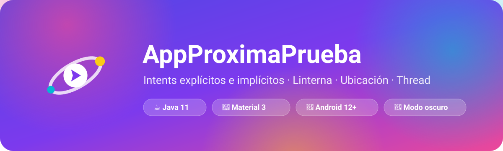
</p>

<h1 align="center">📱 AppProximaPrueba: Intents y Funciones</h1>

<p align="center">
  App Android en <b>Java</b> que reúne <b>8 intents</b> (3 explícitos y 5 implícitos), funciones de <b>hardware</b> (linterna y GPS),
  un <b>Thread</b> en segundo plano y un diseño <b>Material 3</b> con animaciones, modo oscuro y vistas personalizadas.
</p>

<p align="center">
  
  
  
  
  
</p>

> 📘 **Guía de estudio completa:** [`docs/GUIA_DE_ESTUDIO.md`](docs/GUIA_DE_ESTUDIO.md) explica toda la materia, archivo por archivo (Java, vistas, recursos, Gradle, Manifest), con flujos, preguntas de prueba y ejercicios.
>
> 🎬 **Vista previa en video:** [`docs/video/vista-previa.mp4`](docs/video/vista-previa.mp4) muestra un recorrido de 1:44 por todas las pantallas, colores, íconos y animaciones. Es una maqueta de referencia, no una grabación del teléfono.

---

## 📚 Índice

1. [¿Qué hace la app?](#-qué-hace-la-app)
2. [Diseño](#-diseño)
3. [Estructura del proyecto](#-estructura-del-proyecto)
4. **Materia del curso**
   1. [Componentes de una app Android](#1-componentes-de-una-app-android)
   2. [AndroidManifest.xml](#2-androidmanifestxml)
   3. [Gradle y dependencias](#3-gradle-y-dependencias)
   4. [Ciclo de vida de una Activity](#4-ciclo-de-vida-de-una-activity)
   5. [Layouts y vistas (XML)](#5-layouts-y-vistas-xml)
   6. [Recursos (`res/`)](#6-recursos-res)
   7. [Conectar XML con Java y manejar eventos](#7-conectar-xml-con-java-y-manejar-eventos)
   8. [Intents](#8-intents)
   9. [Permisos en tiempo de ejecución](#9-permisos-en-tiempo-de-ejecución)
   10. [Hardware: linterna y ubicación](#10-hardware-linterna-y-ubicación)
   11. [Hilos (Threads)](#11-hilos-threads)
   12. [Validaciones y mensajes al usuario](#12-validaciones-y-mensajes-al-usuario)
   13. [Temas, Material Design 3 y modo oscuro](#13-temas-material-design-3-y-modo-oscuro)
   14. [Animaciones](#14-animaciones)
   15. [Vistas personalizadas (Canvas)](#15-vistas-personalizadas-canvas)
   16. [Persistencia y estado](#16-persistencia-y-estado)
   17. [Edge-to-edge y Splash Screen](#17-edge-to-edge-y-splash-screen)
   18. [Accesibilidad](#18-accesibilidad)
   19. [Pruebas](#19-pruebas)
5. [Buenas prácticas aplicadas](#-buenas-prácticas-aplicadas)
6. [Cómo compilar y ejecutar](#️-cómo-compilar-y-ejecutar)
7. [Guía de pruebas manuales](#-guía-de-pruebas-manuales)
8. [Capturas](#-capturas)
9. [Glosario](#-glosario)
10. [Créditos](#-créditos)

---

## 🚀 ¿Qué hace la app?

| Tipo | Acción | Cómo se implementa |
|---|---|---|
| 🧭 **Explícito** | Abrir la **Segunda Ventana** enviando tu nombre | `new Intent(this, Segunda_Vista.class)` + `putExtra("nombre", …)` |
| 🧭 **Explícito** | Abrir **Ayuda** | `new Intent(this, Ayuda.class)` |
| 🧭 **Explícito** | Abrir **Configuración** | `new Intent(this, Config.class)` |
| 🌐 **Implícito** | Ver tu ubicación en el **Mapa** | `ACTION_VIEW` + `geo:lat,lng?q=lat,lng` |
| 🌐 **Implícito** | Abrir una **página web** | `ACTION_VIEW` + `https://…` |
| 🌐 **Implícito** | Abrir el **marcador telefónico** | `ACTION_DIAL` + `tel:912345678` |
| 🌐 **Implícito** | Escribir un **correo** con asunto y cuerpo | `ACTION_SENDTO` + `mailto:` + `EXTRA_SUBJECT` / `EXTRA_TEXT` |
| 🌐 **Implícito** | Abrir los **ajustes de Wi-Fi** | `Settings.ACTION_WIFI_SETTINGS` |
| ⚡ **Función** | Encender / apagar la **linterna** | `CameraManager.setTorchMode()` |
| ⚡ **Función** | Obtener la **ubicación** actual | `LocationManager.getCurrentLocation()` |
| 🧵 **Thread** | Simular una carga antes del saludo | `new Thread(...)` + `Thread.sleep()` + `runOnUiThread()` |

**Extras** que se agregaron en el rediseño:

- 🌙 **Modo claro / oscuro / del sistema**, guardado con `SharedPreferences`.
- 🔐 Estado de los **permisos** en Configuración y botón para ir a los **ajustes de la app** (intent implícito extra).
- 📍 Si el GPS está apagado, un Snackbar ofrece **activarlo** (intent implícito a `ACTION_LOCATION_SOURCE_SETTINGS`).
- 🎉 **Confeti**, aurora animada, radar de ubicación, halo de linterna y contadores animados.
- 💫 **Splash Screen** animado (API nativa de Android 12).

---

## 🎨 Diseño

### Concepto: "Aurora Neón"

La interfaz usa **degradados vivos**, **tarjetas** limpias y luces que se mueven lentamente en los encabezados (como una aurora boreal). Cada tipo de acción tiene su color, así el usuario aprende qué hace cada botón con solo mirarlo:

<p align="center">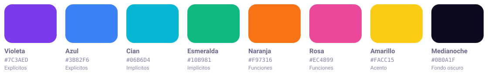</p>

| Color | Significado | Dónde se ve |
|---|---|---|
| 🟣 Violeta → 🔵 Azul | **Intents explícitos** (navegan dentro de la app) | Botón "Abrir Segunda Ventana", sección explícitos |
| 🩵 Cian → 🟢 Esmeralda | **Intents implícitos** (piden ayuda a otra app) | Mapa, Web, Correo, Wi-Fi, Llamar |
| 🟠 Naranja → 🩷 Rosa | **Funciones** de hardware | Linterna y Ubicación |

### Elementos del diseño

- **Encabezado con degradado** y bordes inferiores redondeados, con una ilustración vectorial que "flota".
- **Tarjeta de contadores** (3 · 5 · 2) que se superpone al encabezado y cuenta desde 0.
- **Tiles** en grilla de 2 columnas con ícono, título, descripción y una **etiqueta de código** (`VIEW · geo:`, `CameraManager`…) que enseña qué API usa cada botón.
- **Campos Material** (`TextInputLayout`) con ícono, texto de ayuda, contador y errores con sacudida.
- **Tipografía Poppins** incluida en `res/font`.
- **Íconos vectoriales** Material Symbols (nítidos en cualquier pantalla y livianos).
- **Ícono de la app adaptativo** con versión monocromática (íconos temáticos de Android 13+).
- **Modo oscuro** completo (`values-night/colors.xml`).

---

## 🗂️ Estructura del proyecto

```
app/src/main/
├── AndroidManifest.xml                 ← Permisos, Activities, Application, intent-filter
├── java/com/devstbryan/appproximaprueba/
│   ├── AppProximaPrueba.java           ← Clase Application: aplica el tema guardado
│   ├── Panel.java                      ← Pantalla principal: 8 intents + linterna + ubicación
│   ├── Segunda_Vista.java              ← Recibe el extra y usa un Thread
│   ├── Ayuda.java                      ← Guía de uso
│   ├── Config.java                     ← Tema, permisos e información
│   ├── util/
│   │   ├── Animaciones.java            ← Animaciones reutilizables
│   │   ├── Pantalla.java               ← Edge-to-edge e insets
│   │   ├── Preferencias.java           ← SharedPreferences
│   │   └── Validaciones.java           ← Reglas de validación (Java puro, testeable)
│   └── widget/
│       ├── AuroraView.java             ← Vista personalizada: luces animadas
│       └── ConfettiView.java           ← Vista personalizada: confeti con física
└── res/
    ├── anim/          ← Animaciones de vista y transiciones entre pantallas
    ├── animator/      ← StateListAnimator (efecto al presionar)
    ├── drawable/      ← Degradados, ripples, íconos vectoriales, ilustración, splash animado
    ├── font/          ← Poppins
    ├── layout/        ← activity_panel, activity_segunda_vista, activity_ayuda, activity_config
    ├── mipmap-anydpi/ ← Ícono adaptativo
    ├── values/        ← strings, colors, dimens, styles, themes, attrs, arrays
    ├── values-night/  ← Colores del modo oscuro
    └── xml/           ← Reglas de respaldo de datos
app/src/test/          ← Pruebas unitarias (JUnit)
app/src/androidTest/   ← Pruebas instrumentadas (en el dispositivo)
```

---

# 📖 Materia del curso

## 1. Componentes de una app Android

Una app Android se arma con **4 componentes** principales, que se declaran en el Manifest:

| Componente | Para qué sirve | ¿Se usa aquí? |
|---|---|---|
| **Activity** | Una pantalla con interfaz | ✅ `Panel`, `Segunda_Vista`, `Ayuda`, `Config` |
| **Service** | Trabajo en segundo plano sin interfaz (música, descargas) | ➖ |
| **BroadcastReceiver** | Responder a eventos del sistema (batería baja, modo avión) | ➖ |
| **ContentProvider** | Compartir datos con otras apps (contactos, fotos) | ➖ |

Además, la clase **`Application`** (`AppProximaPrueba.java`) se crea **una sola vez** antes que cualquier Activity; aquí se usa para aplicar el tema guardado.

Los componentes se comunican mediante **Intents** (ver sección 8).

## 2. AndroidManifest.xml

Es la "ficha técnica" de la app. El sistema lo lee **antes** de ejecutar cualquier código.

```xml
<uses-permission android:name="android.permission.CAMERA" />
<uses-permission android:name="android.permission.ACCESS_FINE_LOCATION" />
<uses-permission android:name="android.permission.ACCESS_COARSE_LOCATION" />

<uses-feature android:name="android.hardware.camera.flash" android:required="false" />

<application android:name=".AppProximaPrueba" android:theme="@style/Theme.AppProximaPrueba" …>
    <activity android:name=".Ayuda" android:exported="false" android:parentActivityName=".Panel" />
    …
    <activity android:name=".Panel" android:exported="true" android:windowSoftInputMode="adjustResize">
        <intent-filter>
            <action android:name="android.intent.action.MAIN" />
            <category android:name="android.intent.category.LAUNCHER" />
        </intent-filter>
    </activity>
</application>
```

| Elemento | Explicación |
|---|---|
| `<uses-permission>` | Declara los permisos. Los **peligrosos** (cámara, ubicación) además se piden en tiempo de ejecución. |
| `<uses-feature required="false">` | La app usa flash/GPS, pero **se puede instalar** en teléfonos que no lo tengan. |
| `android:name` en `<application>` | Clase `Application` propia. |
| `android:theme` | Tema global de la app. |
| `exported="false"` | Otras apps **no pueden** abrir esa Activity (seguridad). Solo `Panel` es `true` porque la abre el launcher. |
| `intent-filter` MAIN + LAUNCHER | Marca la pantalla de inicio y hace que aparezca en el menú de apps. |
| `parentActivityName` | Define la jerarquía de navegación (pantalla "padre"). |
| `windowSoftInputMode="adjustResize"` | Al abrir el teclado, la pantalla se ajusta para que los campos no queden tapados. |

## 3. Gradle y dependencias

- **`settings.gradle.kts`**: nombre del proyecto, módulos (`:app`) y repositorios (`google()`, `mavenCentral()`).
- **`build.gradle.kts` (raíz)**: plugins comunes.
- **`app/build.gradle.kts`**: configuración del módulo.
- **`gradle/libs.versions.toml`**: *Version Catalog*, un único lugar con las versiones de todas las librerías.

```kotlin
android {
    namespace = "com.devstbryan.appproximaprueba"   // Paquete de la clase R
    compileSdk { version = release(36) { minorApiLevel = 1 } }   // API con la que se compila
    defaultConfig {
        minSdk = 31        // Android 12: versión mínima para instalar
        targetSdk = 36     // Versión para la que se probó la app
        versionCode = 2    // Número interno (sube en cada publicación)
        versionName = "2.0"// Versión visible para el usuario
    }
    buildFeatures { buildConfig = true }   // Genera BuildConfig.VERSION_NAME
}
dependencies {
    implementation(libs.appcompat)          // Compatibilidad entre versiones de Android
    implementation(libs.material)           // Componentes Material Design 3
    implementation(libs.activity)           // EdgeToEdge, Activity Result API
    implementation(libs.constraintlayout)
    testImplementation(libs.junit)          // Pruebas unitarias
    androidTestImplementation(libs.espresso.core) // Pruebas de interfaz
}
```

| Concepto | Significado |
|---|---|
| `minSdk` | Versión más antigua donde se puede instalar. Con 31 se pueden usar APIs de Android 12 sin `if (Build.VERSION…)`. |
| `targetSdk` | Le dice al sistema qué comportamientos nuevos acepta la app. |
| `compileSdk` | APIs disponibles al compilar. |
| `implementation` / `testImplementation` | Dependencia para la app / solo para las pruebas. |

## 4. Ciclo de vida de una Activity

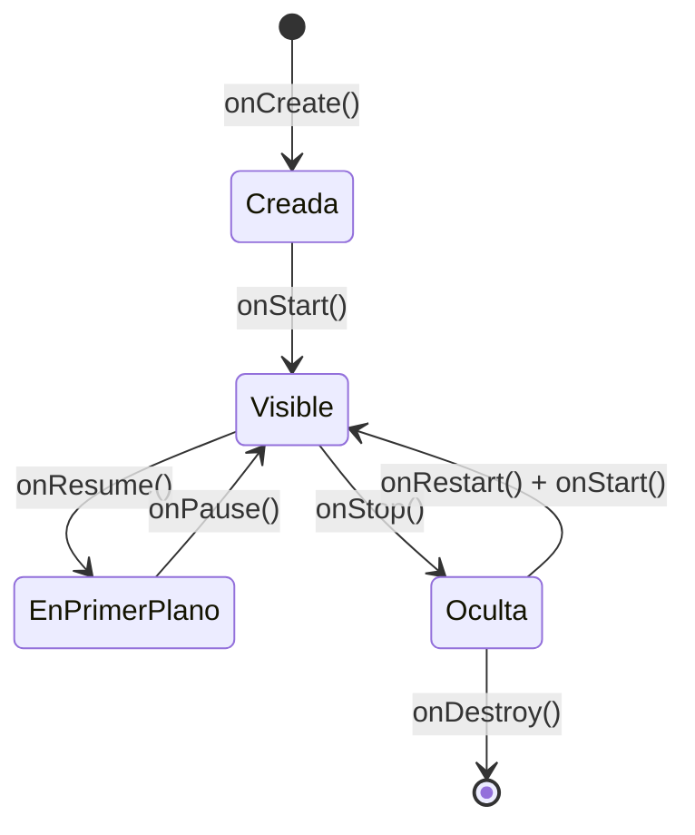

| Método | Qué hace la app ahí |
|---|---|
| `onCreate()` | `setContentView()`, `findViewById()`, listeners, restaurar estado (todas las pantallas). |
| `onStart()` | `Panel` registra el `TorchCallback` para saber si la linterna cambia desde fuera. |
| `onResume()` | `Config` vuelve a revisar los permisos (el usuario pudo cambiarlos en Ajustes). |
| `onStop()` | `Panel` quita el `TorchCallback` (no escuchar si no se ve la pantalla). |
| `onSaveInstanceState()` | `Panel` guarda latitud/longitud en un `Bundle` para no perderlas al **rotar**. |
| `onDestroy()` | Se cancelan la búsqueda de ubicación, las animaciones y el `Thread` de `Segunda_Vista`. |

> 💡 Al **rotar** el teléfono, Android destruye y vuelve a crear la Activity. Por eso se usa `onSaveInstanceState()`.

## 5. Layouts y vistas (XML)

La interfaz se describe en XML (`res/layout/`) y se "infla" con `setContentView(R.layout.activity_panel)`.

**Jerarquía:** todo es una `View`; los contenedores son `ViewGroup`.

| Contenedor / vista | Uso en la app |
|---|---|
| `NestedScrollView` | Permite desplazar el Panel, Ayuda y Config. |
| `LinearLayout` | Apila elementos vertical u horizontalmente (con `layout_weight` para dividir el espacio 50/50 en los tiles). |
| `FrameLayout` | Superpone capas: aurora + ilustración + textos; halo + ícono de linterna. |
| `TextView`, `ImageView`, `ImageButton`, `Button` | Textos, imágenes y botones. |
| `MaterialCardView` | Tarjetas con bordes redondeados y efecto ripple. |
| `TextInputLayout` + `TextInputEditText` | Campos con etiqueta flotante, ícono, ayuda, contador y error. |
| `MaterialButtonToggleGroup` | Selector Sistema / Claro / Oscuro. |
| `CircularProgressIndicator` | Indicador de carga multicolor. |

**Conceptos clave**

| Atributo | Significado |
|---|---|
| `match_parent` / `wrap_content` | Ocupar todo el padre / solo lo necesario. |
| `layout_weight` | Reparte el espacio sobrante (`0dp` + `weight=1` = partes iguales). |
| `gravity` vs `layout_gravity` | Alinea el **contenido** dentro de la vista / alinea la **vista** dentro del padre. |
| `padding` vs `margin` | Espacio **interno** / espacio **externo**. |
| `dp` vs `sp` | `dp` para tamaños (independiente de la densidad); `sp` para texto (respeta el tamaño de letra del usuario). |
| `id` (`@+id/…`) | Identificador para encontrar la vista desde Java. |
| `style` | Aplica un grupo de atributos reutilizable. |
| `tools:` | Atributos que solo ve Android Studio en la vista previa (no llegan al APK). |

## 6. Recursos (`res/`)

Nada de textos, colores ni medidas "a mano" en el código o en los layouts: todo está en recursos.

| Carpeta / archivo | Contenido | Ejemplo |
|---|---|---|
| `values/strings.xml` | Textos (permite traducir la app) | `@string/btn_segunda` |
| `values/colors.xml` | Paleta de marca y colores semánticos | `@color/violeta` |
| `values-night/colors.xml` | Los mismos nombres con valores oscuros | `fondo` = `#0B0A1F` |
| `values/dimens.xml` | Medidas | `@dimen/radio` = `20dp` |
| `values/styles.xml` | Estilos reutilizables (`Tarjeta.Tile`, `Boton.Implicito`…) | `style="@style/Boton.Explicito"` |
| `values/themes.xml` | Tema Material 3, tipografía, splash y transiciones | `Theme.AppProximaPrueba` |
| `values/attrs.xml` | Atributos de la vista personalizada | `app:radioInferior` |
| `values/arrays.xml` | Lista de colores del indicador de carga | `@array/colores_carga` |
| `drawable/` | `shape` (degradados), `ripple`, `vector`, `animated-vector` | `bg_boton_implicito.xml` |
| `font/` | Tipografía Poppins | `@font/poppins` |
| `anim/` | Animaciones de vista y transiciones | `sacudir.xml` |
| `animator/` | Animaciones de propiedades | `presion.xml` |
| `mipmap-anydpi/` | Ícono adaptativo | `ic_launcher.xml` |

**Calificadores:** Android elige automáticamente la carpeta según el dispositivo: `values-night` (modo oscuro), `values-es` (idioma), `drawable-land` (horizontal), etc.

**Strings con formato:** `<string name="saludo">¡Hola, %1$s! 👋</string>` → `getString(R.string.saludo, nombre)`.

**La clase `R`**: Gradle la genera con un número entero por cada recurso (`R.layout.activity_panel`, `R.id.btnMap`, `R.string.error_nombre`…).

**Drawables usados**

- `<shape>` con `<gradient>`: fondos degradados de botones, encabezados y avatar.
- `<ripple>`: onda al tocar un botón.
- `<vector>`: íconos e ilustración (se escalan sin perder calidad).
- `<animated-vector>`: ícono animado del Splash Screen.
- Gradiente radial (`bg_brillo`): halo de la linterna.

## 7. Conectar XML con Java y manejar eventos

```java
setContentView(R.layout.activity_panel);          // 1. Inflar el layout
etNombre = findViewById(R.id.etNombre);           // 2. Buscar la vista por su id
findViewById(R.id.btnWeb).setOnClickListener(v -> // 3. Reaccionar al toque (lambda)
        abrir(new Intent(Intent.ACTION_VIEW, Uri.parse(getString(R.string.url_web)))));
```

| Evento / listener | Dónde |
|---|---|
| `setOnClickListener` | Todos los botones y tiles. |
| `setOnEditorActionListener` | La tecla "Ir"/"Listo" del teclado abre la Segunda Ventana o llama. |
| `TextWatcher` | Borra el mensaje de error apenas el usuario vuelve a escribir. |
| `addOnButtonCheckedListener` | Cambia el tema en Configuración. |

> Las **lambdas** (`v -> …`) son una forma corta de escribir una clase anónima que implementa una interfaz con un solo método (Java 8+).

## 8. Intents

Un **Intent** es un **mensaje** que pide al sistema realizar una acción: abrir una pantalla, abrir otra app, compartir algo…

### Explícito vs implícito

| | **Explícito** | **Implícito** |
|---|---|---|
| ¿Qué indica? | La **clase exacta** a abrir | Una **acción** + datos (`Uri`) |
| ¿Quién lo resuelve? | Tu propia app | El **sistema**, que busca una app capaz |
| Ejemplo | `new Intent(this, Ayuda.class)` | `new Intent(Intent.ACTION_DIAL, Uri.parse("tel:912345678"))` |
| Uso típico | Navegar entre tus pantallas | Mapa, navegador, teléfono, correo, ajustes |

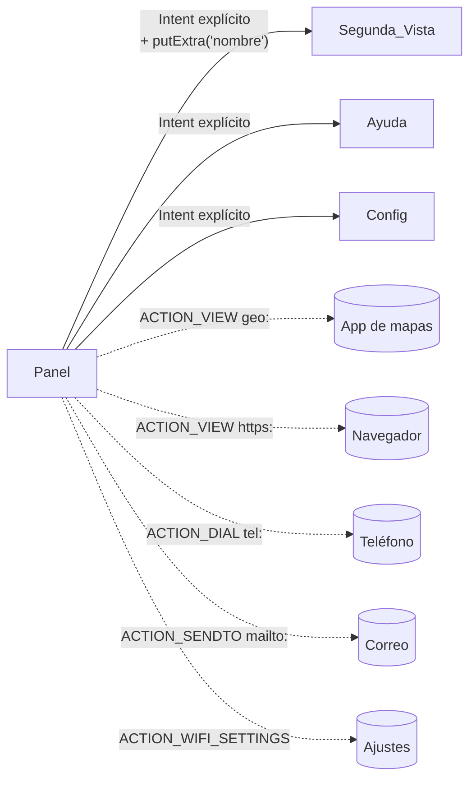

### Enviar y recibir datos (extras)

```java
// Panel.java: envía
Intent segunda = new Intent(Panel.this, Segunda_Vista.class);
segunda.putExtra(Segunda_Vista.EXTRA_NOMBRE, nombre);
startActivity(segunda);

// Segunda_Vista.java: recibe (validando null)
String extra = getIntent().getStringExtra(EXTRA_NOMBRE);
String nombre = extra == null ? "" : extra;
```

> ✅ La clave `"nombre"` es una **constante** (`EXTRA_NOMBRE`): así quien envía y quien recibe usan exactamente el mismo texto.

### Los 5 implícitos de la app

| # | Acción | `Uri` / extras | Abre |
|---|---|---|---|
| 1 | `Intent.ACTION_VIEW` | `geo:lat,lng?q=lat,lng` | Google Maps u otra app de mapas |
| 2 | `Intent.ACTION_VIEW` | `https://www.santotomas.cl` | El navegador |
| 3 | `Intent.ACTION_DIAL` | `tel:912345678` | El marcador (no llama solo, por eso **no necesita** el permiso `CALL_PHONE`) |
| 4 | `Intent.ACTION_SENDTO` | `mailto:…` + `EXTRA_SUBJECT` + `EXTRA_TEXT` | Solo apps de correo |
| 5 | `Settings.ACTION_WIFI_SETTINGS` | (sin datos) | Ajustes de Wi-Fi |

Extras: `Settings.ACTION_APPLICATION_DETAILS_SETTINGS` (ajustes de la app) y `Settings.ACTION_LOCATION_SOURCE_SETTINGS` (activar GPS).

### ¿Y si no hay ninguna app que pueda abrirlo?

`startActivity()` lanza `ActivityNotFoundException` y la app se cerraría. Se captura en un solo método:

```java
private void abrir(Intent intent) {
    try {
        startActivity(intent);
    } catch (ActivityNotFoundException e) {
        mensaje(R.string.error_app);   // "No hay una app para realizar esta acción"
    }
}
```

### Pila de pantallas (back stack) y `finish()`

Cada `startActivity()` apila una pantalla nueva. El botón **Volver** (o la flecha) llama a `finish()`, que cierra la actual y regresa a la anterior.

```
startActivity(Segunda_Vista)      finish()
┌──────────────┐               ┌──────────────┐
│ Segunda_Vista│  ← visible     │              │
├──────────────┤               ├──────────────┤
│    Panel     │               │    Panel     │ ← visible otra vez
└──────────────┘               └──────────────┘
```

## 9. Permisos en tiempo de ejecución

| Tipo | Ejemplo | ¿Hay que pedirlo al usuario? |
|---|---|---|
| **Normal** | Internet, vibración | No, basta el Manifest |
| **Peligroso** | **Cámara**, **ubicación**, contactos, micrófono | **Sí**, con un diálogo del sistema |

La app usa la **Activity Result API** (forma moderna que reemplaza a `onRequestPermissionsResult`):

```java
private final ActivityResultLauncher<String> solicitarCamara = registerForActivityResult(
        new ActivityResultContracts.RequestPermission(), concedido -> {
            if (concedido) alternarLinterna();   // Si acepta, la acción sigue sola
            else permisoDenegado();              // Si rechaza, se ofrece ir a Ajustes
        });
```

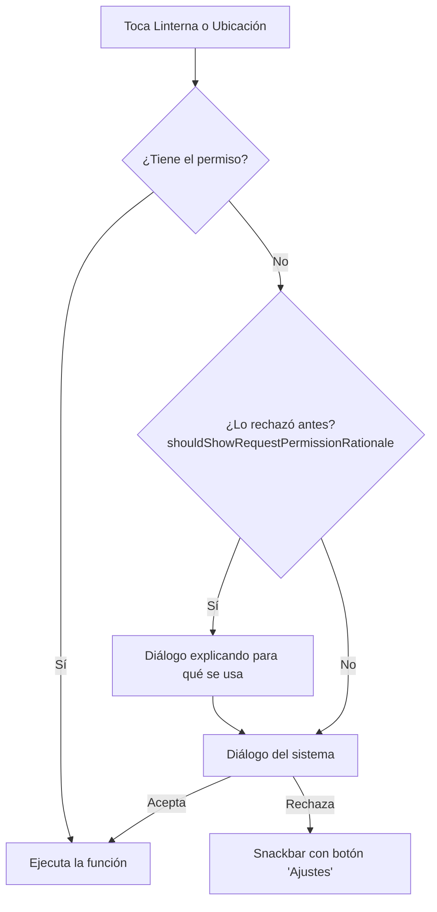

- **Ubicación precisa vs aproximada (Android 12+)**: se piden `FINE` y `COARSE` **juntas** y el usuario elige; la app funciona con cualquiera de las dos.
- La **linterna** pide el permiso de cámara como parte del ejercicio de permisos (`setTorchMode` no abre la cámara para fotos).

## 10. Hardware: linterna y ubicación

### 🔦 Linterna con `CameraManager`

```java
cameraManager = getSystemService(CameraManager.class);
// Se busca una cámara que realmente tenga flash
for (String id : cameraManager.getCameraIdList()) {
    Boolean tieneFlash = cameraManager.getCameraCharacteristics(id)
            .get(CameraCharacteristics.FLASH_INFO_AVAILABLE);
    if (Boolean.TRUE.equals(tieneFlash)) return id;
}
…
cameraManager.setTorchMode(idCamara, !linternaEncendida);
```

- `TorchCallback` mantiene el botón sincronizado si la linterna se apaga desde el panel rápido.
- `CameraAccessException` se captura (por ejemplo, si otra app está usando la cámara).

### 📍 Ubicación con `LocationManager`

```java
LocationManager lm = getSystemService(LocationManager.class);
if (!lm.isLocationEnabled()) { /* Snackbar con "Activar" */ }
String proveedor = lm.hasProvider(LocationManager.FUSED_PROVIDER) ? LocationManager.FUSED_PROVIDER : …;
lm.getCurrentLocation(proveedor, cancelarUbicacion, getMainExecutor(), this::mostrarUbicacion);
```

| Proveedor | Fuente |
|---|---|
| `GPS_PROVIDER` | Satélites (preciso, lento en interiores) |
| `NETWORK_PROVIDER` | Antenas y Wi-Fi (rápido, menos preciso) |
| `FUSED_PROVIDER` | Combina los anteriores (Android 12+) |

- `CancellationSignal` permite **cancelar** la búsqueda si se cierra la pantalla.
- `getMainExecutor()` hace que el resultado llegue en el **hilo principal**, listo para actualizar la interfaz.
- `this::mostrarUbicacion` es una **referencia a método** (equivale a `ubicacion -> mostrarUbicacion(ubicacion)`).

## 11. Hilos (Threads)

Android tiene un **hilo principal (UI thread)** que dibuja la pantalla y atiende los toques. Si se bloquea más de ~5 segundos aparece el error **ANR** ("La app no responde"). Por eso el trabajo lento va en **otro hilo**, y **solo el hilo principal puede modificar las vistas**.

```java
hiloCarga = new Thread(() -> {
    try {
        Thread.sleep(TIEMPO_CARGA_MS);          // Trabajo "lento" en segundo plano
    } catch (InterruptedException e) {
        return;                                  // La pantalla se cerró: se detiene
    }
    runOnUiThread(() -> {                        // Volver al hilo principal
        if (!isFinishing() && !isDestroyed()) mostrarSaludo(nombre, true);
    });
}, "hilo-carga");
hiloCarga.start();
…
@Override protected void onDestroy() {
    if (hiloCarga != null) hiloCarga.interrupt(); // No dejar hilos trabajando de más
    super.onDestroy();
}
```

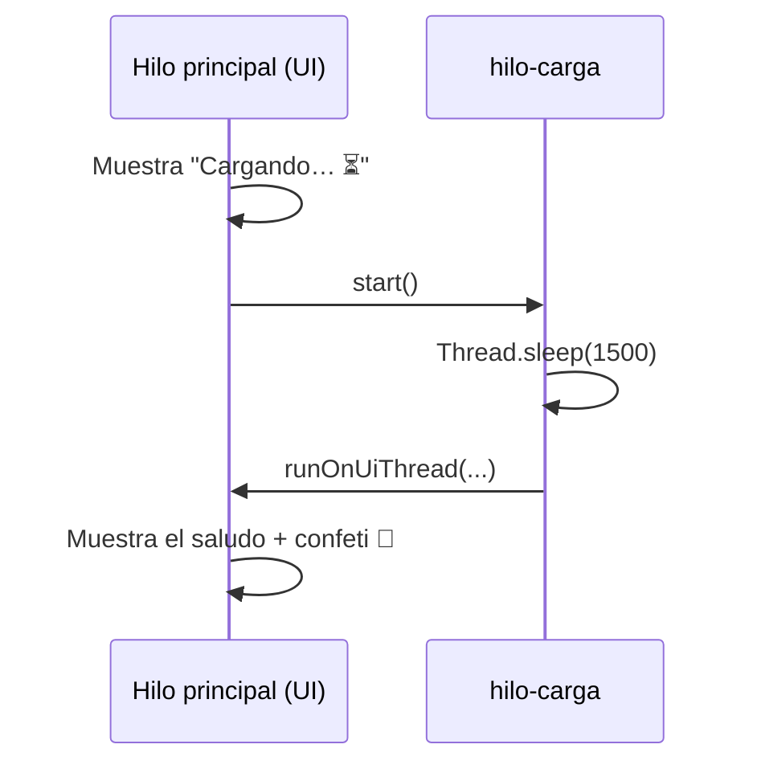

> Alternativas que se ven más adelante: `ExecutorService`, `Handler`/`Looper`, `WorkManager` y, en Kotlin, corrutinas.

## 12. Validaciones y mensajes al usuario

Las reglas están en `util/Validaciones.java` (Java puro, **probado con JUnit**):

| Validación | Regla | Feedback |
|---|---|---|
| ✍️ Nombre | No vacío ni solo espacios | Error en el campo + sacudida + vibración |
| 📞 Teléfono | Exactamente **9 dígitos** (`\d{9}`) | Error en el campo + sacudida |
| 📍 Mapa | Primero hay que obtener la ubicación | Snackbar + sacude el tile de Ubicación |
| 🔐 Permisos | Se piden antes de usar cámara/ubicación | Diálogo explicativo y Snackbar con "Ajustes" |
| 🔦 Flash | Que exista una cámara con flash | Snackbar |
| 🛰️ GPS | Que la ubicación esté activada | Snackbar con "Activar" |
| 🚫 Intents | Que exista una app que lo reciba | `try/catch ActivityNotFoundException` |
| 🧩 Extras | `getStringExtra()` puede devolver `null` | Se reemplaza por `""` |

**Formas de avisar al usuario**

| Componente | Cuándo usarlo |
|---|---|
| `Toast` | Mensaje breve y simple (sin acciones). |
| **`Snackbar`** (usado) | Mensaje breve de Material Design que **puede tener un botón** ("Ajustes", "Activar"). |
| **`MaterialAlertDialogBuilder`** (usado) | Preguntar o explicar algo importante (motivo de un permiso). |
| **`TextInputLayout.setError()`** (usado) | Error asociado a un campo específico. |
| **Vibración háptica** (usado) | `performHapticFeedback(CONFIRM / REJECT)`. |

## 13. Temas, Material Design 3 y modo oscuro

```xml
<style name="Base.Theme.AppProximaPrueba" parent="Theme.Material3.DayNight.NoActionBar">
    <item name="colorPrimary">@color/violeta</item>
    <item name="colorSecondary">@color/cian</item>
    <item name="colorTertiary">@color/rosa</item>
    <item name="android:colorBackground">@color/fondo</item>
    <item name="android:fontFamily">@font/poppins</item>
    …
</style>
```

- **Tema vs estilo**: el **tema** se aplica a toda la app o Activity; el **estilo** a una vista.
- **Roles de color** de Material 3 (`colorPrimary`, `colorSurface`, `colorOnSurface`…): los componentes Material toman sus colores de ahí.
- **`DayNight`**: el tema cambia solo entre claro y oscuro usando `values/` y `values-night/`.
- **Elegir el tema desde la app**: `AppCompatDelegate.setDefaultNightMode(MODE_NIGHT_YES / NO / FOLLOW_SYSTEM)`; se guarda en `SharedPreferences` y se aplica en `Application.onCreate()`.
- **Herencia de estilos**: `Boton.Implicito` hereda todo de `Boton` y solo cambia el fondo.

## 14. Animaciones

| Tipo | API | Dónde se ve |
|---|---|---|
| **View Animation** | `res/anim` + `AnimationUtils.loadAnimation()` | Sacudida en errores (`sacudir.xml` + `cycleInterpolator`) |
| **LayoutAnimation** | `android:layoutAnimation` | Las tarjetas aparecen en **cascada** al abrir cada pantalla |
| **Transiciones entre Activities** | `windowAnimationStyle` en el tema | Las pantallas entran deslizándose desde la derecha |
| **ObjectAnimator** | `ObjectAnimator.ofFloat(vista, TRANSLATION_Y, …)` | Ilustración e íconos que **flotan** |
| **PropertyValuesHolder** | Varias propiedades a la vez | Rebote del ícono de linterna y del avatar |
| **AnimatorSet** | Agrupa animaciones | **Radar** de ubicación (2 ondas desfasadas) |
| **ValueAnimator** | Anima un número | **Contadores** 0→3, 0→5, 0→2 y coordenadas que "giran" |
| **ViewPropertyAnimator** | `vista.animate().alpha(1f)…` | Saludo que aparece en la Segunda Ventana |
| **StateListAnimator** | `res/animator/presion.xml` | Botones y tarjetas se "hunden" al presionarlos |
| **AnimatedVectorDrawable** | `res/drawable/avd_splash.xml` | Logo animado del **Splash Screen** |
| **Animación con Canvas** | `ValueAnimator` + `invalidate()` | Aurora y confeti |

**Interpoladores** (controlan la "velocidad" de la animación): `OvershootInterpolator` (rebote), `DecelerateInterpolator` (frena al final), `AccelerateDecelerateInterpolator`, `LinearInterpolator`, `CycleInterpolator`, `fast_out_slow_in`.

**Buenas prácticas de animación**
- Las animaciones **infinitas se cancelan** cuando la vista sale de pantalla (`Animaciones.cancelarAlSalir`) para evitar *memory leaks*.
- La aurora **se pausa** cuando no está visible (`onVisibilityAggregated`) para ahorrar batería.
- Si el usuario activa **"Quitar animaciones"** en accesibilidad, `ValueAnimator.areAnimatorsEnabled()` lo detecta y se omiten.

## 15. Vistas personalizadas (Canvas)

Cuando ningún componente existente sirve, se **extiende `View`** y se dibuja a mano:

```java
public class AuroraView extends View {
    @Override protected void onSizeChanged(int w, int h, int oldw, int oldh) { /* crear degradados */ }
    @Override protected void onDraw(Canvas canvas) { /* dibujar círculos con RadialGradient */ }
}
```

| Concepto | Uso |
|---|---|
| `Canvas` | "Lienzo": `drawCircle`, `drawRect`, `translate`, `rotate`, `clipPath`, `save`/`restore`. |
| `Paint` | "Pincel": color, transparencia, degradado (`Shader`). |
| `onSizeChanged()` | Se crean los objetos que dependen del tamaño (**nunca dentro de `onDraw`**, que se llama ~60 veces por segundo). |
| `invalidate()` | Pide volver a dibujar la vista. |
| **Atributos propios** | `attrs.xml` → `app:radioInferior="@dimen/radio_header"` → se leen con `obtainStyledAttributes()`. |

- **`AuroraView`**: manchas de luz que se mueven con funciones seno/coseno.
- **`ConfettiView`**: 140 partículas con **física simple** (posición = posición inicial + velocidad·t + ½·gravedad·t²) que giran y se desvanecen.

## 16. Persistencia y estado

| Herramienta | Duración | Uso en la app |
|---|---|---|
| `Bundle` en `onSaveInstanceState()` | Mientras exista la tarea (rotación, cambio de tema) | Coordenadas del Panel; la Segunda Ventana no repite la carga al rotar |
| `SharedPreferences` | Permanente (hasta desinstalar) | Tema elegido (`Preferencias.java`) |
| `Intent extras` | Solo durante el viaje entre pantallas | Nombre hacia `Segunda_Vista` |

```java
prefs(context).edit().putInt(CLAVE_TEMA, modo).apply();   // apply(): guarda en segundo plano
```

## 17. Edge-to-edge y Splash Screen

**Edge-to-edge** (obligatorio desde Android 15 con `targetSdk` 35+): la app se dibuja **detrás** de la barra de estado y de navegación. Para que nada quede tapado se aplican **insets**:

```java
EdgeToEdge.enable(activity, SystemBarStyle.dark(Color.TRANSPARENT), …);
ViewCompat.setOnApplyWindowInsetsListener(vista, (v, insets) -> {
    Insets barras = insets.getInsets(WindowInsetsCompat.Type.systemBars());
    v.setPadding(…, paddingOriginal + barras.top, …);
    return insets;
});
```

También se considera el **teclado** (`WindowInsetsCompat.Type.ime()`).

Los íconos de la barra de estado empiezan en blanco (sobre el encabezado oscuro) y, cuando el encabezado sale de la pantalla, pasan a oscuros para seguir viéndose sobre el fondo claro (`WindowInsetsControllerCompat.setAppearanceLightStatusBars()` dentro de un `OnScrollChangeListener`).

**Splash Screen (Android 12+)**: se configura solo con el tema, sin una Activity extra:

```xml
<item name="android:windowSplashScreenBackground">@color/medianoche</item>
<item name="android:windowSplashScreenAnimatedIcon">@drawable/avd_splash</item>
<item name="android:windowSplashScreenIconBackgroundColor">@color/violeta</item>
```

## 18. Accesibilidad

- `contentDescription` en imágenes con significado; `importantForAccessibility="no"` en las decorativas (aurora, confeti, íconos repetidos).
- `accessibilityHeading="true"` en los títulos de sección (TalkBack permite saltar entre ellos).
- `accessibilityLiveRegion="polite"`: TalkBack **lee solo** el cambio de estado de la linterna, la ubicación y el saludo.
- Zonas táctiles de **48 dp** como mínimo y textos en `sp`.
- Colores con buen **contraste** en modo claro y oscuro.
- Respeto por la opción **"Quitar animaciones"**.
- `autofillHints` (`name`, `phone`) para que el sistema pueda autocompletar.

## 19. Pruebas

| Tipo | Carpeta | Corre en | Comando |
|---|---|---|---|
| **Unitarias** (JUnit 4) | `app/src/test` | La JVM del computador (rápidas) | `./gradlew test` |
| **Instrumentadas** | `app/src/androidTest` | Emulador o teléfono | `./gradlew connectedAndroidTest` |

`ValidacionesTest` tiene **7 pruebas**: nombre válido/vacío/nulo, teléfono con 9 dígitos, largo incorrecto, con símbolos o letras e inicial del nombre. Se pudo probar en la JVM porque `Validaciones` **no depende de Android** (separar la lógica de la interfaz).

---

## ✅ Buenas prácticas aplicadas

- 🧱 **Sin valores "a mano"**: textos, colores, medidas y estilos en `res/values`.
- ♻️ **DRY**: estilos con herencia (`Tarjeta.Tile`, `Boton.Implicito`) y clases de utilidades (`Animaciones`, `Pantalla`).
- 🔒 **Encapsulamiento**: campos `private`, constantes `static final`, clases de utilidades `final` con constructor privado.
- 🧩 **Responsabilidad única**: validaciones, preferencias, animaciones y vistas personalizadas en paquetes separados (`util/`, `widget/`).
- 🛡️ **Seguridad**: `exported="false"` en pantallas internas; `ACTION_DIAL` en lugar de `ACTION_CALL` (no requiere permiso).
- 🔐 **Permisos mínimos y explicados**: se piden solo al usarlos, con explicación si el usuario ya los rechazó.
- 🧹 **Ciclo de vida**: se liberan callbacks, hilos, búsquedas de ubicación y animaciones.
- 🔋 **Rendimiento**: objetos creados fuera de `onDraw`, animaciones pausadas cuando no se ven, `apply()` en vez de `commit()`.
- 🔄 **Estado**: `onSaveInstanceState()` para sobrevivir a la rotación.
- 🚫 **Sin cierres inesperados**: `try/catch` de `ActivityNotFoundException` y `CameraAccessException`, validación de `null`.
- 🌙 **Modo oscuro** y **edge-to-edge**.
- ♿ **Accesibilidad** (ver sección 18).
- 🧪 **Pruebas unitarias** de la lógica de validación.
- 📝 **Comentarios** que explican el *porqué* de cada decisión.

---

## ▶️ Cómo compilar y ejecutar

**Requisitos:** Android Studio (versión reciente compatible con AGP 9), JDK 21 (Android Studio ya lo incluye) y un dispositivo o emulador con **Android 12+**.

1. Clona el repositorio y ábrelo en **Android Studio**.
2. Espera a que termine la sincronización de Gradle.
3. Presiona **Run ▶️**, o desde la terminal:

```bash
./gradlew assembleDebug        # Compila el APK → app/build/outputs/apk/debug/app-debug.apk
./gradlew test                 # Ejecuta las pruebas unitarias
./gradlew installDebug         # Instala en el dispositivo conectado
```

> 💡 En el **emulador**: la linterna no enciende un flash real y la ubicación se simula desde **⋮ Extended controls → Location**.

---

## 🧪 Guía de pruebas manuales

| # | Prueba | Resultado esperado |
|---|---|---|
| 1 | Presionar **Abrir Segunda Ventana** sin nombre | El campo muestra un error y se sacude |
| 2 | Escribir "Bryan" y abrir la Segunda Ventana | Indicador de carga ~1,5 s → avatar "B", saludo y confeti 🎉 |
| 3 | Tocar **Ayuda** / **Configuración** | Se abren con transición deslizante; flecha y "Volver" regresan |
| 4 | Tocar **Linterna** la primera vez | Pide permiso de cámara; al aceptar se enciende (ícono amarillo con halo) |
| 5 | Tocar **Mapa** antes de la ubicación | Snackbar "Primero obtén tu ubicación" y se sacude el tile Ubicación |
| 6 | Tocar **Ubicación** | Pide permiso → radar animado → coordenadas con efecto contador |
| 7 | Tocar **Mapa** después | Se abre la app de mapas en tus coordenadas |
| 8 | **Llamar** con 8 dígitos / con 9 dígitos | Error / se abre el marcador con el número |
| 9 | **Correo** | App de correo con destinatario, asunto y cuerpo |
| 10 | **Web** / **Wi-Fi** | Navegador / ajustes de Wi-Fi |
| 11 | Rechazar un permiso dos veces | Snackbar con botón **Ajustes** |
| 12 | Configuración → **Oscuro** | Toda la app cambia a modo oscuro y se mantiene al reabrirla |
| 13 | Rotar el teléfono con coordenadas visibles | Las coordenadas se mantienen |

---

## 📸 Capturas

> Capturas reales tomadas en el emulador **Pixel 3a (Android 17 / API 37)**.

| Panel | Validación 🛡️ | Segunda Ventana |
|---|---|---|
| 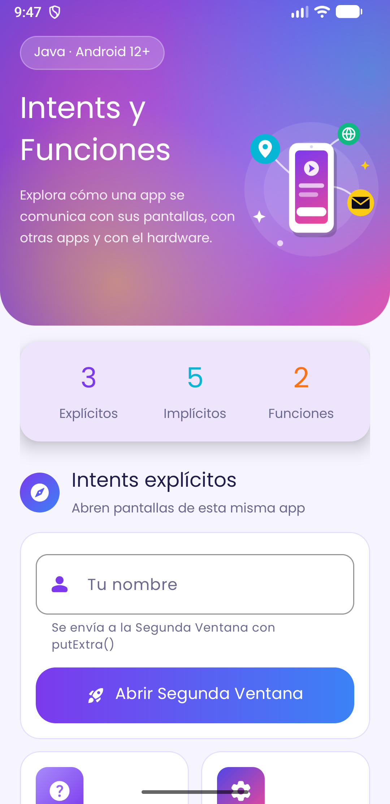 | 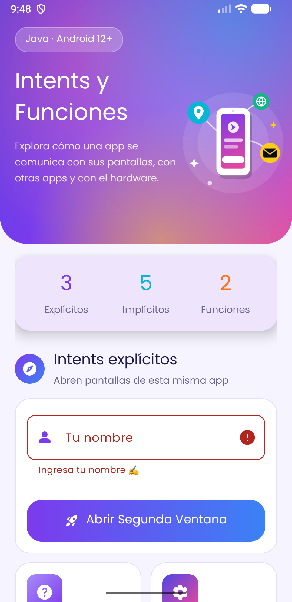 | 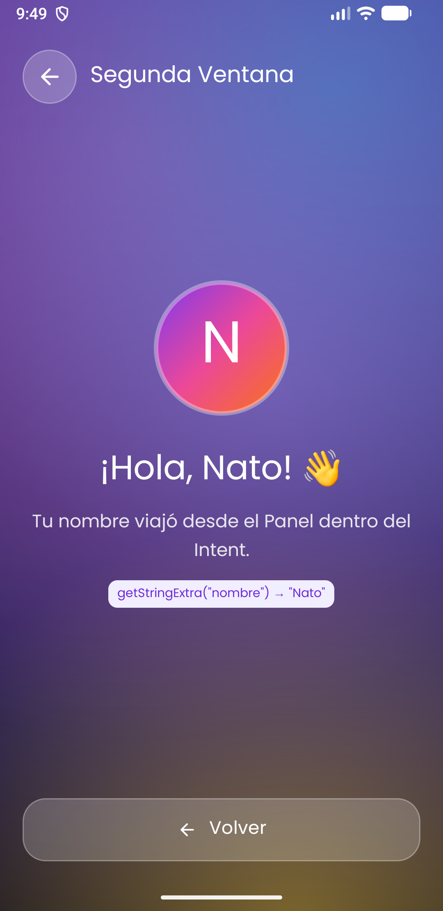 |

| Ayuda | Configuración |
|---|---|
| 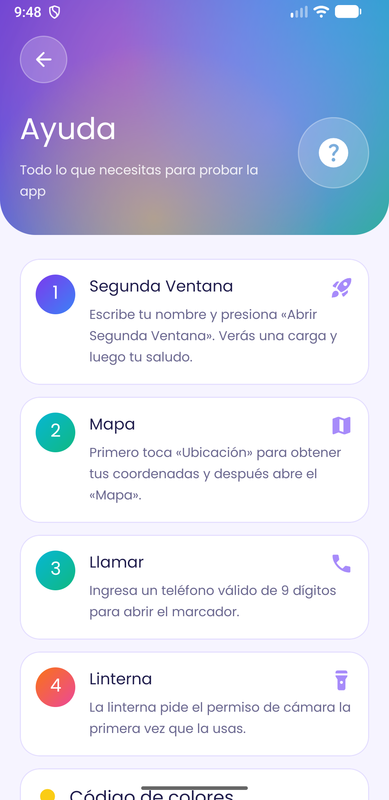 | 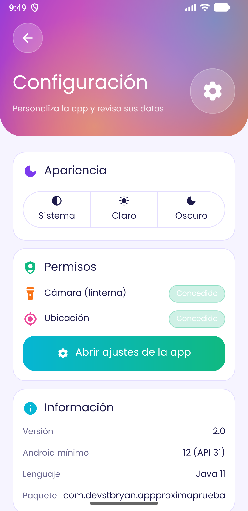 |

---

## 📘 Glosario

| Término | Definición |
|---|---|
| **Activity** | Una pantalla de la app. |
| **Intent** | Mensaje para pedir una acción a otro componente o app. |
| **Extra** | Dato que viaja dentro de un Intent (clave → valor). |
| **Uri** | Dirección de un recurso: `tel:`, `geo:`, `mailto:`, `https:`. |
| **Manifest** | Archivo que describe la app al sistema. |
| **Permiso peligroso** | Permiso que el usuario debe aceptar mientras usa la app. |
| **UI thread** | Hilo principal que dibuja la interfaz. |
| **ANR** | "Application Not Responding": la app bloqueó el hilo principal. |
| **dp / sp** | Unidades independientes de la densidad / escalables para texto. |
| **Drawable** | Cualquier cosa que se puede dibujar: imagen, forma, degradado, vector. |
| **Inset** | Espacio ocupado por las barras del sistema o el teclado. |
| **Material Design 3** | Sistema de diseño de Google (colores, formas, componentes). |
| **Memory leak** | Memoria que no se libera porque algo sigue referenciando un objeto. |

---

## 🙌 Créditos

- Íconos: [Material Symbols](https://fonts.google.com/icons) (Google, licencia Apache 2.0).
- Tipografía: [Poppins](https://fonts.google.com/specimen/Poppins) (Indian Type Foundry, SIL Open Font License; ver `docs/licencias/OFL-Poppins.txt`).
- Ilustraciones, logo, splash, aurora y confeti: hechos para este proyecto con vectores y Canvas.

<p align="center">Hecho con 💜 en Java · Santo Tomás</p>
