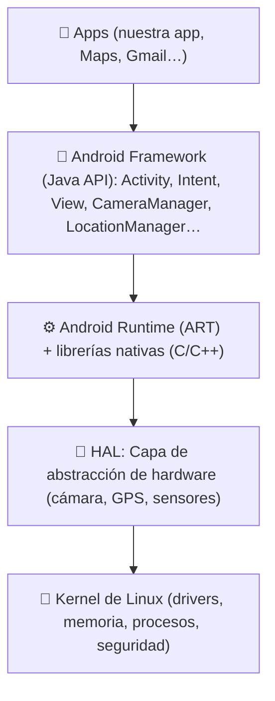
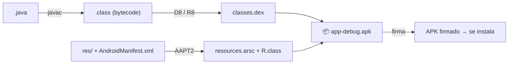
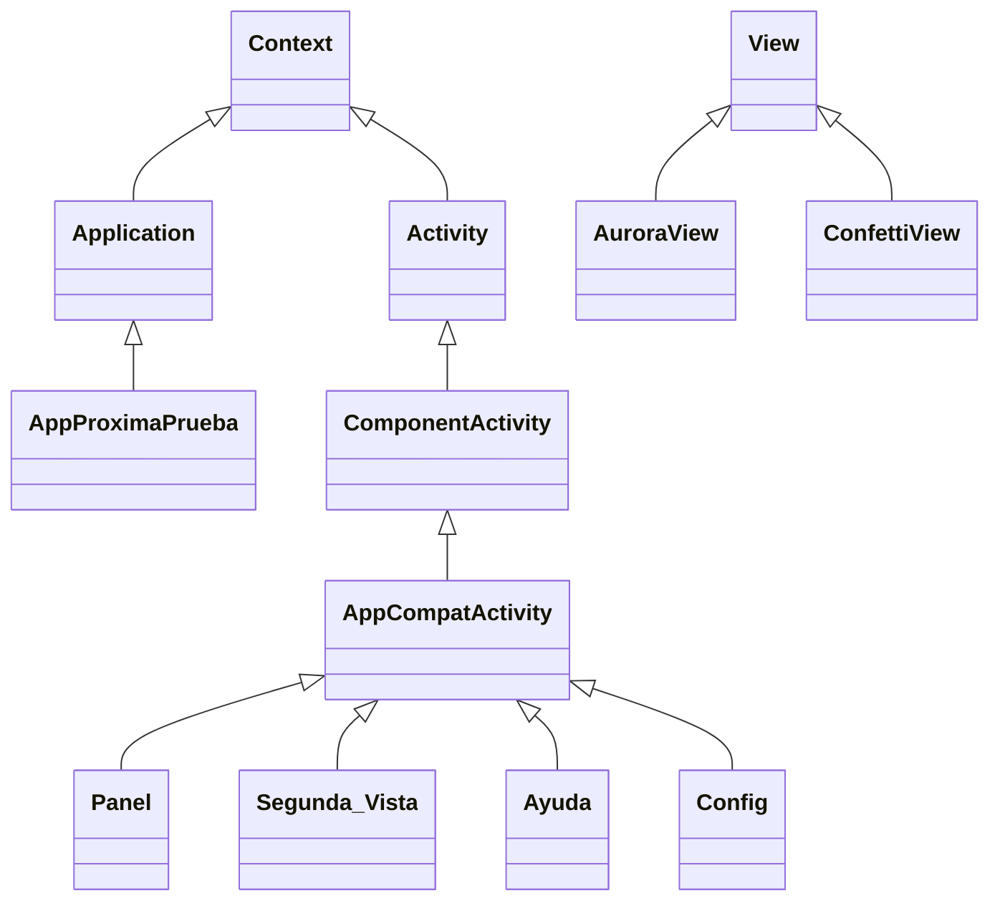
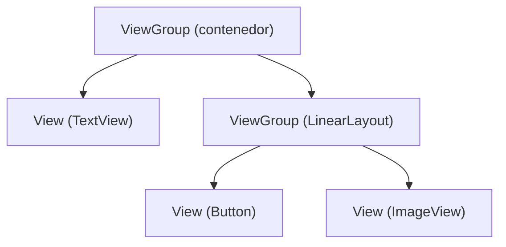
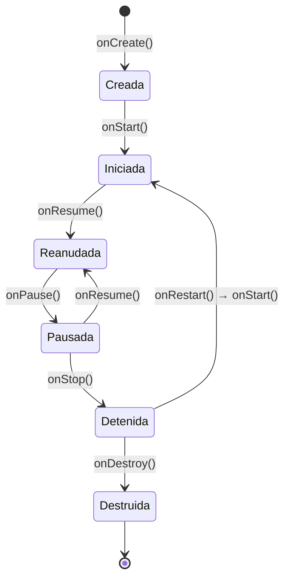
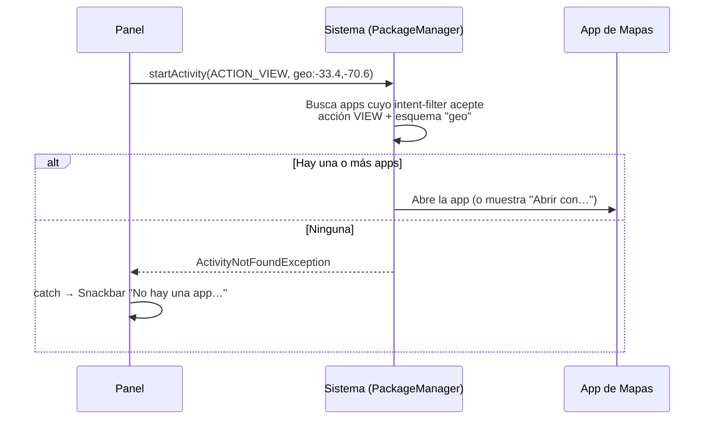

# 📘 Guía de estudio: AppProximaPrueba

> Esta guía explica **toda la materia** que aparece en el proyecto, **archivo por archivo** y **línea por línea** en las partes importantes.
> Está pensada para estudiar para la prueba y para poder **defender el código** frente al profesor.
>
> 💡 Las referencias como `Panel.java:215` indican **archivo:línea**. Ábrelas en Android Studio con `Ctrl + N` (buscar clase) y `Ctrl + G` (ir a línea).

---

## 🗺️ Mapa de la guía

| Parte | Tema | Qué vas a aprender |
|---|---|---|
| **0** | [Cómo estudiar con esta guía](#parte-0--cómo-estudiar-con-esta-guía) | Orden recomendado y checklist |
| **I** | [Fundamentos de Android](#parte-i--fundamentos-de-android) | Qué es Android, cómo se compila una app, versiones (API), componentes |
| **II** | [Estructura del proyecto](#parte-ii--estructura-del-proyecto-todos-los-archivos) | Cada carpeta y cada archivo, para qué sirve |
| **III** | [Configuración: Gradle y Manifest](#parte-iii--configuración-gradle-manifest-y-archivos-del-proyecto) | `build.gradle.kts`, `libs.versions.toml`, `AndroidManifest.xml`, wrapper, ProGuard, backup |
| **IV** | [Repaso de Java usado en el proyecto](#parte-iv--repaso-de-java-usado-en-el-proyecto) | Clases, herencia, interfaces, lambdas, genéricos, excepciones… |
| **V** | [Archivos Java, uno por uno](#parte-v--archivos-java-uno-por-uno) | Las 11 clases de la app + las 2 de pruebas |
| **VI** | [Vistas (layouts XML), una por una](#parte-vi--vistas-layouts-xml-una-por-una) | Árbol de vistas, cada widget, cada atributo, cada id |
| **VII** | [Recursos (`res/`), uno por uno](#parte-vii--recursos-res-uno-por-uno) | strings, colors, dimens, styles, themes, drawables, anim, font, mipmap… |
| **VIII** | [Temas transversales](#parte-viii--temas-transversales-en-profundidad) | Intents, permisos, ciclo de vida, hilos, animaciones, Material, edge-to-edge… |
| **IX** | [¿Qué pasa cuando toco…?](#parte-ix--qué-pasa-cuando-toco-flujos-completos) | Recorrido completo de cada botón, del toque al resultado |
| **X** | [Repaso para la prueba](#parte-x--repaso-para-la-prueba) | Preguntas con respuesta, ejercicios, errores comunes, glosario, resumen de 1 página |

---

# Parte 0 · Cómo estudiar con esta guía

**Orden recomendado (de lo más importante a lo complementario):**

1. Parte I (fundamentos) → entender qué es una Activity y un Intent.
2. `AndroidManifest.xml` (Parte III).
3. `Panel.java` + `activity_panel.xml` (Partes V y VI): es el corazón de la prueba.
4. `Segunda_Vista.java` (extras + Thread).
5. Intents y permisos (Parte VIII).
6. Recursos (`strings`, `colors`, `styles`, `themes`).
7. Resto de archivos (utilidades, vistas personalizadas, animaciones).
8. Parte X: responde las preguntas **sin mirar** y luego revisa.

**✅ Checklist: deberías poder explicar…**

- [ ] Qué es una Activity y su ciclo de vida (`onCreate` … `onDestroy`).
- [ ] La diferencia entre intent **explícito** e **implícito**, con ejemplos del proyecto.
- [ ] Cómo se envía un dato con `putExtra` y cómo se recibe con `getStringExtra`.
- [ ] Qué hace `setContentView` y `findViewById`.
- [ ] Qué es la clase `R`.
- [ ] Para qué sirve el `AndroidManifest.xml` y qué es el `intent-filter` MAIN/LAUNCHER.
- [ ] Qué es un permiso peligroso y cómo se pide en tiempo de ejecución.
- [ ] Por qué el trabajo lento va en otro hilo y qué hace `runOnUiThread`.
- [ ] Qué pasa si no hay app para un intent implícito (`ActivityNotFoundException`).
- [ ] Cómo funcionan la linterna (`CameraManager`) y la ubicación (`LocationManager`).
- [ ] Qué son `strings.xml`, `colors.xml`, `dimens.xml`, `styles.xml` y `themes.xml`.
- [ ] Qué es `dp` y `sp`, `match_parent` y `wrap_content`, `padding` y `margin`.
- [ ] Qué validaciones tiene la app y dónde están.

---

# Parte I · Fundamentos de Android

## I.1 ¿Qué es Android?

Android es un **sistema operativo** para dispositivos móviles, basado en el **kernel de Linux**. Está organizado en capas:



| Capa | Qué hace | Ejemplo en el proyecto |
|---|---|---|
| **Apps** | Lo que usa el usuario | AppProximaPrueba, la app de Mapas que abre el intent |
| **Framework** | Clases Java que usamos al programar | `Activity`, `Intent`, `CameraManager`, `LocationManager` |
| **ART** | Ejecuta el código de la app | Ejecuta el bytecode DEX de nuestras clases |
| **HAL** | Traduce pedidos al hardware real | `setTorchMode()` termina encendiendo el LED del flash |
| **Kernel** | Base del sistema | Procesos, memoria, permisos de Linux |

**Seguridad (sandbox):** cada app corre en **su propio proceso** con **su propio usuario de Linux**. Por eso una app no puede leer los datos de otra, y por eso existen los **permisos** y los **intents** (la forma "oficial" de comunicarse).

## I.2 ¿Cómo se convierte el código en una app?



1. **javac** compila los `.java` a bytecode (`.class`).
2. **D8** (o **R8** si se minifica) convierte el bytecode a formato **DEX** (Dalvik Executable), que es lo que entiende **ART**.
3. **AAPT2** compila los recursos (`res/`), genera la clase **`R`** y el archivo `resources.arsc`.
4. Todo se empaqueta en un **APK** (o un **AAB** para Google Play) y se **firma** (debug o release).
5. **Gradle** + **AGP** (Android Gradle Plugin) automatizan todos estos pasos.

## I.3 Versiones de Android (niveles de API)

Cada versión de Android tiene un número de **API level**. El proyecto usa estos:

| API | Versión | Importancia para el proyecto |
|---|---|---|
| **31** | Android 12 | **`minSdk`**: versión mínima. Trae Splash Screen API, ubicación aproximada, `FUSED_PROVIDER` |
| 32 | Android 12L | Pantallas grandes |
| 33 | Android 13 | Íconos temáticos (por eso el ícono monocromático) |
| 34 | Android 14 | — |
| 35 | Android 15 | **Edge-to-edge obligatorio** si `targetSdk ≥ 35` |
| **36** | Android 16 | **`targetSdk`** y **`compileSdk`** (36.1) |

> 🎯 **Pregunta típica:** "¿En qué teléfonos se puede instalar la app?" → En Android **12 o superior** (`minSdk = 31`).

## I.4 Componentes de una app

| Componente | Definición | ¿Lo usa la app? | Dónde |
|---|---|---|---|
| **Activity** | Una pantalla con interfaz de usuario | ✅ Sí, 4 | `Panel`, `Segunda_Vista`, `Ayuda`, `Config` |
| **Service** | Tarea en segundo plano sin interfaz (música, descargas) | ❌ | — |
| **BroadcastReceiver** | Escucha eventos del sistema (batería baja, modo avión, SMS) | ❌ | — |
| **ContentProvider** | Comparte datos estructurados con otras apps (contactos) | ❌ | — |
| *(Application)* | No es un componente, pero es la clase global de la app | ✅ | `AppProximaPrueba` |

Todos los componentes **deben declararse en el `AndroidManifest.xml`**. Se activan mediante **Intents** (excepto el ContentProvider, que usa un `ContentResolver`).

## I.5 Conceptos que se repiten en toda la guía

| Concepto | Explicación corta |
|---|---|
| **Context** | "Contexto": acceso a recursos, servicios del sistema y a abrir pantallas. `Activity` y `Application` **son** Context. Por eso escribimos `new Intent(this, …)`. |
| **View** | Cualquier elemento visible (texto, botón, imagen). |
| **ViewGroup** | Una View que contiene otras (`LinearLayout`, `FrameLayout`…). |
| **Layout** | Archivo XML que describe el árbol de vistas de una pantalla. |
| **Recurso** | Todo lo que está en `res/` (textos, colores, imágenes…). Se usa con `R.tipo.nombre` en Java y `@tipo/nombre` en XML. |
| **Intent** | Mensaje para pedir una acción (abrir pantalla, abrir otra app). |
| **Hilo principal (UI thread)** | El único hilo que puede tocar las vistas. |
| **Servicio del sistema** | Objeto que da acceso al hardware/sistema: `getSystemService(CameraManager.class)`. |

---

# Parte II · Estructura del proyecto (todos los archivos)

```
Prueba-Android-App/
├── .gitignore                         ← Archivos que Git NO debe subir (build, .idea, local.properties)
├── README.md                          ← Presentación del proyecto
├── build.gradle.kts                   ← Gradle raíz: declara plugins comunes
├── settings.gradle.kts                ← Nombre del proyecto, módulos y repositorios
├── gradle.properties                  ← Opciones globales de Gradle (memoria, AndroidX, R no transitiva)
├── gradlew  /  gradlew.bat            ← Gradle Wrapper (Linux-Mac / Windows)
├── gradle/
│   ├── libs.versions.toml             ← Version Catalog: versiones de librerías y plugins
│   ├── gradle-daemon-jvm.properties   ← Versión de Java con la que corre Gradle (21)
│   └── wrapper/
│       ├── gradle-wrapper.jar         ← Programa que descarga Gradle
│       └── gradle-wrapper.properties  ← Qué versión de Gradle usar (9.2.1)
├── docs/
│   ├── GUIA_DE_ESTUDIO.md             ← (este archivo)
│   ├── img/banner.svg, paleta.svg     ← Imágenes del README
│   ├── video/vista-previa.mp4         ← Video de referencia del diseño
│   └── licencias/OFL-Poppins.txt      ← Licencia de la tipografía
└── app/                               ← Módulo de la aplicación
    ├── .gitignore                     ← Ignora app/build
    ├── build.gradle.kts               ← Configuración del módulo (SDK, versión, dependencias)
    ├── proguard-rules.pro             ← Reglas de ofuscación/minificación (release)
    └── src/
        ├── main/
        │   ├── AndroidManifest.xml
        │   ├── java/com/devstbryan/appproximaprueba/
        │   │   ├── AppProximaPrueba.java      ← Application
        │   │   ├── Panel.java                 ← Activity principal
        │   │   ├── Segunda_Vista.java         ← Activity (extra + Thread)
        │   │   ├── Ayuda.java                 ← Activity
        │   │   ├── Config.java                ← Activity
        │   │   ├── util/
        │   │   │   ├── Animaciones.java
        │   │   │   ├── Pantalla.java
        │   │   │   ├── Preferencias.java
        │   │   │   └── Validaciones.java
        │   │   └── widget/
        │   │       ├── AuroraView.java
        │   │       └── ConfettiView.java
        │   └── res/
        │       ├── anim/        (8 archivos)  ← Animaciones de vista y transiciones
        │       ├── animator/    (1 archivo)   ← StateListAnimator
        │       ├── drawable/    (56 archivos) ← Fondos, íconos, ilustración, splash
        │       ├── font/        (4 archivos)  ← Poppins
        │       ├── layout/      (4 archivos)  ← Las 4 pantallas
        │       ├── mipmap-anydpi/ (2)         ← Ícono adaptativo
        │       ├── values/      (7 archivos)  ← strings, colors, dimens, styles, themes, attrs, arrays
        │       ├── values-night/ (1)          ← colors del modo oscuro
        │       └── xml/         (2)           ← Reglas de respaldo
        ├── test/java/…/util/ValidacionesTest.java              ← Pruebas unitarias
        └── androidTest/java/…/ExampleInstrumentedTest.java     ← Prueba instrumentada
```

**¿Por qué los paquetes `util` y `widget`?** Para separar responsabilidades:

| Paquete | Contiene | Regla |
|---|---|---|
| `appproximaprueba` (raíz) | Activities y Application | Lo que el sistema abre directamente |
| `appproximaprueba.util` | Clases de utilidades (`static`) | Lógica reutilizable, sin pantalla propia |
| `appproximaprueba.widget` | Vistas personalizadas | Clases que extienden `View` |


---

# Parte III · Configuración: Gradle, Manifest y archivos del proyecto

## III.1 ¿Qué es Gradle?

**Gradle** es la herramienta que **construye** el proyecto: descarga librerías, compila Java, procesa recursos, empaqueta y firma el APK. El **AGP** (*Android Gradle Plugin*) le enseña a Gradle a construir apps Android. Los archivos `.kts` están escritos en **Kotlin Script** (por eso usan `=` y comillas dobles).

## III.2 `settings.gradle.kts`

```kotlin
pluginManagement {
    repositories {
        google { content { includeGroupByRegex("com\\.android.*") … } }  // Plugins de Google
        mavenCentral()
        gradlePluginPortal()
    }
}
plugins {
    id("org.gradle.toolchains.foojay-resolver-convention") version "1.0.0"
}
dependencyResolutionManagement {
    repositoriesMode.set(RepositoriesMode.FAIL_ON_PROJECT_REPOS)
    repositories { google(); mavenCentral() }
}
rootProject.name = "AppProximaPrueba"
include(":app")
```

| Bloque | Explicación |
|---|---|
| `pluginManagement` | Dónde buscar los **plugins** de Gradle (como el AGP). `content { includeGroupByRegex }` limita el repositorio de Google a los grupos de Google (más rápido y seguro). |
| `foojay-resolver-convention` | Plugin que **descarga automáticamente el JDK** que pida el proyecto (toolchain). |
| `dependencyResolutionManagement` | Dónde buscar las **librerías**: `google()` (AndroidX, Material) y `mavenCentral()` (JUnit). |
| `FAIL_ON_PROJECT_REPOS` | Prohíbe declarar repositorios dentro de cada módulo: todo se centraliza aquí. |
| `rootProject.name` | Nombre del proyecto. |
| `include(":app")` | El proyecto tiene **un módulo**: `app`. |

## III.3 `build.gradle.kts` (raíz)

```kotlin
plugins {
    alias(libs.plugins.android.application) apply false
}
```

Declara el plugin de aplicación Android **sin aplicarlo** (`apply false`): solo deja definida su versión para que los módulos lo usen.

## III.4 `app/build.gradle.kts` (módulo)

```kotlin
plugins {
    alias(libs.plugins.android.application)         // Este módulo ES una app Android
}

android {
    namespace = "com.devstbryan.appproximaprueba"   // Paquete de la clase R y BuildConfig
    compileSdk { version = release(36) { minorApiLevel = 1 } }  // Compila con API 36.1

    defaultConfig {
        applicationId = "com.devstbryan.appproximaprueba"  // ID único en Google Play y en el teléfono
        minSdk = 31                                        // Android 12 mínimo
        targetSdk = 36                                     // Probada para Android 16
        versionCode = 2                                    // Entero interno; sube en cada publicación
        versionName = "2.0"                                // Texto visible para el usuario
        testInstrumentationRunner = "androidx.test.runner.AndroidJUnitRunner"
    }

    buildTypes {
        release {
            isMinifyEnabled = false                        // No ofusca ni reduce el código
            proguardFiles(getDefaultProguardFile("proguard-android-optimize.txt"), "proguard-rules.pro")
        }
    }
    buildFeatures {
        buildConfig = true                                 // Genera la clase BuildConfig
    }
    compileOptions {
        sourceCompatibility = JavaVersion.VERSION_11       // Sintaxis de Java 11
        targetCompatibility = JavaVersion.VERSION_11
    }
}

dependencies {
    implementation(libs.appcompat)
    implementation(libs.material)
    implementation(libs.activity)
    implementation(libs.constraintlayout)
    testImplementation(libs.junit)
    androidTestImplementation(libs.ext.junit)
    androidTestImplementation(libs.espresso.core)
}
```

| Propiedad | Significado | Pregunta de prueba |
|---|---|---|
| `namespace` | Paquete donde se genera `R` y `BuildConfig` | ¿Dónde está la clase R? → `com.devstbryan.appproximaprueba.R` |
| `applicationId` | Identificador único de la app instalada | Si cambia, Android la considera **otra app** |
| `compileSdk` | Con qué API se compila (qué clases puedo usar) | — |
| `minSdk` | Versión mínima para instalar | Si el teléfono tiene API 30, **no se instala** |
| `targetSdk` | Comportamientos del sistema que la app acepta | Con 35+, edge-to-edge es obligatorio |
| `versionCode` | Número para comparar versiones (Play Store) | Siempre debe **aumentar** |
| `versionName` | Texto de versión que ve el usuario | Se muestra en Configuración |
| `buildTypes` | Variantes: `debug` (pruebas) y `release` (publicación) | — |
| `isMinifyEnabled` | Activa R8 para reducir/ofuscar | En `false` el APK es más grande pero más fácil de depurar |
| `buildConfig = true` | Genera `BuildConfig.VERSION_NAME`, `APPLICATION_ID`, `DEBUG` | Lo usa `Config.java:90` |
| `implementation` | Librería para la app | — |
| `testImplementation` | Librería solo para pruebas unitarias (`src/test`) | — |
| `androidTestImplementation` | Librería solo para pruebas en dispositivo (`src/androidTest`) | — |

## III.5 `gradle/libs.versions.toml` (Version Catalog)

```toml
[versions]
agp = "9.0.1"
junit = "4.13.2"
junitVersion = "1.3.0"
espressoCore = "3.7.0"
appcompat = "1.7.1"
material = "1.13.0"
activity = "1.12.4"
constraintlayout = "2.2.1"

[libraries]
appcompat = { group = "androidx.appcompat", name = "appcompat", version.ref = "appcompat" }
material  = { group = "com.google.android.material", name = "material", version.ref = "material" }
…

[plugins]
android-application = { id = "com.android.application", version.ref = "agp" }
```

- `[versions]`: los números de versión, **en un solo lugar**.
- `[libraries]`: cada librería (grupo + nombre + versión). En Gradle se usa como `libs.appcompat` (los guiones se convierten en puntos: `espresso-core` → `libs.espresso.core`).
- `[plugins]`: los plugins; se usan con `alias(libs.plugins.android.application)`.

| Librería | Para qué la usa la app |
|---|---|
| **appcompat** | `AppCompatActivity`, `AppCompatDelegate` (modo oscuro), compatibilidad de vistas (`app:tint`, `drawableStartCompat`) |
| **material** | Material Design 3: `MaterialCardView`, `MaterialButton`, `TextInputLayout`, `Snackbar`, `MaterialAlertDialogBuilder`, `MaterialButtonToggleGroup`, `CircularProgressIndicator` |
| **activity** | `EdgeToEdge`, `SystemBarStyle`, Activity Result API (`registerForActivityResult`) |
| **constraintlayout** | Disponible (venía en la plantilla); los layouts actuales usan LinearLayout/FrameLayout |
| **junit** | Pruebas unitarias |
| **ext.junit**, **espresso** | Pruebas instrumentadas e interfaz |

> `androidx.core` (con `ViewCompat`, `ContextCompat`, `NestedScrollView`) llega **de forma transitiva** a través de appcompat.

## III.6 `gradle.properties`

| Línea | Significado |
|---|---|
| `org.gradle.jvmargs=-Xmx2048m -Dfile.encoding=UTF-8` | Memoria máxima de Gradle (2 GB) y codificación UTF-8 (tildes y ñ). |
| `android.useAndroidX=true` | Usa las librerías modernas **AndroidX** (no las antiguas "support library"). |
| `android.nonTransitiveRClass=true` | Cada módulo tiene un `R` solo con **sus** recursos (compila más rápido). |

## III.7 Gradle Wrapper y JDK

| Archivo | Para qué |
|---|---|
| `gradlew` / `gradlew.bat` | Scripts para ejecutar Gradle **sin instalarlo**: `./gradlew assembleDebug`. |
| `gradle/wrapper/gradle-wrapper.properties` | Versión de Gradle (`gradle-9.2.1-bin.zip`) y su **hash SHA-256** (`distributionSha256Sum`) para verificar que la descarga no fue alterada. |
| `gradle/wrapper/gradle-wrapper.jar` | Programa que descarga esa versión de Gradle. |
| `gradle/gradle-daemon-jvm.properties` | `toolchainVersion=21`: Gradle corre con **Java 21**. |

> Ojo: **Gradle corre con Java 21**, pero **nuestro código se compila con nivel Java 11** (`sourceCompatibility`). Son cosas distintas.

## III.8 `proguard-rules.pro`

Reglas para **R8/ProGuard**, que en `release` puede **reducir** (quita código no usado), **ofuscar** (renombra clases a `a`, `b`, `c`) y **optimizar**. Como `isMinifyEnabled = false`, hoy no se aplica. El archivo solo tiene comentarios de ejemplo.

## III.9 `.gitignore` y `app/.gitignore`

Le dicen a Git qué **no** subir: `build/` (se regenera), `.gradle`, `local.properties` (ruta del SDK de **tu** computador), `.idea/` (configuración personal de Android Studio), `*.iml`, `.DS_Store`.

## III.10 `AndroidManifest.xml` (línea por línea)

```xml
 1 <?xml version="1.0" encoding="utf-8"?>
 2 <manifest xmlns:android="http://schemas.android.com/apk/res/android"
 3     xmlns:tools="http://schemas.android.com/tools">
 6     <uses-permission android:name="android.permission.CAMERA" />
 7     <uses-permission android:name="android.permission.ACCESS_FINE_LOCATION" />
 8     <uses-permission android:name="android.permission.ACCESS_COARSE_LOCATION" />
11     <uses-feature android:name="android.hardware.camera" android:required="false" />
14     <uses-feature android:name="android.hardware.camera.flash" android:required="false" />
17     <uses-feature android:name="android.hardware.location.gps" android:required="false" />
21     <application
22         android:name=".AppProximaPrueba"
23         android:allowBackup="true"
24         android:dataExtractionRules="@xml/data_extraction_rules"
25         android:fullBackupContent="@xml/backup_rules"
26         android:icon="@mipmap/ic_launcher"
27         android:label="@string/app_name"
28         android:roundIcon="@mipmap/ic_launcher_round"
29         android:supportsRtl="true"
30         android:theme="@style/Theme.AppProximaPrueba">
33         <activity android:name=".Ayuda" android:exported="false" android:parentActivityName=".Panel" />
37         <activity android:name=".Config" … />
41         <activity android:name=".Segunda_Vista" … />
47         <activity android:name=".Panel" android:exported="true" android:windowSoftInputMode="adjustResize">
51             <intent-filter>
52                 <action android:name="android.intent.action.MAIN" />
54                 <category android:name="android.intent.category.LAUNCHER" />
55             </intent-filter>
56         </activity>
57     </application>
59 </manifest>
```

| Línea | Elemento | Explicación |
|---|---|---|
| 2 | `xmlns:android` | Espacio de nombres: permite usar atributos `android:…`. |
| 3 | `xmlns:tools` | Atributos solo para herramientas (no llegan al APK). |
| 6 | `CAMERA` | Permiso **peligroso** para la linterna (también se pide en tiempo de ejecución). |
| 7 | `ACCESS_FINE_LOCATION` | Ubicación **precisa** (GPS). Peligroso. |
| 8 | `ACCESS_COARSE_LOCATION` | Ubicación **aproximada** (antenas/Wi-Fi). Peligroso. Desde Android 12 hay que declarar **ambos**. |
| 11–19 | `uses-feature … required="false"` | La app usa cámara, flash y GPS, pero **se puede instalar aunque no existan**. Sin esto, pedir `CAMERA` haría que Play Store la ocultara en dispositivos sin cámara. |
| 22 | `android:name=".AppProximaPrueba"` | Clase `Application` propia. El punto inicial significa "dentro del `namespace`". |
| 23 | `allowBackup` | Permite respaldar los datos de la app (por ejemplo, las preferencias). |
| 24–25 | `dataExtractionRules`, `fullBackupContent` | Qué se respalda (Android 12+ y anteriores). Ver III.11. |
| 26 / 28 | `icon` / `roundIcon` | Ícono de la app (adaptativo, en `mipmap-anydpi`). |
| 27 | `label` | Nombre visible bajo el ícono: `@string/app_name`. |
| 29 | `supportsRtl` | Soporta idiomas de derecha a izquierda (árabe, hebreo): por eso los layouts usan `Start`/`End` en vez de `Left`/`Right`. |
| 30 | `theme` | Tema de toda la app (`themes.xml`). |
| 33–44 | `<activity exported="false">` | Pantallas **internas**: otras apps **no** pueden abrirlas. |
| 36 | `parentActivityName` | Pantalla "padre" (para la navegación hacia arriba). |
| 49 | `exported="true"` | `Panel` **debe** ser exportada porque la abre el **launcher** (otra app). Desde Android 12, toda Activity con `intent-filter` **debe** declarar `exported`. |
| 50 | `windowSoftInputMode="adjustResize"` | Cuando aparece el teclado, la ventana se ajusta para no tapar los campos. |
| 52 | `action.MAIN` | "Punto de entrada principal". |
| 54 | `category.LAUNCHER` | "Muéstrala en el menú de aplicaciones". |

> 🎯 **Si no declaras una Activity en el Manifest** y la abres con `startActivity`, la app se cierra con `ActivityNotFoundException`.

## III.11 `res/xml/backup_rules.xml` y `data_extraction_rules.xml`

- `backup_rules.xml` (`<full-backup-content>`): reglas de **Auto Backup** para Android 11 o anterior.
- `data_extraction_rules.xml` (`<data-extraction-rules>`): reglas para Android 12+, separadas en `<cloud-backup>` (Google Drive) y `<device-transfer>` (pasar a un teléfono nuevo).
- Ambos están con el contenido de ejemplo (comentado): se respalda todo lo que Android respalda por defecto, incluido el archivo de `SharedPreferences` con el tema elegido.


---

# Parte IV · Repaso de Java usado en el proyecto

Todo lo que sigue aparece en el código. Si entiendes esta parte, puedes leer cualquier archivo del proyecto.

## IV.1 Paquetes e imports

```java
package com.devstbryan.appproximaprueba;          // Dónde vive la clase
import android.content.Intent;                    // Clase del framework Android
import androidx.appcompat.app.AppCompatActivity;  // Clase de AndroidX
import com.devstbryan.appproximaprueba.util.Validaciones; // Clase nuestra de otro paquete
```

- `android.*`: viene **dentro del sistema** del teléfono.
- `androidx.*` y `com.google.android.material.*`: librerías que **se incluyen en el APK** (por eso se declaran en Gradle).

## IV.2 Clases, herencia y `@Override`

```java
public class Panel extends AppCompatActivity {     // Panel HEREDA de AppCompatActivity
    @Override
    protected void onCreate(Bundle savedInstanceState) {
        super.onCreate(savedInstanceState);         // Llama a la versión del padre (OBLIGATORIO)
        …
    }
}
```

- `extends`: **herencia**. `Panel` **es una** `AppCompatActivity`, que a su vez es una `Activity` y un `Context`.
- `@Override`: indica que **sobrescribimos** un método del padre (el compilador avisa si el nombre está mal escrito).
- `super.onCreate(...)`: ejecuta lo que hace el padre. En los métodos del ciclo de vida **es obligatorio**; si se omite, la app se cierra con `SuperNotCalledException`.

**Jerarquía de herencia del proyecto:**



## IV.3 Modificadores de acceso

| Modificador | ¿Quién puede usarlo? | Ejemplo |
|---|---|---|
| `public` | Todos | `public static final String EXTRA_NOMBRE` (lo usa `Panel`) |
| `protected` | La clase, sus hijas y el paquete | `protected void onCreate(...)` |
| *(sin modificador)* | Solo el mismo paquete | — |
| `private` | Solo la misma clase | `private TextInputLayout tilNombre;` |

**Buena práctica:** todos los campos son `private` (**encapsulamiento**): nadie de afuera puede modificar el estado de la pantalla.

## IV.4 `static` y `final`

| Palabra | Significado | Ejemplo |
|---|---|---|
| `static` | Pertenece a la **clase**, no a cada objeto | `Validaciones.esNombreValido(...)` se llama sin `new` |
| `final` (variable) | No se puede reasignar | `private final Paint pincel = new Paint(...)` |
| `static final` | **Constante** | `private static final long TIEMPO_CARGA_MS = 1500;` |
| `final` (clase) | No se puede heredar | `public final class Validaciones` |

**Convención:** las constantes se escriben en `MAYUSCULAS_CON_GUIONES`.

## IV.5 Clase de utilidades

```java
public final class Validaciones {
    private Validaciones() { }                      // Constructor privado: nadie puede hacer new Validaciones()
    public static boolean esNombreValido(String nombre) { … }
}
```

`final` + constructor `private` + métodos `static` = clase que **solo agrupa funciones**. Igual que `Math` en Java. En el proyecto: `Validaciones`, `Preferencias`, `Pantalla`, `Animaciones`.

## IV.6 Interfaces, clases anónimas y lambdas

Una **interfaz** define métodos que otra clase debe implementar. Android usa muchas para los eventos:

```java
// Forma 1: clase anónima (forma "larga", la usamos en TextWatcher, Panel.java:444)
texto.addTextChangedListener(new TextWatcher() {
    @Override public void beforeTextChanged(CharSequence s, int a, int b, int c) { }
    @Override public void onTextChanged(CharSequence s, int a, int b, int c) { }
    @Override public void afterTextChanged(Editable s) { campo.setError(null); }
});

// Forma 2: lambda (Java 8+). Solo sirve si la interfaz tiene UN método abstracto
boton.setOnClickListener(v -> abrirSegundaVentana());
```

| Interfaz | Método | Dónde |
|---|---|---|
| `View.OnClickListener` | `onClick(View v)` | Todos los botones |
| `TextView.OnEditorActionListener` | `onEditorAction(v, actionId, event)` | Tecla "Ir"/"Listo" (`Panel.java:199`) |
| `TextWatcher` | 3 métodos → **no** puede ser lambda | `Panel.java:444` |
| `ActivityResultCallback<O>` | `onActivityResult(O resultado)` | Permisos (`Panel.java:86`) |
| `Runnable` | `run()` | Hilo (`Segunda_Vista.java:64`), `runOnUiThread`, `pedirPermiso` |
| `DialogInterface.OnClickListener` | `onClick(dialog, which)` | Botón del diálogo (`Panel.java:419`) |
| `MaterialButtonToggleGroup.OnButtonCheckedListener` | `onButtonChecked(group, id, checked)` | `Config.java:65` |
| `Consumer<Location>` | `accept(Location)` | Resultado de ubicación (`Panel.java:329`) |
| `OnApplyWindowInsetsListener` | `onApplyWindowInsets(v, insets)` | `Pantalla.java:59` |
| `NestedScrollView.OnScrollChangeListener` | `onScrollChange(...)` | `Pantalla.java:80` |
| `ValueAnimator.AnimatorUpdateListener` | `onAnimationUpdate(a)` | `Animaciones`, `AuroraView`, `ConfettiView` |

**Clase anónima extra:** `CameraManager.TorchCallback` (`Panel.java:103`) es una **clase abstracta**, no una interfaz, por eso se escribe con `new … { @Override … }` y no con lambda.

## IV.7 Referencias a métodos (`::`)

```java
lm.getCurrentLocation(proveedor, cancelarUbicacion, getMainExecutor(), this::mostrarUbicacion);
```

`this::mostrarUbicacion` es lo mismo que `ubicacion -> mostrarUbicacion(ubicacion)`. Es una forma más corta de escribir una lambda que solo llama a un método.

## IV.8 Genéricos (`<…>`)

```java
ActivityResultLauncher<String>   solicitarCamara;     // Lanza pidiendo UN permiso (String)
ActivityResultLauncher<String[]> solicitarUbicacion;  // Lanza pidiendo VARIOS (String[])
Map<String, Boolean> resultado;                       // permiso → ¿concedido?
private static <T extends Animator> T cancelarAlSalir(View vista, T animador)  // Animaciones.java:43
```

Los genéricos indican **el tipo de dato** con el que trabaja una clase o método, y el compilador revisa que no se mezclen tipos. `<T extends Animator>` significa "cualquier tipo que sea un `Animator`" y devuelve **el mismo tipo** que recibió.

## IV.9 Varargs (`...`)

```java
public static AnimatorSet pulso(View... ondas)    // Animaciones.java:131
Animaciones.pulso(vOnda1, vOnda2);                // Se pueden pasar 1, 2, 3… vistas
```

Dentro del método, `ondas` es un **arreglo** (`View[]`).

## IV.10 Operador ternario

```java
String nombre = extra == null ? "" : extra;                  // condición ? siVerdadero : siFalso
ivLinterna.setImageResource(on ? R.drawable.ic_linterna_on : R.drawable.ic_linterna_off);
```

## IV.11 Excepciones (`try` / `catch`)

```java
try {
    startActivity(intent);
} catch (ActivityNotFoundException e) {   // Si no hay app que pueda abrirlo…
    mensaje(R.string.error_app);          // …avisamos en vez de cerrar la app
}
```

| Excepción | Cuándo ocurre | Dónde se maneja |
|---|---|---|
| `ActivityNotFoundException` | Ninguna app puede abrir el intent | `Panel.abrir()`, `Config.abrirAjustesApp()` |
| `CameraAccessException` | La cámara está ocupada o no disponible | `Panel.buscarCamaraConFlash()`, `alternarLinterna()` |
| `InterruptedException` | Se interrumpe un hilo que dormía (`sleep`) | `Segunda_Vista.iniciarCarga()` |

## IV.12 `null` y `Boolean.TRUE.equals(...)`

```java
Boolean tieneFlash = …get(CameraCharacteristics.FLASH_INFO_AVAILABLE);  // Puede ser null
if (Boolean.TRUE.equals(tieneFlash)) …       // Seguro: si es null, da false (no se cae)
// if (tieneFlash) …                          // ¡Peligro! Si es null → NullPointerException
```

`Boolean` (con mayúscula) es un **objeto** y puede ser `null`; `boolean` (minúscula) es un **primitivo** y no.

## IV.13 Anotaciones

| Anotación | Significado |
|---|---|
| `@Override` | Sobrescribe un método del padre |
| `@NonNull` | Este valor **nunca** es `null` |
| `@Nullable` | Este valor **puede** ser `null` (hay que revisarlo) |
| `@StringRes` | Este `int` debe ser un id de `R.string` (Android Studio avisa si pasas otro) |

## IV.14 Strings y formatos

```java
String.format(Locale.getDefault(), "%d", 5);            // Entero
getString(R.string.saludo, nombre);                      // "¡Hola, %1$s! 👋"  → texto
getString(R.string.ubicacion_texto, latitud, longitud);  // "%1$.5f" → decimal con 5 decimales
"geo:" + latitud + "," + longitud                         // Concatenación
nombre.trim()                                             // Quita espacios al inicio y al final
telefono.matches("\\d{9}")                                // Expresión regular: exactamente 9 dígitos
```

| Formato | Significado |
|---|---|
| `%s` | Texto |
| `%d` | Entero |
| `%.5f` | Decimal con 5 decimales |
| `%1$s`, `%2$s` | Argumento **número 1**, **número 2** (posicional) |

## IV.15 Expresiones regulares usadas

| Regex | Significado |
|---|---|
| `\d` | Un dígito (0–9). En Java se escribe `"\\d"` (la barra se escapa) |
| `{9}` | Exactamente 9 veces |
| `\d{9}` | Exactamente 9 dígitos; `matches()` exige que **todo** el texto calce |

---

# Parte V · Archivos Java, uno por uno

## V.1 `AppProximaPrueba.java` (Application)

```java
public class AppProximaPrueba extends Application {
    @Override
    public void onCreate() {
        super.onCreate();
        Preferencias.aplicarTema(this);     // Lee el tema guardado y lo aplica
    }
}
```

| Pregunta | Respuesta |
|---|---|
| ¿Qué es? | La clase **Application**: existe **una sola instancia** mientras la app está viva. |
| ¿Cuándo se ejecuta `onCreate`? | **Antes** que cualquier Activity, al iniciar el proceso de la app. |
| ¿Por qué aplicar el tema aquí? | Para que **todas** las pantallas nazcan con el tema correcto (si se hiciera en `Panel`, la primera pantalla podría parpadear con el tema incorrecto). |
| ¿Cómo sabe Android que existe? | Por `android:name=".AppProximaPrueba"` en el Manifest (línea 22). |

---

## V.2 `Panel.java` (pantalla principal) — 468 líneas

Es **el archivo más importante**. Organización:

| Líneas | Sección |
|---|---|
| 1–41 | `package` e `import` |
| 43–49 | Javadoc y declaración de la clase |
| 51–58 | Constantes (claves de estado y nombres de permisos) |
| 60–81 | Campos: vistas, linterna, ubicación, animaciones |
| 83–100 | **Launchers de permisos** (Activity Result API) |
| 102–111 | `TorchCallback` (linterna sincronizada) |
| 113–192 | **Ciclo de vida** + enlazar vistas + restaurar estado + animación de entrada |
| 194–224 | **Intents explícitos** |
| 226–345 | **Funciones**: linterna y ubicación |
| 347–395 | **Intents implícitos** |
| 397–467 | **Métodos de ayuda** (abrir, permisos, errores, mensajes) |

### Constantes (líneas 51–58)

```java
private static final String ESTADO_LATITUD = "latitud";
private static final String ESTADO_LONGITUD = "longitud";
private static final String ESTADO_UBICACION = "ubicacion_obtenida";
private static final String PERMISO_CAMARA = Manifest.permission.CAMERA;
private static final String PERMISO_UBICACION_FINA = Manifest.permission.ACCESS_FINE_LOCATION;
private static final String PERMISO_UBICACION_APROX = Manifest.permission.ACCESS_COARSE_LOCATION;
```

- Las 3 primeras son **claves** para guardar datos en el `Bundle` al rotar.
- Las 3 últimas son **nombres cortos** de los permisos (`Manifest.permission.CAMERA` vale `"android.permission.CAMERA"`).

### Campos (líneas 60–81)

| Campo | Tipo | Para qué |
|---|---|---|
| `tilNombre`, `tilTelefono` | `TextInputLayout` | Contenedores de los campos: muestran **errores** |
| `etNombre`, `etTelefono` | `EditText` | Donde el usuario **escribe** |
| `tvUbicacion` | `TextView` | Muestra las coordenadas |
| `tvEstadoLinterna`, `tvEstadoUbicacion` | `TextView` | Texto de estado de cada tile |
| `ivLinterna` | `ImageView` | Ícono de la linterna (cambia on/off) |
| `cardLinterna` | `MaterialCardView` | Tile de la linterna (cambia el borde) |
| `vBrillo`, `vOnda1`, `vOnda2` | `View` | Halo y ondas del radar (decoración animada) |
| `cameraManager` | `CameraManager` | Servicio del sistema para la cámara/flash |
| `idCamara` | `String` | Id de la cámara con flash (`null` si no hay) |
| `linternaEncendida` | `boolean` | Estado actual de la linterna |
| `latitud`, `longitud` | `double` | Última ubicación obtenida |
| `ubicacionObtenida` | `boolean` | ¿Ya hay coordenadas? (lo exige el Mapa) |
| `cancelarUbicacion` | `CancellationSignal` | Permite cancelar la búsqueda de ubicación |
| `animacionPulso`, `animacionBrillo`, `animacionFlotar` | `Animator` | Se guardan para **detenerlas** en `onDestroy` |

### Launchers de permisos (líneas 83–100)

```java
private final ActivityResultLauncher<String> solicitarCamara = registerForActivityResult(
        new ActivityResultContracts.RequestPermission(), concedido -> {
            if (concedido) alternarLinterna();
            else permisoDenegado();
        });
```

- `registerForActivityResult(contrato, callback)` **registra** qué hacer cuando vuelva la respuesta.
- **Debe registrarse antes de que la Activity esté creada** (por eso es un campo inicializado, no se hace dentro de un botón).
- `RequestPermission` → recibe un `String`, devuelve `Boolean` (¿aceptó?).
- `RequestMultiplePermissions` → recibe `String[]`, devuelve `Map<String, Boolean>`.
- Para la ubicación basta con que **uno** de los dos (`FINE` o `COARSE`) esté concedido (líneas 94–95).
- Más adelante se lanza con `solicitarCamara.launch(PERMISO_CAMARA)`.

### `TorchCallback` (líneas 102–111)

```java
private final CameraManager.TorchCallback torchCallback = new CameraManager.TorchCallback() {
    @Override
    public void onTorchModeChanged(@NonNull String cameraId, boolean encendida) {
        if (cameraId.equals(idCamara) && encendida != linternaEncendida) {
            linternaEncendida = encendida;
            actualizarLinterna();
        }
    }
};
```

El sistema llama a `onTorchModeChanged` **cada vez que cambia el flash**, aunque lo cambie otra app o el panel de ajustes rápidos. Así el botón nunca muestra un estado falso. Se **registra** en `onStart` y se **quita** en `onStop`.

### `onCreate` (líneas 115–130) — el orden importa

```java
super.onCreate(savedInstanceState);                  // 1. Siempre primero
Pantalla.activarEdgeToEdge(this, false);             // 2. Dibujar detrás de las barras del sistema
setContentView(R.layout.activity_panel);             // 3. Inflar el XML → crea los objetos View
Pantalla.aplicarInsets(...);                         // 4. Padding para no quedar bajo las barras
Pantalla.iconosSegunDesplazamiento(...);             // 5. Íconos de la barra de estado según scroll
enlazarVistas();                                     // 6. findViewById
if (savedInstanceState != null) restaurarEstado(savedInstanceState);  // 7. ¿Venimos de una rotación?
configurarIntentsExplicitos();                       // 8. Listeners
configurarFunciones();
configurarIntentsImplicitos();
animarEntrada();                                     // 9. Animaciones iniciales
```

> ⚠️ `findViewById` **antes** de `setContentView` devuelve `null`, porque las vistas todavía no existen.

`savedInstanceState` es `null` la primera vez; **no es null** cuando Android recrea la pantalla (rotación, cambio de tema).

### `onStart` / `onStop` / `onSaveInstanceState` / `onDestroy` (líneas 132–159)

| Método | Qué hace | Por qué |
|---|---|---|
| `onStart` | `registerTorchCallback` | Escuchar el flash solo mientras la pantalla es visible |
| `onStop` | `unregisterTorchCallback` | No gastar recursos si no se ve |
| `onSaveInstanceState` | Guarda `latitud`, `longitud`, `ubicacionObtenida` en el `Bundle` | No perder las coordenadas al rotar |
| `onDestroy` | Cancela la ubicación y las animaciones | Evitar fugas de memoria y trabajo inútil |

### `enlazarVistas()` (161–175) y `restaurarEstado()` (177–185)

- `enlazarVistas`: todos los `findViewById` juntos. **El id del XML** (`@+id/etNombre`) se transforma en **`R.id.etNombre`**.
- `cardLinterna = findViewById(R.id.btnLinterna)`: se guarda como `MaterialCardView` porque es una tarjeta (no un `Button`).
- `restaurarEstado`: lee el `Bundle` y, si había coordenadas, las vuelve a mostrar.

### `animarEntrada()` (187–192)

- `Animaciones.flotar(ivHero)`: la ilustración sube y baja infinitamente.
- `Animaciones.contar(tvStat…, n)`: contadores 0→3, 0→5, 0→2.

### Intents explícitos (194–224)

```java
findViewById(R.id.btnSegundaVentana).setOnClickListener(v -> abrirSegundaVentana());
etNombre.setOnEditorActionListener((v, accion, evento) -> {
    if (accion != EditorInfo.IME_ACTION_GO) return false;   // ¿Presionó "Ir" en el teclado?
    abrirSegundaVentana();
    return true;                                              // true = "ya manejé el evento"
});
limpiarErrorAlEscribir(etNombre, tilNombre);
findViewById(R.id.btnAyuda).setOnClickListener(v -> startActivity(new Intent(this, Ayuda.class)));
findViewById(R.id.btnConfig).setOnClickListener(v -> startActivity(new Intent(this, Config.class)));
```

```java
private void abrirSegundaVentana() {
    String nombre = etNombre.getText().toString().trim();      // 1. Leer y limpiar
    if (!Validaciones.esNombreValido(nombre)) {                 // 2. Validar
        mostrarError(tilNombre, R.string.error_nombre);
        return;                                                 //    Salir sin abrir
    }
    Intent segunda = new Intent(Panel.this, Segunda_Vista.class); // 3. Intent explícito
    segunda.putExtra(Segunda_Vista.EXTRA_NOMBRE, nombre);        // 4. Adjuntar dato
    startActivity(segunda);                                       // 5. Abrir
}
```

- `Panel.this` y `this` son lo mismo aquí; `Panel.this` deja claro que es la Activity (útil dentro de clases anónimas).
- `getText()` devuelve un `Editable`; `.toString()` lo convierte a `String`.
- `Ayuda.class` es la **referencia a la clase** (no un objeto).

### Funciones: linterna (226–302)

```java
cameraManager = getSystemService(CameraManager.class);   // Pedir el servicio de cámaras
idCamara = buscarCamaraConFlash();                       // Elegir la que tiene flash
```

`buscarCamaraConFlash()` (255–267): recorre `getCameraIdList()` (normalmente `"0"` trasera, `"1"` frontal) y revisa `CameraCharacteristics.FLASH_INFO_AVAILABLE`. Antes la app usaba siempre `camaras[0]`, que podía no tener flash.

Click en la linterna (234–241):
1. Si **ya tiene** el permiso → `alternarLinterna()`.
2. Si **no** → `pedirPermiso(...)`, que muestra una explicación si ya lo rechazó, y luego `solicitarCamara.launch(...)`.

`alternarLinterna()` (269–284):

```java
cameraManager.setTorchMode(idCamara, !linternaEncendida);  // Encender/apagar el LED
linternaEncendida = !linternaEncendida;                    // Invertir el estado
actualizarLinterna();                                      // Cambiar ícono, colores y halo
Animaciones.rebotar(ivLinterna);                           // Animación del ícono
cardLinterna.performHapticFeedback(HapticFeedbackConstants.CONFIRM);   // Vibración
mensaje(linternaEncendida ? R.string.linterna_on : R.string.linterna_off);
```

`actualizarLinterna()` (287–302) cambia: ícono (`ic_linterna_on/off`), fondo del ícono (degradado ámbar / gris), color del ícono (`setImageTintList`), borde de la tarjeta (`setStrokeColor`), texto de estado, y arranca o detiene el halo (`Animaciones.respirar`).

### Funciones: ubicación (304–345)

```java
LocationManager lm = getSystemService(LocationManager.class);
if (!lm.isLocationEnabled()) { … Snackbar "Activar" → ACTION_LOCATION_SOURCE_SETTINGS … }
boolean precisa = checkSelfPermission(FINE) == GRANTED;
boolean aproximada = checkSelfPermission(COARSE) == GRANTED;
if (!precisa && !aproximada) return;                       // Seguridad extra (y requisito de Lint)
String proveedor = lm.hasProvider(FUSED_PROVIDER) ? FUSED_PROVIDER : precisa ? GPS_PROVIDER : NETWORK_PROVIDER;
cancelarUbicacion = new CancellationSignal();
animacionPulso = Animaciones.pulso(vOnda1, vOnda2);        // Radar
lm.getCurrentLocation(proveedor, cancelarUbicacion, getMainExecutor(), this::mostrarUbicacion);
```

| Parámetro de `getCurrentLocation` | Significado |
|---|---|
| `proveedor` | De dónde sacar la posición (fused / GPS / red) |
| `cancelarUbicacion` | Para cancelar si se cierra la pantalla |
| `getMainExecutor()` | En qué hilo entregar el resultado: el **principal** (para poder tocar vistas) |
| `this::mostrarUbicacion` | Qué método llamar con el resultado (`Location` o `null`) |

`mostrarUbicacion(Location)` (332–345): detiene el radar; si es `null` muestra "no encontrada"; si no, guarda latitud/longitud, marca `ubicacionObtenida = true` y anima las coordenadas.

> El ternario encadenado `a ? X : b ? Y : Z` se lee: "si `a`, X; si no, si `b`, Y; si no, Z".

### Intents implícitos (347–395)

| # | Código | Validación previa |
|---|---|---|
| 1 Mapa | `new Intent(Intent.ACTION_VIEW, Uri.parse("geo:" + lat + "," + lng + "?q=" + lat + "," + lng))` | Debe existir `ubicacionObtenida`; si no, Snackbar + sacudir el tile Ubicación |
| 2 Web | `new Intent(Intent.ACTION_VIEW, Uri.parse(getString(R.string.url_web)))` | — |
| 3 Llamar | `new Intent(Intent.ACTION_DIAL, Uri.parse("tel:" + telefono))` | `Validaciones.esTelefonoValido` (9 dígitos) |
| 4 Correo | `new Intent(Intent.ACTION_SENDTO, Uri.parse("mailto:…"))` + `EXTRA_SUBJECT` + `EXTRA_TEXT` | — |
| 5 Wi-Fi | `new Intent(Settings.ACTION_WIFI_SETTINGS)` | — |

Todos se abren con `abrir(intent)`, que captura `ActivityNotFoundException`.

- `?q=lat,lng` en el `geo:` hace que el mapa ponga un **marcador** en ese punto.
- `ACTION_SENDTO` + `mailto:` garantiza que solo respondan **apps de correo** (con `ACTION_SEND` aparecerían WhatsApp, Drive, etc.).
- `ACTION_DIAL` abre el marcador con el número **sin llamar**. `ACTION_CALL` llamaría directo y necesitaría el permiso `CALL_PHONE`.

### Métodos de ayuda (397–467)

| Método | Líneas | Qué hace |
|---|---|---|
| `abrir(Intent)` | 400–406 | `startActivity` dentro de `try/catch ActivityNotFoundException` |
| `tienePermiso(String)` | 408–410 | `checkSelfPermission(p) == PackageManager.PERMISSION_GRANTED` |
| `pedirPermiso(...)` | 413–425 | Si `shouldShowRequestPermissionRationale` → diálogo explicativo; luego pide el permiso |
| `permisoDenegado()` | 428–434 | Snackbar con acción **Ajustes** → `ACTION_APPLICATION_DETAILS_SETTINGS` + `Uri.fromParts("package", getPackageName(), null)` |
| `mostrarError(...)` | 436–440 | `setError` + `requestFocus` + sacudir |
| `limpiarErrorAlEscribir(...)` | 443–458 | `TextWatcher` que borra el error en `afterTextChanged` |
| `raiz()` | 460–462 | `findViewById(android.R.id.content)`: el contenedor raíz de **cualquier** Activity |
| `mensaje(int)` | 465–467 | `Snackbar.make(raiz(), texto, LENGTH_SHORT).show()` |

> `android.R.id.content` (con `android.` adelante) es un id **del sistema**, no nuestro.

---

## V.3 `Segunda_Vista.java` — 103 líneas

**Rol:** destino del intent explícito con datos. Recibe el nombre y usa un **Thread**.

```java
public static final String EXTRA_NOMBRE = "nombre";   // Clave compartida con Panel
private static final long TIEMPO_CARGA_MS = 1500;     // 1,5 segundos
```

### `onCreate` (31–60)

1. `Pantalla.activarEdgeToEdge(this, true)` → `true` porque el fondo es **oscuro** (íconos de navegación blancos).
2. `setContentView(R.layout.activity_segunda_vista)`.
3. `Pantalla.aplicarInsets(contenido, contenido)` → la **misma** vista recibe padding arriba y abajo.
4. `findViewById` de los 7 elementos.
5. **Recibir el extra**:
   ```java
   String extra = getIntent().getStringExtra(EXTRA_NOMBRE);   // getIntent(): el Intent que abrió esta pantalla
   String nombre = extra == null ? "" : extra;                 // Validación de null
   ```
6. Si `savedInstanceState != null` (rotación) → muestra el saludo **sin** repetir la carga. Si no → `iniciarCarga(nombre)`.
7. `btnVolver` y `btnAtras` → `finish()`.

### `iniciarCarga` (62–76): el Thread

```java
hiloCarga = new Thread(() -> {                    // 1. Crear un hilo con un Runnable (lambda)
    try {
        Thread.sleep(TIEMPO_CARGA_MS);            // 2. Dormir 1,5 s (en el hilo secundario)
    } catch (InterruptedException e) {
        return;                                   // 3. Si lo interrumpen, terminar
    }
    runOnUiThread(() -> {                         // 4. Volver al hilo principal
        if (!isFinishing() && !isDestroyed()) mostrarSaludo(nombre, true);   // 5. ¿La pantalla sigue viva?
    });
}, "hilo-carga");                                 // Nombre del hilo (útil para depurar)
hiloCarga.start();                                // 6. ¡Arrancar! (run() no crea hilo nuevo; start() sí)
```

> 🎯 **`start()` vs `run()`**: `start()` crea un hilo nuevo y ejecuta `run()` en él. Llamar a `run()` directamente lo ejecuta en el hilo **actual** (bloquearía la pantalla).

### `mostrarSaludo` (78–95)

- `Validaciones.inicial(nombre)` → letra del avatar.
- `getString(R.string.saludo, nombre)` → "¡Hola, Bryan! 👋".
- `getString(R.string.codigo_extra, nombre)` → `getStringExtra("nombre") → "Bryan"`.
- Si `animar`: desvanece la carga, rebota el avatar, aparecen los textos con retrasos de 120/220/320 ms, lanza el confeti y vibra.

### `onDestroy` (97–102)

`hiloCarga.interrupt()` despierta al hilo con `InterruptedException` y este termina. Así no queda un hilo trabajando para una pantalla cerrada.

---

## V.4 `Ayuda.java` — 26 líneas

```java
Pantalla.activarEdgeToEdge(this, false);
setContentView(R.layout.activity_ayuda);
Pantalla.aplicarInsets(findViewById(R.id.headerContenido), findViewById(R.id.contenido));
Pantalla.iconosSegunDesplazamiento(this, findViewById(R.id.scroll), findViewById(R.id.header));
Animaciones.flotar(findViewById(R.id.ivIconoHeader));
findViewById(R.id.btnVolver).setOnClickListener(v -> finish());
findViewById(R.id.btnAtras).setOnClickListener(v -> finish());
```

Pantalla informativa: todo su contenido está en el XML. Solo configura la pantalla, una animación y los dos botones de volver.

---

## V.5 `Config.java` — 114 líneas

| Método | Líneas | Qué hace |
|---|---|---|
| `onCreate` | 32–50 | Configura pantalla, animación, tema, información y botones |
| `onResume` | 52–59 | Revisa los permisos **cada vez** que vuelve la pantalla (el usuario pudo cambiarlos en Ajustes) |
| `configurarTema` | 61–73 | Marca el botón del tema guardado y escucha cambios |
| `botonDeModo` / `modoDeBoton` | 75–85 | Convierten modo ↔ id de botón |
| `mostrarInformacion` | 87–92 | `BuildConfig.VERSION_NAME` y `BuildConfig.APPLICATION_ID` |
| `tiene` | 94–96 | ¿Permiso concedido? |
| `mostrarPermiso` | 98–102 | Texto "Concedido"/"Pendiente" y color verde/naranja con `setBackgroundTintList` |
| `abrirAjustesApp` | 104–113 | Intent implícito a los ajustes de la app |

### Cambio de tema (61–73)

```java
grupo.check(botonDeModo(Preferencias.leerTema(this)));   // 1. Marcar el botón guardado (ANTES del listener)
grupo.addOnButtonCheckedListener((g, idBoton, marcado) -> {
    if (!marcado) return;                                 // 2. Ignorar el botón que se desmarca
    int modo = modoDeBoton(idBoton);
    if (modo == Preferencias.leerTema(this)) return;      // 3. Si no cambió, nada
    Preferencias.guardarTema(this, modo);                 // 4. Guardar (SharedPreferences)
    AppCompatDelegate.setDefaultNightMode(modo);          // 5. Aplicar → Android recrea las Activities
});
```

| Constante | Valor | Significado |
|---|---|---|
| `MODE_NIGHT_FOLLOW_SYSTEM` | -1 | Igual que el teléfono |
| `MODE_NIGHT_NO` | 1 | Siempre claro |
| `MODE_NIGHT_YES` | 2 | Siempre oscuro |

> Al cambiar de tema, Android **recrea** las Activities (como en una rotación): por eso es importante `onSaveInstanceState`.

---

## V.6 `util/Validaciones.java`

```java
public static final int LARGO_TELEFONO = 9;

public static boolean esNombreValido(String nombre) {
    return nombre != null && !nombre.trim().isEmpty();
}
public static boolean esTelefonoValido(String telefono) {
    return telefono != null && telefono.matches("\\d{" + LARGO_TELEFONO + "}");
}
public static String inicial(String nombre) {
    if (!esNombreValido(nombre)) return "?";
    String limpio = nombre.trim();
    int primera = limpio.codePointAt(0);
    return new String(Character.toChars(primera)).toUpperCase(Locale.getDefault());
}
```

- **Java puro**: no importa nada de Android → se puede probar con **JUnit** en el computador.
- `nombre != null && …`: el `&&` es de **cortocircuito**: si la primera parte es `false`, no evalúa la segunda (evita `NullPointerException`).
- `codePointAt` + `Character.toChars`: toma el primer **carácter completo** (funciona incluso con emojis o letras especiales).
- `toUpperCase(Locale.getDefault())`: mayúscula según el idioma del teléfono.

| Entrada | `esNombreValido` | `esTelefonoValido` | `inicial` |
|---|---|---|---|
| `"Bryan"` | true | false | `"B"` |
| `"   "` | false | false | `"?"` |
| `null` | false | false | `"?"` |
| `"912345678"` | true | **true** | `"9"` |
| `"91234567"` | true | false (8) | `"9"` |
| `"+56912345"` | true | false (símbolo) | `"+"` |

## V.7 `util/Preferencias.java`

```java
private static final String ARCHIVO = "preferencias";
private static final String CLAVE_TEMA = "tema";

private static SharedPreferences prefs(Context context) {
    return context.getSharedPreferences(ARCHIVO, Context.MODE_PRIVATE);
}
public static int leerTema(Context c) { return prefs(c).getInt(CLAVE_TEMA, AppCompatDelegate.MODE_NIGHT_FOLLOW_SYSTEM); }
public static void guardarTema(Context c, int modo) { prefs(c).edit().putInt(CLAVE_TEMA, modo).apply(); }
public static void aplicarTema(Context c) { AppCompatDelegate.setDefaultNightMode(leerTema(c)); }
```

| Concepto | Explicación |
|---|---|
| `SharedPreferences` | Almacenamiento **clave → valor** para datos pequeños (configuración). Se guarda como XML en `/data/data/<paquete>/shared_prefs/preferencias.xml`. |
| `MODE_PRIVATE` | Solo esta app puede leer el archivo. |
| `getInt(clave, porDefecto)` | Si la clave no existe, devuelve el valor por defecto. |
| `edit()` | Abre un **editor** para modificar. |
| `putInt(...)` | Prepara el cambio. |
| `apply()` | Guarda **en segundo plano** (asíncrono, no bloquea). `commit()` guarda **en el momento** (síncrono) y devuelve `boolean`. |

## V.8 `util/Pantalla.java`

| Método | Líneas | Qué hace |
|---|---|---|
| `activarEdgeToEdge(activity, fondoOscuro)` | 32–37 | `EdgeToEdge.enable(...)`: barras transparentes. Barra de estado siempre con íconos **blancos** (`SystemBarStyle.dark`); barra de navegación según el fondo. |
| `aplicarInsets(arriba, abajo)` | 44–51 | Si son la misma vista, un listener; si no, uno para cada una. |
| `aplicar(vista, superior, inferior)` | 54–67 | Guarda el padding original y le suma el alto de las barras (`systemBars`), el notch (`displayCutout`) y el teclado (`ime`). |
| `iconosSegunDesplazamiento(...)` | 74–86 | Al hacer scroll, si el encabezado ya salió de la pantalla, pone íconos **oscuros** (`setAppearanceLightStatusBars(true)`) en modo claro. |

> ⚠️ **Detalle importante** (comentario de la línea 53): una vista solo puede tener **un** `OnApplyWindowInsetsListener`. Si se registra un segundo, **reemplaza** al primero. Por eso `aplicarInsets` revisa si `arriba == abajo`.

`uiMode & Configuration.UI_MODE_NIGHT_MASK` es una **operación de bits**: extrae solo la parte de `uiMode` que indica si está en modo noche.

## V.9 `util/Animaciones.java`

| Método | Línea | Tipo de animación | Efecto | Se usa en |
|---|---|---|---|---|
| `sacudir(View)` | 33 | View Animation (`R.anim.sacudir`) + vibración `REJECT` | Sacude de lado a lado | Errores de validación, Mapa sin ubicación |
| `cancelarAlSalir(View, T)` | 43 | `OnAttachStateChangeListener` | Cancela animaciones infinitas cuando la vista sale de la ventana | Interno |
| `flotar(View)` | 59 | `ObjectAnimator` `TRANSLATION_Y`, `INFINITE`, `REVERSE` | Sube y baja 10dp cada 2,4 s | Ilustración e ícono de encabezados |
| `rebotar(View)` | 71 | `ObjectAnimator` + `PropertyValuesHolder` (`SCALE_X`, `SCALE_Y`) + `OvershootInterpolator` | Crece de 0,7 a 1 con rebote | Ícono linterna, avatar |
| `aparecer(View, retraso)` | 81 | `ViewPropertyAnimator` (`animate()`) | Aparece desde abajo | Textos del saludo |
| `desvanecer(View)` | 94 | `ViewPropertyAnimator` + `withEndAction` | Se achica, desaparece y queda `GONE` | Grupo de carga |
| `contar(TextView, int)` | 105 | `ValueAnimator.ofInt` | Contador 0 → n | Estadísticas del Panel |
| `contarCoordenadas(...)` | 116 | `ValueAnimator.ofFloat(0,1)` | Coordenadas que "giran" | Ubicación |
| `pulso(View...)` | 131 | `AnimatorSet` de `ObjectAnimator` desfasados (700 ms) | Ondas tipo radar | Buscando ubicación |
| `detenerPulso(...)` | 150 | `cancel()` + reset de propiedades | Detiene el radar | Ubicación encontrada |
| `respirar(View)` | 160 | `ObjectAnimator` con `ALPHA` + escala, `REVERSE` | Halo que "respira" | Linterna encendida |

**Conceptos de Property Animation:**

| Clase | Qué es |
|---|---|
| `ValueAnimator` | Genera valores en el tiempo (de A a B). Tú decides qué hacer con cada valor (`addUpdateListener`). |
| `ObjectAnimator` | Un `ValueAnimator` que **cambia una propiedad** de un objeto automáticamente (`translationY`, `alpha`, `scaleX`…). |
| `PropertyValuesHolder` | Permite animar **varias propiedades** en un solo `ObjectAnimator`. |
| `AnimatorSet` | Agrupa animaciones: `play(a).with(b)` (juntas), `before`/`after` (en secuencia). |
| `ViewPropertyAnimator` | Atajo: `vista.animate().alpha(1f).translationY(0f).start()`. |
| `setRepeatCount(INFINITE)` | Repetir para siempre. |
| `setRepeatMode(REVERSE)` | Ida y vuelta. |
| `setStartDelay(ms)` | Esperar antes de empezar. |
| Interpolador | Curva de velocidad: `Decelerate` (frena), `Overshoot` (se pasa y vuelve), `AccelerateDecelerate`, `Linear`. |

## V.10 `widget/AuroraView.java` (vista personalizada)

| Parte | Líneas | Explicación |
|---|---|---|
| Clase interna `Mancha` | 37–54 | `private static final class`: guarda color, posición base, amplitud, velocidad, fase, escala, `Shader` y radio de cada mancha de luz. `static` porque no necesita acceder a la vista. |
| Campos | 56–66 | `Paint pincel` (con `ANTI_ALIAS_FLAG` = bordes suaves), `Path recorte`, `RectF limites`, arreglo de manchas, `radioInferior`, `intensidad`, `animador`, `tiempo`. |
| Constructores | 68–90 | Dos constructores: `(Context)` para crearla en código y `(Context, AttributeSet)` para crearla **desde XML** (obligatorio para usarla en un layout). Lee `app:radioInferior` y `app:intensidad` con `obtainStyledAttributes` y luego `recycle()`. Se marca `IMPORTANT_FOR_ACCESSIBILITY_NO` (decorativa). |
| `onSizeChanged` | 97–115 | Se llama cuando la vista sabe su tamaño. Crea los `RadialGradient` (centro de color → transparente) y el `Path` con esquinas inferiores redondeadas. **No se crean en `onDraw`** porque `onDraw` corre ~60 veces por segundo. |
| `onDraw` | 117–137 | `canvas.save()` → `clipPath` → por cada mancha calcula `x = ancho·(base + amplitud·sin(ángulo))`, `y` con `cos`, mueve el lienzo (`translate`) y dibuja un círculo (`drawCircle`) → `restore()`. |
| `onVisibilityAggregated` | 140–145 | Si la vista se oculta → `pause()`; si vuelve a verse → `resume()`. Ahorra batería. |
| `onDetachedFromWindow` | 147–150 | Detiene la animación al quitar la vista. |
| `iniciar` | 152–168 | Si `ValueAnimator.areAnimatorsEnabled()` es false (usuario desactivó animaciones) no anima. Crea un `ValueAnimator` de 0 a 2π, 24 s, infinito, lineal; en cada cuadro guarda `tiempo` y llama a `invalidate()` (→ vuelve a ejecutarse `onDraw`). |

## V.11 `widget/ConfettiView.java` (vista personalizada)

| Parte | Explicación |
|---|---|
| Constantes | `CANTIDAD = 140` partículas, `DURACION = 2800` ms. |
| Clase `Particula` | Posición inicial (`x0`, `y0`), velocidad (`vx`, `vy`), giro, velocidad de giro, tamaño, color y si es círculo. |
| Constructor | Lee la **densidad** de pantalla (para convertir dp a px) y prepara los 6 colores de la marca con `ContextCompat.getColor`. Crea las 140 partículas **una sola vez** (reutilización). |
| `lanzar()` (64) | Si la vista no tiene tamaño o las animaciones están desactivadas, no hace nada. Da valores aleatorios (`Random`) a cada partícula y arranca un `ValueAnimator` que avanza el **tiempo en segundos**. |
| `onDraw` (92) | **Física de tiro parabólico**: `x = x0 + vx·t` y `y = y0 + vy·t + ½·g·t²`. Rota cada pieza, simula el "volteo" del papel con `cos`, y se desvanece en el último 30 % del tiempo. |
| `onDetachedFromWindow` (127) | Cancela la animación. |

> Ambas vistas personalizadas se usan en XML con su **nombre completo**: `<com.devstbryan.appproximaprueba.widget.ConfettiView … />`.

## V.12 Pruebas: `ValidacionesTest.java` y `ExampleInstrumentedTest.java`

```java
@Test
public void telefono_conNueveDigitos_esValido() {
    assertTrue(Validaciones.esTelefonoValido("912345678"));
}
```

| Elemento | Explicación |
|---|---|
| `@Test` | Marca un método como prueba. |
| `assertTrue` / `assertFalse` / `assertEquals(esperado, real)` | Si no se cumple, la prueba **falla**. |
| Nombre `metodo_condicion_resultado` | Convención que explica qué se prueba. |
| 7 pruebas | Nombre válido; nombre vacío/nulo/espacios; teléfono con 9 dígitos; largo incorrecto; con símbolos o letras; inicial en mayúscula (incluye "á" → "Á"); inicial sin nombre → "?". |
| `src/test` | Corre en la **JVM del computador** (rápido, sin emulador). |
| `ExampleInstrumentedTest` | Corre **en el teléfono/emulador** (`@RunWith(AndroidJUnit4.class)`); verifica que el paquete sea `com.devstbryan.appproximaprueba`. |


---

# Parte VI · Vistas (layouts XML), una por una

## VI.1 Conceptos base de las vistas

**Árbol de vistas:** cada pantalla es un árbol. La raíz es un `ViewGroup`; las hojas son `View`.



**¿Cómo se dibuja una pantalla?** En 3 pasadas: **measure** (cada vista calcula su tamaño), **layout** (se ubica cada una) y **draw** (se pintan).

**Inflar:** `setContentView(R.layout.activity_panel)` lee el XML y crea **un objeto Java por cada etiqueta**. Por eso, después, `findViewById` puede encontrarlos.

### Atributos más usados

| Atributo | Valores | Significado |
|---|---|---|
| `android:layout_width` / `layout_height` | `match_parent`, `wrap_content`, `48dp`, `0dp` | Tamaño. `match_parent` = todo el padre; `wrap_content` = lo justo. `0dp` + `layout_weight` = reparto proporcional. |
| `android:layout_weight` | `1` | Fracción del espacio sobrante (LinearLayout). |
| `android:orientation` | `vertical` / `horizontal` | Dirección del LinearLayout. |
| `android:gravity` | `center`, `center_vertical`… | Alinea el **contenido** dentro de la vista. |
| `android:layout_gravity` | `center`, `end|bottom`… | Alinea **la vista** dentro de su padre. |
| `android:padding…` | `16dp` | Espacio **interno**. |
| `android:layout_margin…` | `12dp`, `-48dp` | Espacio **externo**. Un margen negativo hace que se **superponga** (tarjeta de contadores). |
| `Start` / `End` | — | "Inicio" y "fin": en idiomas RTL se invierten (mejor que `Left`/`Right`). |
| `android:id="@+id/nombre"` | — | `@+id` **crea** el id; `@id` lo **referencia**. |
| `android:visibility` | `visible`, `invisible`, `gone` | `invisible` ocupa espacio sin verse; `gone` no ocupa espacio. |
| `android:alpha` | `0`–`1` | Transparencia. |
| `android:background` | `@drawable/…`, `@color/…` | Fondo. |
| `android:text` | `@string/…` | Texto. |
| `android:textSize` | `16sp` | Tamaño de letra (siempre en **sp**). |
| `android:contentDescription` | `@string/…` | Descripción para lectores de pantalla. |
| `style` | `@style/…` | Aplica un estilo (sin `android:`). |

### Unidades

| Unidad | Significado | Uso |
|---|---|---|
| **dp** | *Density-independent pixel*: 1dp ≈ 1px en una pantalla de 160 dpi | Tamaños, márgenes, padding |
| **sp** | *Scale-independent pixel*: como dp, pero **respeta el tamaño de letra** elegido por el usuario | Textos |
| px | Píxel real (depende de la pantalla) | Evitar |

`px = dp × (dpi / 160)`. En una pantalla xxhdpi (480 dpi), 1dp = 3px.

### Los tres espacios de nombres

| Prefijo | Origen | Ejemplo |
|---|---|---|
| `android:` | Atributos del sistema Android | `android:text`, `android:layout_width` |
| `app:` | Atributos de **librerías** (Material, AppCompat) o **propios** (`attrs.xml`) | `app:icon`, `app:cardElevation`, `app:radioInferior` |
| `tools:` | Solo para el **editor** de Android Studio (no llegan a la app) | `tools:context=".Panel"`, `tools:text="Bryan"`, `tools:ignore` |

## VI.2 Catálogo de widgets usados

| Widget | Paquete | Qué es | Dónde |
|---|---|---|---|
| `NestedScrollView` | `androidx.core.widget` | Contenedor con **scroll vertical** (admite un solo hijo directo). `fillViewport="true"` hace que el hijo ocupe al menos toda la pantalla. | Raíz de Panel, Ayuda, Config |
| `LinearLayout` | `android.widget` | Apila hijos en fila o columna. | En todas partes |
| `FrameLayout` | `android.widget` | **Superpone** hijos uno encima de otro (el último queda arriba). | Encabezados, halo de la linterna, Segunda Vista |
| `TextView` | `android.widget` | Texto. | Títulos, descripciones, chips |
| `ImageView` | `android.widget` | Imagen. `android:src` = imagen; `app:tint` = color. | Íconos, ilustración |
| `ImageButton` | `android.widget` | Imagen presionable. | Botón de volver (flecha) |
| `View` | `android.view` | Vista vacía: sirve como forma de color. | Halo, ondas, puntos de la leyenda |
| `Button` → **`MaterialButton`** | Material | Con un tema Material, cada `<Button>` se convierte automáticamente en `MaterialButton` (admite `app:icon`). | Botones principales |
| `MaterialCardView` | Material | Tarjeta con bordes redondeados, borde y ripple. | Tarjetas y tiles |
| `TextInputLayout` + `TextInputEditText` | Material | Campo con **etiqueta flotante**, ícono, ayuda, contador y error. | Nombre y teléfono |
| `MaterialButtonToggleGroup` | Material | Grupo de botones con selección única. | Tema Sistema/Claro/Oscuro |
| `CircularProgressIndicator` | Material | Indicador de carga circular. | Segunda Vista |
| `AuroraView`, `ConfettiView` | Nuestros | Vistas personalizadas dibujadas con Canvas. | Encabezados, Segunda Vista |

## VI.3 `activity_panel.xml` (656 líneas)

### Árbol de vistas

```
NestedScrollView  #scroll  (fondo @color/fondo, fillViewport)
└── LinearLayout (vertical)
    ├── FrameLayout  #header  (bg_header: degradado + esquinas inferiores redondeadas)
    │   ├── AuroraView  (app:radioInferior)                     ← luces animadas
    │   ├── ImageView  #ivHero  (ilustracion_hero, end|bottom)  ← flota
    │   └── LinearLayout  #headerContenido
    │       ├── TextView  (chip "Java · Android 12+")
    │       ├── TextView  (título "Intents y Funciones")
    │       └── TextView  (subtítulo)
    └── LinearLayout  #contenido  (style Contenido → layoutAnimation en cascada)
        ├── MaterialCardView (contadores, marginTop -48dp, elevation 10dp)
        │   └── 3 × [TextView #tvStatExplicitos/#tvStatImplicitos/#tvStatFunciones + TextView etiqueta]
        ├── Sección "Intents explícitos" (ImageView círculo + títulos)
        ├── MaterialCardView
        │   ├── TextInputLayout #tilNombre → TextInputEditText #etNombre
        │   └── Button #btnSegundaVentana (Boton.Explicito, ícono cohete)
        ├── LinearLayout (fila)
        │   ├── MaterialCardView #btnAyuda   (tile)
        │   └── MaterialCardView #btnConfig  (tile)
        ├── Sección "Funciones"
        ├── LinearLayout (fila)
        │   ├── MaterialCardView #btnLinterna
        │   │   └── FrameLayout 64dp → View #vBrillo + ImageView #ivLinterna
        │   │       + TextView título + TextView #tvEstadoLinterna + chip "CameraManager"
        │   └── MaterialCardView #btnUbicacion
        │       └── FrameLayout 64dp → View #vOnda1 + View #vOnda2 + ImageView
        │           + TextView título + TextView #tvEstadoUbicacion + chip "LocationManager"
        ├── TextView #tvUbicacion  (coordenadas, borde punteado, monospace)
        ├── Sección "Intents implícitos"
        ├── LinearLayout (fila) → #btnMap + #btnWeb
        ├── LinearLayout (fila) → #btnCorreo + #btnWifi
        ├── MaterialCardView
        │   ├── TextInputLayout #tilTelefono → TextInputEditText #etTelefono
        │   ├── Button #btnLlamar (Boton.Implicito)
        │   └── TextView chip "Intent.ACTION_DIAL · tel:"
        └── TextView pie "Hecho con 💜 en Java"
```

### Detalles importantes del Panel

| Elemento | Atributos clave | Explicación |
|---|---|---|
| Raíz | `tools:context=".Panel"` | Le dice al editor qué Activity usa este layout. |
| `#header` | `style="@style/Encabezado"` → `clipToOutline="true"` | Recorta el contenido a la forma redondeada del fondo. |
| `#ivHero` | `layout_gravity="end|bottom"`, `layout_marginBottom="52dp"` | Abajo a la derecha, sin chocar con la tarjeta de contadores. |
| Título | `layout_marginEnd="120dp"` | Deja espacio a la ilustración. `accessibilityHeading="true"`. |
| Tarjeta de contadores | `layout_marginTop="-48dp"`, `app:cardElevation="10dp"`, `app:strokeWidth="0dp"` | Margen **negativo** = se monta sobre el encabezado; sombra; sin borde. |
| Números `0` | `tools:ignore="HardcodedText"` | El `0` es solo inicial (el código lo anima); se le dice a Lint que no avise. |
| `#tilNombre` | `android:hint`, `app:helperText`, `app:startIconDrawable` | Etiqueta flotante, texto de ayuda bajo el campo e ícono de persona. |
| `#etNombre` | `inputType="textPersonName\|textCapWords"`, `imeOptions="actionGo"`, `maxLength="30"`, `autofillHints="name"` | Teclado de nombres con mayúscula inicial, tecla "Ir", máximo 30 caracteres, autocompletar nombre. |
| `#btnSegundaVentana` | `style="@style/Boton.Explicito"`, `app:icon="@drawable/ic_cohete"` | Degradado violeta→azul con ícono. |
| Filas de tiles | `baselineAligned="false"` | Evita que LinearLayout alinee por la línea base del texto (que desalinearía tarjetas). |
| Tiles | `style="@style/Tarjeta.Tile"`, `layout_marginEnd/Start="6dp"` | Ancho `0dp` + `weight 1` → mitad y mitad, con 12dp entre ellas. |
| Marco de la linterna | `layout_marginStart/Top/Bottom="-8dp"`, `clipChildren="false"` | El marco de 64dp se alinea con los íconos de 48dp; el halo puede salirse del marco al animarse. |
| `#vBrillo` | `alpha="0"`, `background="@drawable/bg_brillo"` | Halo invisible hasta encender la linterna. |
| `#ivLinterna` | `app:tint="@color/texto_secundario"` | Gris al estar apagada. |
| `#tvEstadoLinterna` | `accessibilityLiveRegion="polite"` | TalkBack lee el cambio de estado automáticamente. |
| `#tvUbicacion` | `fontFamily="monospace"`, `app:drawableStartCompat="@drawable/ic_pin"`, `app:drawableTint="@color/rosa"` | Coordenadas alineadas, con ícono de pin a la izquierda. |
| `#tilTelefono` | `style="@style/Campo.Implicito"`, `app:counterEnabled="true"`, `app:counterMaxLength="9"` | Campo cian con contador "0/9". |
| `#etTelefono` | `inputType="phone"`, `maxLength="9"`, `imeOptions="actionDone"`, `autofillHints="phone"` | Teclado numérico, 9 caracteres máximo, tecla "Listo". |

### `inputType` e `imeOptions`

| `inputType` | Teclado |
|---|---|
| `text` | Normal |
| `textPersonName` | Nombres |
| `textCapWords` | Mayúscula al inicio de cada palabra |
| `phone` | Numérico de teléfono |
| `number` | Solo números |
| `textEmailAddress` | Con `@` y `.com` |
| `textPassword` | Oculta el texto |

| `imeOptions` | Tecla de acción | Constante en Java |
|---|---|---|
| `actionGo` | "Ir" | `EditorInfo.IME_ACTION_GO` |
| `actionDone` | "Listo" | `EditorInfo.IME_ACTION_DONE` |
| `actionNext` | "Siguiente" | `EditorInfo.IME_ACTION_NEXT` |
| `actionSearch` | Lupa | `EditorInfo.IME_ACTION_SEARCH` |

## VI.4 `activity_segunda_vista.xml` (142 líneas)

```
FrameLayout  (bg_segunda_vista: degradado nocturno)
├── AuroraView  (app:intensidad="0.45")
├── LinearLayout  #contenidoSegunda  (vertical, padding)
│   ├── LinearLayout (barra superior)
│   │   ├── ImageButton #btnAtras  (style BotonVolver)
│   │   └── TextView "Segunda Ventana"
│   ├── FrameLayout (height 0dp + weight 1 → ocupa todo el espacio del medio)
│   │   ├── LinearLayout #grupoCarga  (visible al inicio)
│   │   │   ├── CircularProgressIndicator (indeterminate, colores @array/colores_carga)
│   │   │   ├── TextView "Cargando… ⏳"
│   │   │   └── TextView "Un Thread trabaja en segundo plano"
│   │   └── LinearLayout #grupoSaludo  (visibility="invisible")
│   │       ├── TextView #tvAvatar  (120dp, bg_avatar, letra inicial)
│   │       ├── TextView #tvSaludo
│   │       ├── TextView #tvDetalle
│   │       └── TextView #tvCodigo  (chip de código)
│   └── Button #btnVolver  (style Boton.Vidrio)
└── ConfettiView #confeti  (encima de todo; importantForAccessibility="no")
```

| Detalle | Explicación |
|---|---|
| Capas del `FrameLayout` | Fondo → aurora → contenido → confeti. El **último hijo** se dibuja **encima**. |
| Confeti encima del botón | No bloquea los toques porque la vista no es `clickable`: el toque "pasa" a la vista de abajo. |
| `#grupoSaludo invisible` | Ocupa su lugar pero no se ve; el código lo hace `VISIBLE` al terminar el Thread. |
| `CircularProgressIndicator` | `indeterminate="true"` (gira sin porcentaje), `app:indicatorColor="@array/colores_carga"` (cambia de color), `app:indicatorSize="72dp"`, `app:trackThickness="6dp"`. |
| `tools:text` | Texto de ejemplo **solo en el editor** ("B", "¡Hola, Bryan! 👋"). |
| `&quot;` | Así se escriben comillas dobles dentro de un atributo XML. |

## VI.5 `activity_ayuda.xml` (353 líneas)

```
NestedScrollView #scroll
└── LinearLayout
    ├── FrameLayout #header  (bg_header_implicito: índigo → azul → esmeralda)
    │   ├── AuroraView
    │   └── LinearLayout #headerContenido
    │       ├── ImageButton #btnAtras
    │       └── LinearLayout (horizontal)
    │           ├── LinearLayout → TextView "Ayuda" + subtítulo
    │           └── ImageView #ivIconoHeader  (72dp, bg_chip_vidrio, flota)
    └── LinearLayout #contenido  (layoutAnimation)
        ├── 4 × MaterialCardView "Paso N"
        │   └── LinearLayout horizontal → TextView número (círculo degradado) + título con ícono final + texto
        ├── MaterialCardView "Código de colores" → 3 filas (View punto de color + TextView)
        └── Button #btnVolver
```

- Pasos con colores según el tipo: 1 violeta (explícito), 2 y 3 cian (implícitos), 4 naranja (función).
- `app:drawableEndCompat` + `app:drawableTint`: ícono a la derecha del título del paso, en violeta claro.

## VI.6 `activity_config.xml` (353 líneas)

```
NestedScrollView #scroll
└── LinearLayout
    ├── FrameLayout #header  (bg_header_funcion: violeta → rosa → naranja)
    │   └── … igual que Ayuda (btnAtras, título, ivIconoHeader con ic_ajustes)
    └── LinearLayout #contenido
        ├── MaterialCardView "Apariencia"
        │   └── MaterialButtonToggleGroup #grupoTema  (singleSelection, selectionRequired)
        │       ├── Button #btnTemaSistema  (materialButtonOutlinedStyle, iconGravity="top")
        │       ├── Button #btnTemaClaro
        │       └── Button #btnTemaOscuro
        ├── MaterialCardView "Permisos"
        │   ├── Fila: TextView "Cámara (linterna)" + TextView #tvPermisoCamara (chip)
        │   ├── Fila: TextView "Ubicación" + TextView #tvPermisoUbicacion (chip)
        │   └── Button #btnAjustesApp  (Boton.Implicito)
        ├── MaterialCardView "Información"
        │   ├── Versión → TextView #tvVersion
        │   ├── Android mínimo → "12 (API 31)"
        │   ├── Lenguaje → "Java 11"
        │   └── Paquete → TextView #tvPaquete
        └── Button #btnVolver
```

| Atributo | Explicación |
|---|---|
| `app:singleSelection="true"` | Solo un botón marcado a la vez (como radio buttons). |
| `app:selectionRequired="true"` | Siempre debe haber uno marcado. |
| `style="?attr/materialButtonOutlinedStyle"` | `?attr/` toma el valor **del tema actual** (botón con borde). |
| `app:iconGravity="top"` | Ícono arriba del texto. |

## VI.7 Tabla de **todos** los ids y quién los usa

| Layout | id | Tipo | Usado en |
|---|---|---|---|
| panel | `scroll` | NestedScrollView | `Panel.java:121` (íconos según scroll) |
| panel | `header` | FrameLayout | `Panel.java:121` |
| panel | `ivHero` | ImageView | `Panel.java:188` (flotar) |
| panel | `headerContenido` | LinearLayout | `Panel.java:120` (insets arriba) |
| panel | `contenido` | LinearLayout | `Panel.java:120` (insets abajo) |
| panel | `tvStatExplicitos` / `tvStatImplicitos` / `tvStatFunciones` | TextView | `Panel.java:189–191` (contadores) |
| panel | `tilNombre` / `etNombre` | TextInputLayout / EditText | `Panel.java:163,165` |
| panel | `btnSegundaVentana` | MaterialButton | `Panel.java:198` |
| panel | `btnAyuda` / `btnConfig` | MaterialCardView | `Panel.java:207,211` |
| panel | `btnLinterna` | MaterialCardView | `Panel.java:171` → `cardLinterna` |
| panel | `vBrillo` / `ivLinterna` / `tvEstadoLinterna` | View / ImageView / TextView | `Panel.java:168–172` |
| panel | `btnUbicacion` | MaterialCardView | `Panel.java:244`, `354` (sacudir) |
| panel | `vOnda1` / `vOnda2` / `tvEstadoUbicacion` | View / View / TextView | `Panel.java:169,173–174` |
| panel | `tvUbicacion` | TextView | `Panel.java:167` |
| panel | `btnMap` / `btnWeb` / `btnCorreo` / `btnWifi` | MaterialCardView | `Panel.java:351,362,375,384` |
| panel | `tilTelefono` / `etTelefono` / `btnLlamar` | — | `Panel.java:164,166,366` |
| segunda | `contenidoSegunda` | LinearLayout | `Segunda_Vista.java:36` |
| segunda | `btnAtras` / `btnVolver` | ImageButton / Button | `Segunda_Vista.java:58–59` |
| segunda | `grupoCarga` / `grupoSaludo` | LinearLayout | `Segunda_Vista.java:39–40` |
| segunda | `tvAvatar` / `tvSaludo` / `tvDetalle` / `tvCodigo` | TextView | `Segunda_Vista.java:41–44` |
| segunda | `confeti` | ConfettiView | `Segunda_Vista.java:45` |
| ayuda | `scroll`, `header`, `headerContenido`, `contenido`, `btnAtras`, `ivIconoHeader`, `btnVolver` | — | `Ayuda.java:18–24` |
| config | `scroll`, `header`, `headerContenido`, `contenido`, `btnAtras`, `ivIconoHeader`, `btnVolver` | — | `Config.java:37–49` |
| config | `grupoTema`, `btnTemaSistema`, `btnTemaClaro`, `btnTemaOscuro` | ToggleGroup / Buttons | `Config.java:62–84` |
| config | `tvPermisoCamara`, `tvPermisoUbicacion` | TextView | `Config.java:41–42` |
| config | `btnAjustesApp`, `tvVersion`, `tvPaquete` | — | `Config.java:47,88–89` |

> 💡 Distintos layouts pueden repetir el mismo id (`btnVolver`, `scroll`…). No hay conflicto: `findViewById` busca **solo dentro del layout de esa Activity**.

---

# Parte VII · Recursos (`res/`), uno por uno

## VII.1 Reglas generales

- En **Java**: `R.tipo.nombre` (un `int`). En **XML**: `@tipo/nombre`.
- Nombres de archivo y de recursos: **minúsculas, números y `_`** (no se permiten mayúsculas ni guiones en archivos).
- **Calificadores** de carpeta: Android elige la mejor según el dispositivo.

| Carpeta | Se usa cuando… |
|---|---|
| `values/` | Siempre (por defecto) |
| `values-night/` | El teléfono (o la app) está en modo oscuro |
| `values-en/` | El idioma es inglés (no existe en el proyecto, pero así se traduciría) |
| `layout-land/` | Orientación horizontal |
| `mipmap-anydpi/` | Cualquier densidad (vectores) |
| `drawable-xxhdpi/` | Pantallas de ~480 dpi (para PNG) |

## VII.2 `values/strings.xml` (145 líneas, ~110 textos)

**¿Por qué no escribir los textos en el código?** Para **traducir** la app (se crea `values-en/strings.xml`), para **no repetir** y para cambiar textos sin tocar Java.

| Grupo | Ejemplos |
|---|---|
| App | `app_name` = "AppProximaPrueba" |
| Panel | `chip_header`, `titulo`, `subtitulo_panel`, `desc_ilustracion`, `stat_*` |
| Secciones | `seccion_explicitos`, `seccion_explicitos_desc`, `seccion_funciones…`, `seccion_implicitos…` |
| Campos | `hint_nombre`, `ayuda_nombre`, `hint_telefono`, `ayuda_telefono` |
| Botones y tiles | `btn_segunda`, `btn_ayuda`, `desc_ayuda`, `codigo_ayuda`, `btn_mapa`, `codigo_mapa`… |
| Funciones | `linterna_estado_on/off`, `ubicacion_vacia`, `buscando`, `ubicacion_texto`, `ubicacion_lista` |
| Segunda vista | `cargando`, `cargando_detalle`, `saludo`, `saludo_detalle`, `codigo_extra`, `desc_avatar` |
| Ayuda | `paso_1_titulo` … `paso_4`, `leyenda_*` |
| Configuración | `config_apariencia`, `tema_*`, `config_permisos`, `permiso_*`, `info_*` |
| Datos de intents | `url_web`, `correo_destino` (**`translatable="false"`**: no se traducen), `correo_asunto`, `correo_cuerpo` |
| Errores | `error_nombre`, `error_telefono`, `error_ubicacion`, `error_camara`, `error_camara_uso`, `error_app`, `error_gps` |
| Permisos | `permiso_denegado`, `permiso_titulo_*`, `permiso_motivo_*`, `accion_continuar/cancelar/ajustes/activar` |

**Formatos especiales:**

| En strings.xml | Resultado |
|---|---|
| `¡Hola, %1$s! 👋` | `getString(R.string.saludo, "Bryan")` → "¡Hola, Bryan! 👋" |
| `Latitud: %1$.5f\nLongitud: %2$.5f` | Dos decimales con 5 cifras y **salto de línea** (`\n`) |
| `getStringExtra(\"nombre\")` | `\"` = comilla doble escapada |
| `docente@santotomas.cl` | El `@` al inicio de un string debe escaparse (`\@`); en medio no |
| Varios espacios seguidos | Android los **colapsa** en uno (salvo que el texto vaya entre comillas) |

## VII.3 `values/colors.xml` y `values-night/colors.xml`

**Formato `#AARRGGBB`**: `AA` = transparencia (`FF` opaco, `00` invisible), luego rojo, verde y azul en hexadecimal.

| Grupo | Colores |
|---|---|
| **Marca** (no cambian) | `violeta #7C3AED`, `violeta_claro #A78BFA`, `indigo #4F46E5`, `azul #3B82F6`, `cian #06B6D4`, `esmeralda #10B981`, `amarillo #FACC15`, `naranja #F97316`, `rosa #EC4899`, `medianoche #0B0A1F` |
| **Por tipo** (alias) | `explicito = @color/violeta`, `explicito_fin = @color/azul`, `implicito`/`implicito_fin` (cian/esmeralda), `funcion`/`funcion_fin` (naranja/rosa) |
| **Semánticos** (cambian en modo oscuro) | `fondo`, `superficie`, `superficie_variante`, `borde`, `texto`, `texto_secundario`, `chip_codigo`, `chip_codigo_texto` |
| **Vidrio** (translúcidos) | `vidrio #33FFFFFF` (20 % blanco), `vidrio_borde #55FFFFFF`, `blanco_suave #D9FFFFFF` (85 %) |

| Color semántico | Claro | Oscuro |
|---|---|---|
| `fondo` | `#F6F4FF` lavanda muy claro | `#0B0A1F` medianoche |
| `superficie` | `#FFFFFF` | `#17152E` |
| `superficie_variante` | `#EFEBFF` | `#221F42` |
| `borde` | `#E4DEFF` | `#2E2A57` |
| `texto` | `#1E1B4B` | `#F5F3FF` |
| `texto_secundario` | `#6B6890` | `#A9A6CF` |

> 🎯 **¿Cómo funciona el modo oscuro?** Los layouts usan `@color/fondo`. En modo claro Android lee `values/colors.xml`; en modo oscuro lee `values-night/colors.xml`. **Mismo nombre, distinto valor.** No hay que cambiar ni una línea de Java.

**Nombres semánticos vs. literales:** `@color/texto` dice **para qué** sirve; `@color/negro` diría **cómo se ve** (y quedaría mal en modo oscuro).

## VII.4 `values/dimens.xml`

| Recurso | Valor | Uso |
|---|---|---|
| `padding_pantalla` | 20dp | Márgenes laterales |
| `margen` / `margen_chico` / `margen_grande` | 12 / 8 / 24dp | Separaciones (escala de 4dp) |
| `titulo` / `subtitulo` / `texto` / `texto_chico` / `texto_codigo` | 30 / 20 / 16 / 13 / 11sp | Tipografía |
| `radio` / `radio_chico` / `radio_header` | 20 / 12 / 36dp | Esquinas redondeadas |
| `alto_boton` | 56dp | Alto de los botones (mínimo táctil: 48dp) |
| `icono_tile` / `icono_seccion` | 48 / 40dp | Íconos |
| `avatar` | 120dp | Círculo del saludo |
| `desplazamiento_entrada` | 32dp | Distancia de la animación "aparecer" |
| `flotar` | 10dp | Distancia de la animación "flotar" |

## VII.5 `values/styles.xml` (todos los estilos)

**Herencia de estilos:** `Texto.Titulo` hereda de `Texto` **por el punto** (herencia implícita). `parent="…"` es herencia explícita. `parent=""` = sin padre.

| Estilo | Hereda de | Define |
|---|---|---|
| `Texto` | — | ancho match, alto wrap, 16sp, color `texto`, Poppins, interlineado 1.15 |
| `Texto.Secundario` | Texto | 13sp, `texto_secundario` |
| `Texto.Titulo` | Texto | 30sp, Poppins Bold |
| `Texto.Titulo.Blanco` | Texto.Titulo | color blanco |
| `Texto.Subtitulo` | Texto | 20sp, Poppins SemiBold |
| `Texto.Blanco` | Texto | blanco al 85 % |
| `Texto.ChipVidrio` | Texto | chip translúcido (fondo `bg_chip_vidrio`, padding, 13sp) |
| `Texto.Codigo` | Texto | monospace 11sp, fondo `bg_chip_codigo`, 1 línea con "…" |
| `Seccion` | — | fila horizontal centrada con márgenes 24/12dp |
| `Seccion.Icono` | `""` (ninguno) | 40dp, padding 9dp, tinte blanco, decorativo |
| `Tarjeta` | `Widget.Material3.CardView.Outlined` | radio 20dp, borde 1dp, sin elevación, padding 16dp |
| `Tarjeta.Tile` | Tarjeta | ancho 0 + weight 1, clickable, **`stateListAnimator=@animator/presion`** |
| `Tile.Icono` | `""` | 48dp, padding 12dp, tinte blanco |
| `Tile.Titulo` | Texto | 16sp SemiBold, 1 línea |
| `Tile.Descripcion` | Texto.Secundario | máx 2 líneas |
| `Boton` | `Widget.Material3.Button` | alto 56dp, blanco, **`backgroundTint=@null`** + fondo degradado, ícono blanco, efecto presión |
| `Boton.Explicito` | Boton | fondo `bg_boton_explicito` |
| `Boton.Implicito` | Boton | fondo `bg_boton_implicito` |
| `Boton.Vidrio` | Boton | fondo `bg_boton_vidrio` |
| `BotonVolver` | — | 48dp redondo, flecha, `contentDescription` "Volver" |
| `Campo` | `Widget.Material3.TextInputLayout.OutlinedBox` | esquinas 12dp, color violeta, botón para borrar (`endIconMode=clear_text`) |
| `Campo.Implicito` | Campo | color cian |
| `Encabezado` | — | `clipToOutline=true` |
| `Encabezado.Contenido` | Encabezado | vertical con padding |
| `Contenido` | — | vertical, padding, **`layoutAnimation=@anim/layout_entrada`** |

> ¿Por qué `backgroundTint=@null` en `Boton`? Porque `MaterialButton` pinta su fondo con un color del tema; anulando el tinte, respeta nuestro **degradado**.

## VII.6 `values/themes.xml`

```xml
<style name="Base.Theme.AppProximaPrueba" parent="Theme.Material3.DayNight.NoActionBar">
    <item name="colorPrimary">@color/violeta</item> …
<style name="Theme.AppProximaPrueba" parent="Base.Theme.AppProximaPrueba">
    <item name="android:windowSplashScreenBackground">@color/medianoche</item> …
<style name="Animacion.Ventana" parent="@android:style/Animation.Activity"> …
<style name="TextAppearance.App.*" parent="TextAppearance.Material3.*"> …
```

| Parte | Explicación |
|---|---|
| `Theme.Material3.DayNight.NoActionBar` | Tema Material 3, claro/oscuro automático, **sin barra de título** (el diseño tiene su propio encabezado). |
| Roles de color | `colorPrimary` (violeta), `colorOnPrimary` (texto sobre primario), `colorSecondary` (cian), `colorTertiary` (rosa), `colorSurface`, `colorOnSurface`, `colorSurfaceVariant`, `colorOutline`, `android:colorBackground`… Los componentes Material los leen para pintarse. |
| `android:windowBackground` | Color de la ventana antes de dibujar el layout. |
| `android:fontFamily` / `fontFamily` | Poppins en toda la app. |
| `textAppearance…` | Reemplazan la tipografía de los componentes Material (botones, diálogos, Snackbar) por Poppins. |
| `android:windowAnimationStyle` | Animaciones al abrir/cerrar pantallas (`Animacion.Ventana`). |
| Splash (`windowSplashScreen…`) | Fondo medianoche, ícono animado `avd_splash`, 900 ms, círculo violeta detrás. |
| `Animacion.Ventana` | `activityOpenEnterAnimation` (entra la nueva), `activityOpenExitAnimation` (sale la anterior), `activityCloseEnterAnimation`, `activityCloseExitAnimation`. |

**Tema vs estilo:** el **tema** se aplica a una Activity o a toda la app (Manifest) y define atributos globales (`colorPrimary`); el **estilo** se aplica a **una** vista (`style="@style/…"`).

**`?attr/` vs `@color/`**: `@color/violeta` es un valor fijo; `?attr/colorPrimary` es "el valor que tenga el tema actual".

## VII.7 `values/attrs.xml` y `values/arrays.xml`

```xml
<declare-styleable name="AuroraView">
    <attr name="radioInferior" format="dimension" />
    <attr name="intensidad" format="float" />
</declare-styleable>
```

Declara **atributos propios** para `AuroraView`. Se usan como `app:radioInferior="@dimen/radio_header"` y se leen en Java con `R.styleable.AuroraView_radioInferior`.

```xml
<integer-array name="colores_carga">
    <item>@color/rosa</item> <item>@color/amarillo</item> <item>@color/cian</item> <item>@color/violeta_claro</item>
</integer-array>
```

Lista de colores que recorre el indicador de carga.

## VII.8 `res/font/`

| Archivo | Contenido |
|---|---|
| `poppins_regular.ttf` | Peso 400 |
| `poppins_semibold.ttf` | Peso 600 |
| `poppins_bold.ttf` | Peso 700 |
| `poppins.xml` | **Familia**: une los 3 archivos con `fontWeight`; Android elige el peso según `textStyle="bold"` o el peso pedido |

Se usa como `@font/poppins` (familia) o `@font/poppins_bold` (archivo directo). Licencia OFL en `docs/licencias/`.

## VII.9 `res/drawable/` (56 archivos)

### Tipos de drawable usados

| Tipo (etiqueta raíz) | Qué es | Ejemplo |
|---|---|---|
| `<shape>` | Forma dibujada por código: `rectangle`/`oval`, con `<solid>`, `<gradient>`, `<stroke>`, `<corners>` | `bg_header.xml` |
| `<ripple>` | Efecto de **onda** al tocar, con un `<item>` de fondo | `bg_boton_explicito.xml` |
| `<vector>` | Imagen vectorial (rutas SVG): nítida en cualquier tamaño, pesa poco | `ic_mapa.xml` |
| `<animated-vector>` | Vector + animaciones de sus grupos | `avd_splash.xml` |

### `<shape>` en detalle

```xml
<shape android:shape="rectangle">
    <gradient android:angle="315" android:startColor="@color/indigo"
              android:centerColor="@color/violeta" android:endColor="@color/rosa" />
    <corners android:bottomLeftRadius="@dimen/radio_header" android:bottomRightRadius="@dimen/radio_header" />
</shape>
```

| Etiqueta | Atributos |
|---|---|
| `<gradient>` | `type` (`linear`, `radial`, `sweep`), `angle` (múltiplo de 45: 0 = izq→der, 90 = abajo→arriba, 270 = arriba→abajo, **315 = arriba-izq → abajo-der**), `startColor`, `centerColor`, `endColor`, `gradientRadius` (radial) |
| `<solid>` | Color de relleno |
| `<stroke>` | Borde: `width`, `color`, `dashWidth`/`dashGap` (punteado) |
| `<corners>` | `radius` o cada esquina por separado |

### Inventario completo

| Grupo | Archivos | Para qué |
|---|---|---|
| Botones con degradado + ripple | `bg_boton_explicito`, `bg_boton_implicito`, `bg_boton_funcion` | Botones principales |
| Botones de vidrio | `bg_boton_vidrio`, `bg_boton_circular_vidrio` | Sobre fondos oscuros; flecha de volver |
| Íconos de tile (cuadrado redondeado) | `bg_icono_ayuda`, `bg_icono_config`, `bg_icono_mapa`, `bg_icono_web`, `bg_icono_correo`, `bg_icono_wifi`, `bg_icono_funcion`, `bg_icono_linterna_on`, `bg_icono_apagado` | Fondo de cada ícono |
| Círculos | `bg_circulo_explicito`, `bg_circulo_implicito`, `bg_circulo_funcion` | Íconos de sección, números de pasos, leyenda |
| Encabezados | `bg_header`, `bg_header_implicito`, `bg_header_funcion` | Degradados con esquinas inferiores |
| Fondos especiales | `bg_segunda_vista` (degradado vertical nocturno), `bg_avatar` (óvalo + borde), `bg_brillo` (**radial** amarillo), `bg_pulso` (óvalo rosa translúcido), `bg_tarjeta_coordenadas` (**punteado**), `bg_chip_vidrio`, `bg_chip_codigo` | — |
| Íconos Material Symbols (24dp) | `ic_ajustes`, `ic_ayuda`, `ic_brujula`, `ic_cohete`, `ic_correo`, `ic_escudo`, `ic_info`, `ic_linterna_off`, `ic_linterna_on`, `ic_mapa`, `ic_marcador`, `ic_modo_claro`, `ic_modo_oscuro`, `ic_modo_sistema`, `ic_mundo`, `ic_persona`, `ic_pin`, `ic_rayo`, `ic_telefono`, `ic_tip`, `ic_ubicacion`, `ic_volver`, `ic_web`, `ic_wifi` | Íconos (blancos; el color se da con `tint`) |
| Ilustración | `ilustracion_hero` | Teléfono con burbujas (vector 200×200 con degradado interno `aapt:attr`) |
| Splash | `avd_splash` | Logo animado |
| Ícono de la app | `ic_launcher_background`, `ic_launcher_foreground`, `ic_launcher_monochrome` | Capas del ícono adaptativo |

### Anatomía de un `<vector>`

```xml
<vector android:width="24dp" android:height="24dp"
        android:viewportWidth="960" android:viewportHeight="960" android:autoMirrored="true">
    <group android:translateY="960">
        <path android:fillColor="@android:color/white" android:pathData="M…Z" />
    </group>
</vector>
```

- `width/height`: tamaño por defecto. `viewport…`: sistema de coordenadas interno del dibujo.
- `pathData`: comandos SVG (`M` mover, `L` línea, `C` curva, `A` arco, `Z` cerrar).
- `<group>`: agrupa y transforma (`rotation`, `scaleX`, `translateY`, `pivotX`).
- `autoMirrored="true"` en las flechas: se **invierten** en idiomas de derecha a izquierda.
- `fillColor` blanco + `app:tint` en la vista = un solo ícono sirve para cualquier color.

### `avd_splash.xml` (AnimatedVectorDrawable)

- Contiene el vector **dentro** (`<aapt:attr name="android:drawable">`) y dos `<target>`:
  - `orbita`: `rotation` de -210° a -30° en 900 ms (`fast_out_slow_in`).
  - `nucleo`: `scaleX`/`scaleY` de 0 a 1 en 600 ms con 150 ms de retraso (`overshoot` = rebote).

## VII.10 `res/anim/` (View Animation y transiciones)

| Archivo | Contenido | Uso |
|---|---|---|
| `item_entrada.xml` | `<set>`: `alpha` 0→1 + `translate` 12 %→0 + `scale` 0.96→1, 450 ms | Animación de cada hijo |
| `layout_entrada.xml` | `<layoutAnimation>` con `animation=@anim/item_entrada` y `delay="15%"` | Cascada (estilo `Contenido`) |
| `sacudir.xml` | `<translate>` 0→3 % con interpolador `ciclo_sacudir`, 400 ms | Errores |
| `ciclo_sacudir.xml` | `<cycleInterpolator cycles="3">` | Ida y vuelta 3 veces |
| `entrar_derecha.xml` | Entra desde 100 % a la derecha + aparece | Abrir pantalla (la nueva) |
| `salir_izquierda.xml` | Se mueve -25 % y se oscurece a 0.6 | Abrir pantalla (la anterior) |
| `entrar_izquierda.xml` | Vuelve desde -25 % | Cerrar pantalla (la anterior) |
| `salir_derecha.xml` | Sale hacia la derecha y desaparece | Cerrar pantalla (la actual) |

> **View Animation** (`res/anim`) solo mueve **cómo se dibuja** la vista: la vista real no cambia de lugar. **Property Animation** (`ObjectAnimator`) sí cambia las propiedades reales.

`zAdjustment="top"` en las animaciones de la pantalla que entra/sale encima: se dibuja por sobre la otra.

## VII.11 `res/animator/presion.xml` (StateListAnimator)

```xml
<selector>
    <item android:state_pressed="true"> <set> scaleX/scaleY → 0.95 (120 ms) </set> </item>
    <item> <set> scaleX/scaleY → 1 (220 ms, overshoot) </set> </item>
</selector>
```

Un **selector** elige según el **estado** de la vista: presionada → se achica; normal → vuelve con rebote. Se aplica con `android:stateListAnimator="@animator/presion"` (en los estilos `Tarjeta.Tile`, `Boton`, `BotonVolver`).

## VII.12 `res/mipmap-anydpi/` (ícono adaptativo)

```xml
<adaptive-icon>
    <background android:drawable="@drawable/ic_launcher_background" />   <!-- degradado -->
    <foreground android:drawable="@drawable/ic_launcher_foreground" />   <!-- logo -->
    <monochrome android:drawable="@drawable/ic_launcher_monochrome" />   <!-- Android 13+ temático -->
</adaptive-icon>
```

- Desde Android 8, los íconos tienen **dos capas** de 108dp; el sistema recorta con la forma del fabricante (círculo, gota, cuadrado).
- **Zona segura**: el logo debe caber en el círculo central de **66dp**.
- `monochrome`: versión de un color que Android 13+ tiñe con los colores del fondo de pantalla.
- `mipmap` (no `drawable`): los íconos del launcher van en `mipmap` para que no se eliminen al optimizar por densidad.


---

# Parte VIII · Temas transversales en profundidad

## VIII.1 Ciclo de vida de una Activity



| Método | Estado | ¿Visible? | ¿Interactúa? | Qué se hace típicamente |
|---|---|---|---|---|
| `onCreate` | Creada | No | No | `setContentView`, `findViewById`, listeners. **Una vez** por instancia. |
| `onStart` | Iniciada | **Sí** | No | Registrar cosas que solo importan si se ve (TorchCallback). |
| `onResume` | Reanudada | Sí | **Sí** | Actualizar datos que pudieron cambiar (permisos en Config). |
| `onPause` | Pausada | Parcialmente | No | Guardar cambios rápidos; pausar cámara/video. |
| `onStop` | Detenida | **No** | No | Liberar lo registrado en `onStart`. |
| `onDestroy` | Destruida | No | No | Liberar todo (hilos, animaciones, búsquedas). |
| `onSaveInstanceState` | — | — | — | Guardar estado de la interfaz en un `Bundle` (antes de una posible destrucción). |

### Secuencias reales en esta app

| Situación | Llamadas |
|---|---|
| Abrir la app | `Application.onCreate` → Panel: `onCreate` → `onStart` → `onResume` |
| Panel abre Segunda Vista | Panel: `onPause` → Segunda: `onCreate` → `onStart` → `onResume` → Panel: `onStop` |
| Volver (`finish()`) | Segunda: `onPause` → Panel: `onRestart` → `onStart` → `onResume` → Segunda: `onStop` → `onDestroy` |
| Rotar el teléfono | `onPause` → `onStop` → `onSaveInstanceState` → `onDestroy` → **nueva instancia**: `onCreate(bundle)` → `onStart` → `onResume` |
| Cambiar el tema en Config | Igual que rotar (se recrean las Activities) |
| Botón Home | `onPause` → `onStop` (la Activity sigue viva en memoria) |

## VIII.2 Intents en profundidad

### Partes de un Intent

| Parte | Explícito | Implícito | Ejemplo del proyecto |
|---|---|---|---|
| **Componente** (clase destino) | ✅ | ❌ | `Segunda_Vista.class` |
| **Acción** | — | ✅ | `ACTION_VIEW`, `ACTION_DIAL`, `ACTION_SENDTO`, `ACTION_WIFI_SETTINGS` |
| **Datos** (`Uri`) | — | ✅ | `geo:…`, `https://…`, `tel:…`, `mailto:…` |
| **Categoría** | — | Opcional | `LAUNCHER` (en el Manifest) |
| **Extras** (`Bundle`) | ✅ | ✅ | `"nombre"`, `EXTRA_SUBJECT`, `EXTRA_TEXT` |
| **Flags** | Opcional | Opcional | (no se usan) |

### ¿Cómo resuelve Android un intent implícito?



Las otras apps declaran en **su** Manifest un `intent-filter` con la acción y el esquema que aceptan. Es la misma idea que el `MAIN/LAUNCHER` del Panel.

### Esquemas de `Uri` usados

| Esquema | Formato | Ejemplo |
|---|---|---|
| `geo:` | `geo:lat,lng?q=lat,lng` | `geo:-33.44889,-70.66926?q=-33.44889,-70.66926` |
| `https:` | URL web | `https://www.santotomas.cl` |
| `tel:` | `tel:número` | `tel:912345678` |
| `mailto:` | `mailto:correo` | `mailto:docente@santotomas.cl` |
| `package:` | `Uri.fromParts("package", paquete, null)` | Ajustes de nuestra app |

### Extras

```java
intent.putExtra("clave", valor);                      // String, int, boolean, double, arrays, Bundle…
String s = getIntent().getStringExtra("clave");      // null si no existe
int n = getIntent().getIntExtra("clave", 0);         // los primitivos piden un valor por defecto
```

Internamente los extras viajan en un **`Bundle`** (un mapa clave → valor que el sistema puede copiar entre procesos).

### Explícito vs implícito: resumen para la prueba

| | Explícito | Implícito |
|---|---|---|
| Se nombra | La **clase** | La **acción** |
| Resuelve | Nuestra app | El sistema |
| Requiere declarar en el Manifest | La Activity destino | No (lo declaran las otras apps) |
| Riesgo | Olvidar declarar la Activity | Que no haya ninguna app → `try/catch` |
| En el proyecto | 3: Segunda Ventana, Ayuda, Configuración | 5: Mapa, Web, Llamar, Correo, Wi-Fi (+ 2 extras: ajustes de la app, ajustes de ubicación) |

### `startActivity` vs `finish()`

- `startActivity(intent)`: apila una pantalla nueva sobre la actual (**back stack**).
- `finish()`: cierra la actual y se vuelve a la anterior. Equivale al botón/gesto **Atrás**.

## VIII.3 Permisos

| Nivel | Ejemplos | Cómo se obtiene |
|---|---|---|
| **Normal** | `INTERNET`, `VIBRATE` | Automático al instalar (basta el Manifest) |
| **Peligroso** (*dangerous*) | `CAMERA`, `ACCESS_FINE_LOCATION`, `ACCESS_COARSE_LOCATION`, `READ_CONTACTS`, `RECORD_AUDIO` | Manifest **+** diálogo en tiempo de ejecución |
| **Especial** | `SYSTEM_ALERT_WINDOW` | El usuario lo activa en Ajustes |

### Flujo completo (como en el proyecto)

1. `checkSelfPermission(p) == PERMISSION_GRANTED`? → si sí, usar la función.
2. Si no: `shouldShowRequestPermissionRationale(p)`?
   - `true` → el usuario **ya lo rechazó una vez**: mostrar un diálogo explicando para qué sirve (`MaterialAlertDialogBuilder`).
   - `false` → primera vez (o marcó "no volver a preguntar").
3. `launcher.launch(p)` → aparece el diálogo del sistema.
4. El callback recibe `true/false`:
   - `true` → se ejecuta la función **sin que el usuario tenga que volver a tocar**.
   - `false` → Snackbar con **Ajustes** (`ACTION_APPLICATION_DETAILS_SETTINGS`).

### Opciones del diálogo del sistema (Android 11+)

| Opción | Resultado |
|---|---|
| "Mientras la app está en uso" | Concedido |
| "Solo esta vez" | Concedido hasta cerrar la app |
| "No permitir" | Denegado (después de 2 rechazos, Android ya no vuelve a preguntar) |
| Ubicación: "Precisa" / "Aproximada" (Android 12+) | `FINE` o solo `COARSE` |

### Antiguo vs moderno

| Antiguo (deprecado en AndroidX) | Moderno (usado) |
|---|---|
| `ActivityCompat.requestPermissions(this, permisos, CODIGO)` | `registerForActivityResult(new RequestPermission(), cb)` |
| `onRequestPermissionsResult(requestCode, permissions, grantResults)` con `if (requestCode == …)` | Callback directo por permiso, sin códigos numéricos |

## VIII.4 Hilos (Threads)

| Concepto | Explicación |
|---|---|
| **Hilo principal (UI thread / main thread)** | Dibuja la pantalla y atiende los toques. Solo él puede modificar vistas. |
| **ANR** (*Application Not Responding*) | Si el hilo principal se bloquea ~5 s, Android ofrece cerrar la app. |
| **Hilo secundario** | Para trabajo lento: red, archivos, base de datos, esperas. |
| `CalledFromWrongThreadException` | Error si un hilo secundario toca una vista. |
| `runOnUiThread(Runnable)` | Envía código al hilo principal. |
| `Thread.sleep(ms)` | Pausa el hilo **actual**. En el principal congelaría la app. |
| `interrupt()` | Pide al hilo que se detenga; si está en `sleep`, lanza `InterruptedException`. |
| `isFinishing()` / `isDestroyed()` | Saber si la Activity se está cerrando o ya se destruyó. |

**Alternativas** (para conocer): `Handler` + `Looper` (`new Handler(Looper.getMainLooper()).post(...)`), `ExecutorService` (grupo de hilos), `getMainExecutor()` (usado en ubicación), `WorkManager` (tareas que sobreviven al cierre), corrutinas (Kotlin). `AsyncTask` está **deprecado**.

## VIII.5 Hardware: linterna y ubicación

### Linterna

| Clase / método | Para qué |
|---|---|
| `getSystemService(CameraManager.class)` | Obtener el administrador de cámaras |
| `getCameraIdList()` | Ids de las cámaras (`"0"`, `"1"`…) |
| `getCameraCharacteristics(id).get(FLASH_INFO_AVAILABLE)` | ¿Tiene flash? |
| `setTorchMode(id, true/false)` | Encender / apagar |
| `registerTorchCallback` / `unregisterTorchCallback` | Escuchar cambios |
| `CameraAccessException` | Cámara ocupada / sin acceso |

### Ubicación

| Clase / método | Para qué |
|---|---|
| `getSystemService(LocationManager.class)` | Obtener el administrador de ubicación |
| `isLocationEnabled()` | ¿El usuario tiene la ubicación activada? |
| `hasProvider(FUSED_PROVIDER)` | ¿Existe el proveedor combinado? |
| `getCurrentLocation(proveedor, cancelación, executor, consumer)` | Pedir **una** ubicación actual |
| `Location.getLatitude()` / `getLongitude()` | Coordenadas en grados |
| `CancellationSignal.cancel()` | Cancelar la búsqueda |

> Latitud negativa = hemisferio **sur**; longitud negativa = **oeste**. Santiago ≈ (-33.45, -70.67).

Alternativa común: **Fused Location Provider** de Google Play Services (`FusedLocationProviderClient`); el proyecto usa la API del sistema, sin dependencias extra.

## VIII.6 Material Design 3

| Concepto | En el proyecto |
|---|---|
| **Sistema de diseño** de Google: color, tipografía, formas, movimiento | Tema `Theme.Material3.DayNight` |
| **Roles de color** | `colorPrimary`, `colorSurface`, `colorOnSurface`… |
| **Componentes** | Cards, Buttons, TextFields, ToggleGroup, ProgressIndicator, Snackbar, Dialog |
| **Elevación** | Sombra de la tarjeta de contadores (`cardElevation`) |
| **Formas** | Esquinas de 12/20/36dp |
| **Movimiento** | Interpoladores `fast_out_slow_in`, transiciones, feedback al presionar |
| **Ripple** | Onda al tocar (botones y tarjetas) |

## VIII.7 Edge-to-edge e insets

- **Edge-to-edge**: la app ocupa toda la pantalla, **detrás** de la barra de estado (arriba) y la de navegación (abajo).
- **Insets**: tamaños de lo que tapa la pantalla: barras del sistema, notch (`displayCutout`) y teclado (`ime`).
- **Por qué**: obligatorio con `targetSdk ≥ 35`; además se ve más moderno.
- **Cómo**: `EdgeToEdge.enable(...)` + `ViewCompat.setOnApplyWindowInsetsListener(...)` sumando los insets al padding.
- **Íconos de la barra de estado**: blancos sobre el encabezado; oscuros al hacer scroll sobre contenido claro (`setAppearanceLightStatusBars`).

## VIII.8 Splash Screen (Android 12+)

Android 12 muestra **siempre** un splash al abrir una app en frío. Se personaliza con el **tema** (sin crear una Activity extra, que es una mala práctica antigua):

| Atributo | Valor |
|---|---|
| `windowSplashScreenBackground` | `@color/medianoche` |
| `windowSplashScreenAnimatedIcon` | `@drawable/avd_splash` |
| `windowSplashScreenAnimationDuration` | `900` ms |
| `windowSplashScreenIconBackgroundColor` | `@color/violeta` |

## VIII.9 Persistencia de datos

| Forma | Dura | Tamaño | En el proyecto |
|---|---|---|---|
| Variables de la Activity | Hasta que se destruye | — | `linternaEncendida`, `latitud` |
| `Bundle` (`onSaveInstanceState`) | Rotaciones/recreaciones | Pequeño | Coordenadas |
| Extras del Intent | El viaje entre pantallas | Pequeño | Nombre |
| `SharedPreferences` | Permanente | Pequeño (clave-valor) | Tema |
| Archivos | Permanente | Cualquiera | — |
| Base de datos (SQLite / Room) | Permanente | Grande, estructurado | — |

## VIII.10 Accesibilidad

| Técnica | Dónde |
|---|---|
| `contentDescription` | Ilustración, avatar, botón volver |
| `importantForAccessibility="no"` | Íconos decorativos, aurora, confeti |
| `accessibilityHeading="true"` | Títulos de secciones y pantallas |
| `accessibilityLiveRegion="polite"` | Estado de linterna, ubicación, saludo, coordenadas |
| Tamaños táctiles ≥ 48dp | Botones (56dp), volver (48dp), tiles |
| Textos en `sp` | Todos |
| Contraste suficiente | Paleta clara y oscura |
| Respetar "Quitar animaciones" | `ValueAnimator.areAnimatorsEnabled()` |
| `autofillHints` | Nombre y teléfono |

## VIII.11 Seguridad

- `exported="false"` en Activities internas.
- `ACTION_DIAL` en vez de `ACTION_CALL` (no necesita el permiso `CALL_PHONE`).
- Permisos solo al usarlos, con explicación.
- `SharedPreferences` en `MODE_PRIVATE`.
- `ACTION_SENDTO` + `mailto:` (el correo solo va a apps de correo).
- Hash SHA-256 del Gradle Wrapper.

## VIII.12 Rendimiento y memoria

| Problema | Solución en el proyecto |
|---|---|
| **Memory leak**: algo que vive más que la Activity (animación infinita, callback, hilo) la mantiene en memoria | `cancelarAlSalir`, `onDestroy` cancela todo, `interrupt()`, `unregisterTorchCallback` |
| Crear objetos en `onDraw` (~60 veces/seg) | Se crean en el constructor u `onSizeChanged` |
| Animar algo que no se ve | `onVisibilityAggregated` pausa la aurora |
| Bloquear el hilo principal | Thread para la carga; ubicación asíncrona |
| Guardar preferencias de forma bloqueante | `apply()` en vez de `commit()` |

---

# Parte IX · ¿Qué pasa cuando toco…? (flujos completos)

### 1. Abro la app

1. El launcher envía un intent `MAIN/LAUNCHER` → Android busca en el Manifest → `Panel`.
2. Se crea el proceso → `AppProximaPrueba.onCreate()` → aplica el tema guardado.
3. Splash animado (`avd_splash`).
4. `Panel.onCreate()` → edge-to-edge → `setContentView` → insets → vistas → listeners → animaciones (contadores, ilustración flotando, tarjetas en cascada).
5. `onStart()` registra el `TorchCallback`. `onResume()`: la pantalla responde.

### 2. "Abrir Segunda Ventana" sin nombre

`setOnClickListener` → `abrirSegundaVentana()` → `trim()` → `esNombreValido("")` = false → `mostrarError(tilNombre, R.string.error_nombre)` → `setError` + `requestFocus` + `sacudir` (animación + vibración `REJECT`) → `return` (no se abre nada). Al escribir, el `TextWatcher` borra el error.

### 3. "Abrir Segunda Ventana" con "Bryan"

1. Validación OK → `new Intent(Panel.this, Segunda_Vista.class)` + `putExtra("nombre", "Bryan")` → `startActivity`.
2. Transición: la nueva entra desde la derecha (`entrar_derecha`), la anterior se desplaza (`salir_izquierda`).
3. `Segunda_Vista.onCreate` → `getStringExtra("nombre")` = "Bryan" → `iniciarCarga`.
4. Hilo `hilo-carga`: `sleep(1500)` mientras se ve el indicador de carga.
5. `runOnUiThread` → `mostrarSaludo("Bryan", true)` → avatar "B" con rebote, "¡Hola, Bryan! 👋", detalle, chip de código, **confeti** y vibración.
6. "Volver" → `finish()` → `onDestroy` → `hiloCarga.interrupt()` (ya había terminado, no pasa nada).

### 4. Linterna (primera vez)

1. Click en `btnLinterna` → `tienePermiso(CAMERA)` = false → `pedirPermiso` → `shouldShowRequestPermissionRationale` = false → `solicitarCamara.launch(CAMERA)`.
2. Diálogo del sistema → "Mientras la app está en uso" → callback `concedido = true` → `alternarLinterna()`.
3. `setTorchMode(id, true)` → el LED se enciende → `actualizarLinterna()` (ícono ámbar, borde amarillo, halo que respira, texto "Encendida") → rebote → vibración → Snackbar "Linterna encendida 🔦".
4. El sistema llama `onTorchModeChanged(id, true)` → como ya coincide con `linternaEncendida`, no hace nada.

### 5. Mapa sin ubicación

`btnMap` → `ubicacionObtenida == false` → Snackbar "Primero obtén tu ubicación 📍" + sacude el tile **Ubicación** (indica qué tocar).

### 6. Ubicación

1. Permiso (igual que la linterna, pero con `FINE` + `COARSE`).
2. `obtenerUbicacion()` → `isLocationEnabled()`? Si no → Snackbar "Activar" → `ACTION_LOCATION_SOURCE_SETTINGS`.
3. Elige proveedor → crea `CancellationSignal` → textos "Buscando…" → radar (`pulso`).
4. `getCurrentLocation(...)` → cuando responde, `mostrarUbicacion(location)` en el hilo principal.
5. Detiene el radar → guarda latitud/longitud → `ubicacionObtenida = true` → coordenadas animadas → vibración.

### 7. Mapa con ubicación

`Intent(ACTION_VIEW, "geo:lat,lng?q=lat,lng")` → `abrir()` → Android abre Google Maps con un marcador. Si no hubiera app de mapas → `ActivityNotFoundException` → Snackbar.

### 8. Llamar

- "91234" (5 dígitos) → `esTelefonoValido` = false → error "Ingresa un teléfono válido de 9 dígitos" + sacudida.
- "912345678" → `Intent(ACTION_DIAL, "tel:912345678")` → se abre el marcador con el número **escrito** (el usuario decide si llama).
- También funciona con la tecla "Listo" del teclado (`IME_ACTION_DONE`).

### 9. Correo, Web y Wi-Fi

- Correo: `ACTION_SENDTO` + `mailto:docente@santotomas.cl` + asunto "Prueba App Android" + cuerpo "Hola, te escribo desde mi app 📱".
- Web: `ACTION_VIEW` + `https://www.santotomas.cl` → navegador.
- Wi-Fi: `Settings.ACTION_WIFI_SETTINGS` → ajustes del sistema.

### 10. Configuración → "Oscuro"

1. `onButtonChecked(btnTemaOscuro, true)` → `modo = MODE_NIGHT_YES` → distinto al guardado.
2. `guardarTema` (SharedPreferences, `apply()`).
3. `setDefaultNightMode(MODE_NIGHT_YES)` → Android **recrea** Config (y Panel cuando vuelvas) usando `values-night/colors.xml`.
4. La próxima vez que abras la app, `AppProximaPrueba.onCreate` aplica el modo oscuro desde el inicio.

### 11. Rechazo un permiso dos veces

1ª vez: diálogo del sistema → "No permitir" → Snackbar con **Ajustes**.
2ª vez: `shouldShowRequestPermissionRationale` = **true** → diálogo propio explicando el motivo → "Continuar" → diálogo del sistema.
Si vuelve a rechazar, Android ya no muestra el diálogo: solo queda ir a **Ajustes** (el Snackbar lo ofrece).

### 12. Roto el teléfono con coordenadas

`onSaveInstanceState` guarda latitud/longitud/flag → la Activity se destruye y se crea otra → `onCreate(savedInstanceState != null)` → `restaurarEstado` vuelve a mostrar las coordenadas. La linterna se sincroniza sola con el `TorchCallback` al registrarse en `onStart`.


---

# Parte X · Repaso para la prueba

## X.1 Preguntas con respuesta

> Tapa la respuesta, contesta en voz alta y luego revisa. (Haz clic en cada pregunta para ver la respuesta.)

### Fundamentos

<details><summary><b>1. ¿Qué es una Activity?</b></summary>

Un componente que representa **una pantalla** con interfaz. Hereda de `Activity` (en el proyecto, de `AppCompatActivity`) y debe declararse en el Manifest.
</details>

<details><summary><b>2. ¿Cuáles son los 4 componentes de una app Android?</b></summary>

Activity, Service, BroadcastReceiver y ContentProvider.
</details>

<details><summary><b>3. ¿Qué es la clase R?</b></summary>

Una clase **generada automáticamente** con un número entero por cada recurso (`R.layout.activity_panel`, `R.id.btnMap`, `R.string.saludo`…). Sirve para referirse a los recursos desde Java.
</details>

<details><summary><b>4. ¿Qué es un Context?</b></summary>

Un objeto que da acceso a recursos, servicios del sistema y a abrir pantallas. `Activity` y `Application` son Context; por eso se usa `this` en `new Intent(this, Ayuda.class)` o `getSystemService(...)`.
</details>

<details><summary><b>5. ¿Diferencia entre minSdk, targetSdk y compileSdk?</b></summary>

`minSdk` (31): versión mínima para instalar. `targetSdk` (36): versión para la que se diseñó/probó y cuyos comportamientos acepta. `compileSdk` (36.1): con qué API se compila (qué clases puedes usar).
</details>

<details><summary><b>6. ¿Para qué sirve el AndroidManifest.xml?</b></summary>

Describe la app al sistema: paquete, permisos, hardware que usa, Application, Activities (y cuál es la principal), tema, ícono y nombre.
</details>

<details><summary><b>7. ¿Qué significa el intent-filter MAIN + LAUNCHER?</b></summary>

`MAIN` = punto de entrada principal; `LAUNCHER` = mostrar la app en el menú de aplicaciones. Lo tiene `Panel`.
</details>

<details><summary><b>8. ¿Por qué Panel tiene exported="true" y las demás "false"?</b></summary>

Panel la abre el **launcher** (otra app), así que debe ser accesible desde fuera. Las demás solo se abren desde nuestra app; con `false` otras apps no pueden abrirlas (seguridad). Desde Android 12, si hay intent-filter es obligatorio declarar `exported`.
</details>

### Ciclo de vida

<details><summary><b>9. Nombra el ciclo de vida en orden.</b></summary>

`onCreate` → `onStart` → `onResume` → (en uso) → `onPause` → `onStop` → `onDestroy`. Y `onRestart` al volver desde detenida.
</details>

<details><summary><b>10. ¿Qué pasa al rotar el teléfono?</b></summary>

La Activity se **destruye y se vuelve a crear**. Los datos de las variables se pierden salvo que se guarden en `onSaveInstanceState` y se lean del `Bundle` en `onCreate` (como hace Panel con las coordenadas).
</details>

<details><summary><b>11. ¿Por qué se registra el TorchCallback en onStart y no en onCreate?</b></summary>

Para escuchar solo mientras la pantalla está visible, y poder quitarlo de forma simétrica en `onStop` (ahorra recursos y evita fugas).
</details>

<details><summary><b>12. ¿Por qué Config revisa los permisos en onResume?</b></summary>

Porque el usuario puede ir a Ajustes, cambiar un permiso y volver: `onResume` se ejecuta cada vez que la pantalla vuelve al frente.
</details>

<details><summary><b>13. ¿Qué pasa si olvido super.onCreate()?</b></summary>

La app se cierra con `SuperNotCalledException`.
</details>

### Vistas

<details><summary><b>14. ¿Qué hace setContentView?</b></summary>

**Infla** el layout XML: crea los objetos View y los pone como contenido de la pantalla.
</details>

<details><summary><b>15. ¿Qué devuelve findViewById si se llama antes de setContentView?</b></summary>

`null` (las vistas aún no existen) → al usarla, `NullPointerException`.
</details>

<details><summary><b>16. Diferencia entre match_parent y wrap_content.</b></summary>

`match_parent` ocupa todo el espacio del padre; `wrap_content` solo lo necesario para su contenido.
</details>

<details><summary><b>17. Diferencia entre dp y sp.</b></summary>

Ambas son independientes de la densidad; `sp` además escala con el tamaño de letra del usuario. `dp` para medidas, `sp` para textos.
</details>

<details><summary><b>18. Diferencia entre gravity y layout_gravity.</b></summary>

`gravity` alinea el **contenido** dentro de la vista; `layout_gravity` alinea **la vista** dentro de su padre.
</details>

<details><summary><b>19. Diferencia entre padding y margin.</b></summary>

`padding` = espacio interno (entre el borde y el contenido); `margin` = espacio externo (entre la vista y las demás).
</details>

<details><summary><b>20. ¿Para qué sirve layout_weight?</b></summary>

Reparte el espacio sobrante de un LinearLayout. Con `layout_width="0dp"` y `weight="1"` en dos hijos, cada uno ocupa la mitad (tiles).
</details>

<details><summary><b>21. Diferencia entre invisible y gone.</b></summary>

`invisible`: no se ve pero **ocupa** espacio. `gone`: no se ve y **no ocupa** espacio.
</details>

<details><summary><b>22. ¿Para qué sirven los atributos tools:?</b></summary>

Solo para la vista previa de Android Studio (`tools:text`, `tools:context`, `tools:ignore`). No llegan a la app.
</details>

<details><summary><b>23. ¿Por qué el Button del XML tiene app:icon si Button no tiene ese atributo?</b></summary>

Porque con un tema Material, `<Button>` se infla como **`MaterialButton`**, que sí lo tiene.
</details>

### Intents

<details><summary><b>24. ¿Qué es un Intent?</b></summary>

Un mensaje que pide al sistema realizar una acción: abrir una pantalla, abrir otra app, compartir, etc.
</details>

<details><summary><b>25. Diferencia entre intent explícito e implícito (con ejemplos).</b></summary>

Explícito: indica la **clase** destino (`new Intent(this, Ayuda.class)`). Implícito: indica una **acción** y datos, y el sistema busca una app (`new Intent(Intent.ACTION_DIAL, Uri.parse("tel:912345678"))`).
</details>

<details><summary><b>26. ¿Cómo se envía y se recibe un dato entre Activities?</b></summary>

Envía: `intent.putExtra("nombre", nombre)`. Recibe: `getIntent().getStringExtra("nombre")` (validando `null`).
</details>

<details><summary><b>27. ¿Por qué la clave "nombre" es una constante (EXTRA_NOMBRE)?</b></summary>

Para que quien envía y quien recibe usen **exactamente** el mismo texto; un error de tipeo haría que llegue `null`.
</details>

<details><summary><b>28. ¿Qué pasa si no hay app para un intent implícito?</b></summary>

`startActivity` lanza `ActivityNotFoundException`. La app lo captura con `try/catch` en `abrir()` y muestra un mensaje.
</details>

<details><summary><b>29. ¿Diferencia entre ACTION_DIAL y ACTION_CALL?</b></summary>

`ACTION_DIAL` abre el marcador con el número (no llama, no requiere permiso). `ACTION_CALL` llama directo y requiere el permiso peligroso `CALL_PHONE`.
</details>

<details><summary><b>30. ¿Por qué ACTION_SENDTO con mailto: y no ACTION_SEND?</b></summary>

`ACTION_SENDTO` + `mailto:` solo lo atienden apps de **correo**. `ACTION_SEND` lo atienden muchas apps (WhatsApp, Drive…).
</details>

<details><summary><b>31. ¿Qué significa ?q= en el intent del mapa?</b></summary>

Es una búsqueda: con `q=lat,lng` el mapa pone un **marcador** en ese punto.
</details>

<details><summary><b>32. ¿Qué hace finish()?</b></summary>

Cierra la Activity actual y vuelve a la anterior en la pila (como el botón Atrás).
</details>

<details><summary><b>33. Nombra los 8 intents del proyecto.</b></summary>

Explícitos: Segunda Ventana (con extra), Ayuda, Configuración. Implícitos: Mapa (`geo:`), Web (`https:`), Llamar (`tel:`), Correo (`mailto:`), Wi-Fi (`ACTION_WIFI_SETTINGS`). Extras: ajustes de la app y ajustes de ubicación.
</details>

### Permisos

<details><summary><b>34. ¿Qué es un permiso peligroso? Ejemplos del proyecto.</b></summary>

Uno que accede a datos o hardware sensibles y que el usuario debe aceptar mientras usa la app: `CAMERA`, `ACCESS_FINE_LOCATION`, `ACCESS_COARSE_LOCATION`.
</details>

<details><summary><b>35. ¿Basta con declarar el permiso en el Manifest?</b></summary>

No para los peligrosos: además hay que pedirlo en tiempo de ejecución (desde Android 6).
</details>

<details><summary><b>36. ¿Qué es shouldShowRequestPermissionRationale?</b></summary>

Devuelve `true` si el usuario ya rechazó el permiso antes: es el momento de explicar para qué se necesita antes de pedirlo de nuevo.
</details>

<details><summary><b>37. ¿Qué es la Activity Result API?</b></summary>

La forma moderna de pedir permisos (y otros resultados): `registerForActivityResult(contrato, callback)` y luego `launcher.launch(...)`. Reemplaza a `requestPermissions` + `onRequestPermissionsResult`.
</details>

<details><summary><b>38. ¿Por qué se piden FINE y COARSE juntos?</b></summary>

Desde Android 12 el usuario puede elegir ubicación precisa o aproximada; hay que pedir ambas y aceptar cualquiera.
</details>

### Hilos

<details><summary><b>39. ¿Por qué no se hace Thread.sleep en el hilo principal?</b></summary>

Congelaría la interfaz (no responde a toques) y podría provocar un **ANR**.
</details>

<details><summary><b>40. ¿Qué hace runOnUiThread?</b></summary>

Ejecuta un `Runnable` en el hilo principal, el único que puede modificar las vistas.
</details>

<details><summary><b>41. ¿Qué pasa si un hilo secundario cambia un TextView?</b></summary>

`CalledFromWrongThreadException` (la app se cierra).
</details>

<details><summary><b>42. ¿Diferencia entre start() y run() de un Thread?</b></summary>

`start()` crea un hilo nuevo que ejecuta `run()`. Llamar `run()` directo lo ejecuta en el hilo actual (no hay hilo nuevo).
</details>

<details><summary><b>43. ¿Para qué se llama a interrupt() en onDestroy?</b></summary>

Para detener el hilo si el usuario cierra la pantalla antes de que termine; el `sleep` lanza `InterruptedException` y el hilo termina.
</details>

### Hardware

<details><summary><b>44. ¿Cómo se enciende la linterna?</b></summary>

`CameraManager cm = getSystemService(CameraManager.class); cm.setTorchMode(idCamaraConFlash, true);`
</details>

<details><summary><b>45. ¿Cómo se obtiene la ubicación?</b></summary>

`LocationManager lm = getSystemService(LocationManager.class); lm.getCurrentLocation(proveedor, cancelacion, getMainExecutor(), location -> …);` con permiso concedido y la ubicación activada.
</details>

<details><summary><b>46. ¿Qué proveedores de ubicación existen?</b></summary>

`GPS_PROVIDER` (satélites, preciso), `NETWORK_PROVIDER` (antenas/Wi-Fi) y `FUSED_PROVIDER` (combinado, Android 12+).
</details>

### Recursos, diseño y otros

<details><summary><b>47. ¿Por qué los textos van en strings.xml?</b></summary>

Para traducir la app, reutilizarlos, cambiarlos sin tocar código y evitar textos "a mano" (hardcoded).
</details>

<details><summary><b>48. ¿Cómo funciona el modo oscuro en la app?</b></summary>

El tema es `DayNight`; los colores semánticos se definen en `values/colors.xml` y se redefinen con el mismo nombre en `values-night/colors.xml`. Android elige según el modo. El usuario lo fuerza en Config con `AppCompatDelegate.setDefaultNightMode` y se guarda en `SharedPreferences`.
</details>

<details><summary><b>49. Diferencia entre tema y estilo.</b></summary>

Tema: atributos globales para toda la app o Activity (`colorPrimary`, fuente, splash). Estilo: grupo de atributos para **una** vista (`style="@style/Boton.Explicito"`).
</details>

<details><summary><b>50. ¿Qué es un drawable &lt;shape&gt;? ¿Y un &lt;vector&gt;?</b></summary>

`<shape>`: forma definida en XML (rectángulo u óvalo con relleno, degradado, borde, esquinas). `<vector>`: imagen vectorial con rutas, nítida en cualquier tamaño.
</details>

<details><summary><b>51. ¿Qué es SharedPreferences? ¿apply() o commit()?</b></summary>

Almacenamiento clave-valor permanente para datos pequeños. `apply()` guarda en segundo plano (no bloquea); `commit()` guarda en el momento y devuelve si funcionó.
</details>

<details><summary><b>52. ¿Qué es la clase Application y cuándo se ejecuta?</b></summary>

Clase global de la app; su `onCreate` se ejecuta una vez al iniciar el proceso, antes de cualquier Activity. Se declara con `android:name` en `<application>`.
</details>

<details><summary><b>53. ¿Qué es Toast y qué es Snackbar?</b></summary>

Ambos son mensajes breves. Toast es del sistema y no tiene acciones. Snackbar es de Material Design, aparece abajo dentro de la app y puede tener un botón ("Ajustes", "Activar"). El proyecto usa Snackbar.
</details>

<details><summary><b>54. ¿Qué es una fuga de memoria (memory leak) y cómo se evita en la app?</b></summary>

Cuando un objeto que vive más que la Activity (animación infinita, callback, hilo) mantiene una referencia a ella y no deja que se libere. Se evita cancelando animaciones (`cancelarAlSalir`, `onDestroy`), quitando callbacks (`onStop`) e interrumpiendo hilos.
</details>

<details><summary><b>55. ¿Qué es una vista personalizada?</b></summary>

Una clase que extiende `View` y dibuja con `Canvas` y `Paint` en `onDraw` (`AuroraView`, `ConfettiView`). Necesita el constructor `(Context, AttributeSet)` para usarse en XML.
</details>

<details><summary><b>56. ¿Para qué sirve la prueba unitaria y por qué Validaciones se puede probar sin emulador?</b></summary>

Para comprobar automáticamente que la lógica funciona. `Validaciones` es Java puro (no usa clases de Android), así que JUnit la ejecuta en el computador con `./gradlew test`.
</details>

## X.2 Ejercicios prácticos

1. **Nuevo intent explícito**: crea `AcercaDe.java` + `activity_acerca_de.xml`, declárala en el Manifest con `exported="false"` y ábrela desde un tile nuevo en el Panel.
   <details><summary>Pista</summary>Copia la estructura de `Ayuda`. No olvides `<activity android:name=".AcercaDe" android:exported="false" />`.</details>
2. **Nuevo intent implícito**: un botón que **comparta** un texto: `new Intent(Intent.ACTION_SEND)` + `setType("text/plain")` + `putExtra(Intent.EXTRA_TEXT, …)` + `Intent.createChooser(...)`.
3. **Enviar un segundo extra**: manda también la edad (`putExtra("edad", 20)`) y recíbela con `getIntExtra("edad", 0)`.
4. **Nueva validación**: que el nombre tenga al menos 2 letras. Agrega el método en `Validaciones` y su prueba en `ValidacionesTest`.
5. **Traducción**: crea `values-en/strings.xml` con algunos textos en inglés y cambia el idioma del emulador.
6. **Nuevo color**: agrega un color semántico en `values/colors.xml` y `values-night/colors.xml` y úsalo en un layout.
7. **Thread**: cambia `TIEMPO_CARGA_MS` a 3000 y observa; luego cierra la pantalla durante la carga y explica por qué no se cae.
8. **Ciclo de vida**: agrega `Log.d("CICLO", "onStart")` en cada método y mira el **Logcat** al abrir, rotar y volver.
9. **Permiso**: rechaza el permiso de cámara 2 veces y describe qué ve el usuario cada vez.
10. **Ubicación en el emulador**: en *Extended controls → Location* pon otra coordenada y vuelve a tocar Ubicación.

## X.3 Errores comunes (y cómo los evita el proyecto)

| Error | Síntoma | Cómo se evita |
|---|---|---|
| Activity no declarada en el Manifest | `ActivityNotFoundException` al abrirla | Las 4 están declaradas |
| `findViewById` antes de `setContentView` | `NullPointerException` | Orden correcto en `onCreate` |
| Id equivocado en `findViewById` | `null` o `ClassCastException` | Ids consistentes |
| Intent implícito sin app | Cierre de la app | `try/catch` en `abrir()` |
| Extra con clave distinta | Llega `null` | Constante `EXTRA_NOMBRE` + validar `null` |
| Tocar vistas desde otro hilo | `CalledFromWrongThreadException` | `runOnUiThread` |
| `sleep` en el hilo principal | App congelada / ANR | Hilo secundario |
| Permiso no pedido en tiempo de ejecución | `SecurityException` | `checkSelfPermission` + launcher |
| Olvidar `super.onX()` | `SuperNotCalledException` | Siempre se llama primero |
| Perder datos al rotar | Coordenadas vacías | `onSaveInstanceState` |
| Animaciones infinitas sin cancelar | Fuga de memoria | `cancelarAlSalir` / `onDestroy` |
| Textos y colores "a mano" | Difícil de traducir y mantener | `strings.xml`, `colors.xml` |
| `Boolean` null en un `if` | `NullPointerException` | `Boolean.TRUE.equals(...)` |
| Contenido tapado por las barras (edge-to-edge) | Botones bajo la barra de navegación | Insets en `Pantalla.aplicarInsets` |

## X.4 Glosario

| Término | Definición |
|---|---|
| **AAB** | Android App Bundle, formato para publicar en Google Play. |
| **AAPT2** | Herramienta que compila los recursos y genera `R`. |
| **Activity** | Pantalla de la app. |
| **Adaptive icon** | Ícono de dos capas que el sistema recorta con su forma. |
| **AGP** | Android Gradle Plugin. |
| **ANR** | La app no responde (hilo principal bloqueado). |
| **APK** | Archivo instalable de Android. |
| **API level** | Número de versión del framework (31 = Android 12). |
| **AppCompat** | Librería de compatibilidad (AndroidX). |
| **ART** | Android Runtime: ejecuta el código DEX. |
| **Back stack** | Pila de pantallas abiertas. |
| **Bundle** | Mapa clave-valor para pasar o guardar datos. |
| **Callback** | Método que "te llaman de vuelta" cuando ocurre algo. |
| **Canvas / Paint** | Lienzo y pincel para dibujar en una vista personalizada. |
| **Context** | Acceso a recursos y servicios del sistema. |
| **DEX** | Formato de bytecode de Android. |
| **dp / sp** | Unidades independientes de la densidad / escalables para texto. |
| **Drawable** | Algo que se puede dibujar: imagen, forma, vector, ripple. |
| **Edge-to-edge** | Dibujar detrás de las barras del sistema. |
| **Extra** | Dato dentro de un Intent. |
| **Gradle** | Herramienta de construcción. |
| **Hardcoded** | Valor escrito directo en el código en vez de un recurso. |
| **Inflar** | Convertir un XML en objetos View. |
| **Inset** | Espacio ocupado por barras del sistema, notch o teclado. |
| **Intent** | Mensaje para pedir una acción. |
| **Intent filter** | Declaración de qué intents acepta un componente. |
| **Interpolador** | Curva de velocidad de una animación. |
| **Lambda** | Función anónima corta (`v -> …`). |
| **Layout** | XML con el árbol de vistas de una pantalla. |
| **Listener** | Objeto que escucha eventos (clics, texto, scroll). |
| **Logcat** | Consola de registros de Android Studio. |
| **Manifest** | Archivo que describe la app al sistema. |
| **Material Design** | Sistema de diseño de Google. |
| **Memory leak** | Memoria que no se libera por referencias que siguen vivas. |
| **Permiso peligroso** | Permiso que se pide en tiempo de ejecución. |
| **R** | Clase generada con los ids de los recursos. |
| **Recurso** | Archivo o valor en `res/`. |
| **Ripple** | Efecto de onda al tocar. |
| **SDK** | Kit de desarrollo de Android. |
| **SharedPreferences** | Almacenamiento clave-valor permanente. |
| **Snackbar / Toast** | Mensajes breves (Material con acción / del sistema). |
| **Splash screen** | Pantalla de bienvenida al abrir la app. |
| **Tema / Estilo** | Atributos globales / atributos de una vista. |
| **Thread** | Hilo de ejecución. |
| **UI thread** | Hilo principal que maneja la interfaz. |
| **Uri** | Dirección de un recurso (`tel:`, `geo:`…). |
| **Version Catalog** | `libs.versions.toml`: versiones centralizadas. |
| **View / ViewGroup** | Elemento visual / contenedor de vistas. |

## X.5 Resumen de una página (para el último repaso)

```
APP: Java 11 · minSdk 31 (Android 12) · targetSdk 36 · Material 3 · 4 Activities + Application

MANIFEST: 3 permisos peligrosos (CAMERA, FINE, COARSE) · uses-feature required=false
          Panel = MAIN + LAUNCHER (exported=true) · Ayuda/Config/Segunda_Vista exported=false

CICLO DE VIDA: onCreate → onStart → onResume → onPause → onStop → onDestroy
               Rotar = destruir + recrear → onSaveInstanceState(Bundle)

EXPLÍCITOS (3): new Intent(this, Clase.class) · putExtra("nombre", n) → getStringExtra("nombre")
IMPLÍCITOS (5): ACTION_VIEW geo: · ACTION_VIEW https: · ACTION_DIAL tel: (sin permiso)
                ACTION_SENDTO mailto: + EXTRA_SUBJECT/EXTRA_TEXT · Settings.ACTION_WIFI_SETTINGS
                try/catch ActivityNotFoundException

PERMISOS: checkSelfPermission → (rationale) → registerForActivityResult(RequestPermission) → launch
          denegado → Snackbar "Ajustes" (ACTION_APPLICATION_DETAILS_SETTINGS)

LINTERNA: CameraManager · FLASH_INFO_AVAILABLE · setTorchMode(id, on) · TorchCallback
UBICACIÓN: LocationManager · isLocationEnabled · FUSED/GPS/NETWORK · getCurrentLocation(…, getMainExecutor(), cb)

THREAD: new Thread(() -> { sleep(1500); runOnUiThread(() -> mostrar()); }).start() · interrupt() en onDestroy

VALIDACIONES: nombre no vacío · teléfono \d{9} · ubicación antes del mapa · permisos · null · app disponible

RECURSOS: strings · colors (+values-night) · dimens · styles · themes · attrs · arrays · drawable · anim · animator · font · mipmap
VISTAS: NestedScrollView · LinearLayout · FrameLayout · MaterialCardView · TextInputLayout · MaterialButton · ToggleGroup
DISEÑO: Material 3 DayNight · edge-to-edge + insets · Splash API · animaciones · AuroraView/ConfettiView (Canvas)
PERSISTENCIA: Bundle (rotación) · SharedPreferences (tema) · extras (entre pantallas)
PRUEBAS: ValidacionesTest (JUnit, 7 pruebas) · ./gradlew test
```

---

<p align="center">💜 ¡Éxito en la prueba! Si entiendes cada sección de esta guía, puedes explicar cualquier línea del proyecto.</p>
